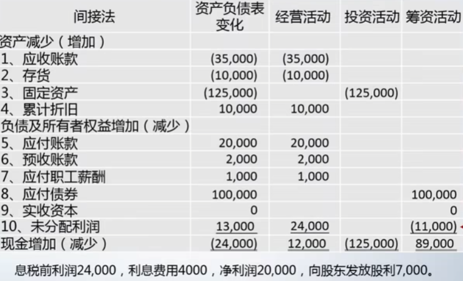
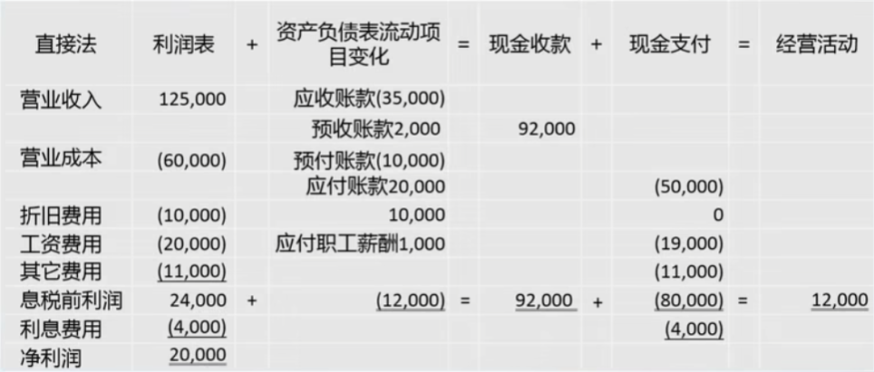

- [1. 会计对象与会计假设](#1-会计对象与会计假设)
	- [1.1 会计信息形成的三个问题](#11-会计信息形成的三个问题)
	- [1.2 会计假设](#12-会计假设)
- [2. 会计要素与会计恒等式](#2-会计要素与会计恒等式)
	- [2.1 记账方式](#21-记账方式)
	- [2.2 会计恒等式](#22-会计恒等式)
	- [2.3 资产](#23-资产)
	- [2.4 负债](#24-负债)
	- [2.5 所有者权益](#25-所有者权益)
	- [2.6 权责发生制与收入](#26-权责发生制与收入)
	- [2.7 费用](#27-费用)
	- [2.8 利润](#28-利润)
- [3. 财务报表与相互勾稽关系](#3-财务报表与相互勾稽关系)
	- [3.1 会计科目](#31-会计科目)
	- [3.2 会计账户与记账规则](#32-会计账户与记账规则)
	- [3.3 会计循环](#33-会计循环)
	- [3.4 会计分录](#34-会计分录)
	- [3.5 财务报表勾稽关系](#35-财务报表勾稽关系)
		- [3.5.1 资产负债表](#351-资产负债表)
		- [3.5.2 利润表](#352-利润表)
		- [3.5.3 现金流量表](#353-现金流量表)
- [4. 筹资活动](#4-筹资活动)
	- [4.1 所有者筹资](#41-所有者筹资)
	- [4.2 银行筹资](#42-银行筹资)
	- [4.3 债券筹资](#43-债券筹资)
	- [4.4 租赁筹资](#44-租赁筹资)
- [5. 投资活动](#5-投资活动)
	- [5.1 固定资产投资](#51-固定资产投资)
	- [5.2 无形资产](#52-无形资产)
	- [5.3 对外股权投资](#53-对外股权投资)
	- [5.4 投资性房地产](#54-投资性房地产)
- [6.经营活动](#6经营活动)
	- [6.1 采购活动与增值税](#61-采购活动与增值税)
	- [6.2 采购活动核算](#62-采购活动核算)
	- [6.3 生产成本构成](#63-生产成本构成)
	- [6.4 材料与人工](#64-材料与人工)
	- [6.5 制造费用](#65-制造费用)
	- [6.6 生产成本与完工产品](#66-生产成本与完工产品)
	- [6.7 销售活动核算](#67-销售活动核算)
- [7. 会计循环](#7-会计循环)
	- [7.1 试算平衡](#71-试算平衡)
	- [7.2 调整账项--类别](#72-调整账项--类别)
	- [7.3 调整账项--递延项目](#73-调整账项--递延项目)
	- [7.4 调整账项--应计项目](#74-调整账项--应计项目)
	- [7.5 调整账项--估计项目](#75-调整账项--估计项目)
	- [7.6 对账](#76-对账)
- [8. 财务成果核算及呈现](#8-财务成果核算及呈现)
	- [8.1 本年利润的核算](#81-本年利润的核算)
	- [8.2 利润分配](#82-利润分配)
	- [8.3 利润表与资产负债表](#83-利润表与资产负债表)
	- [8.4 现金流量表](#84-现金流量表)

# 1. 会计对象与会计假设

## 1.1 会计信息形成的三个问题

1. 主体：对谁的经济交易与事项进行记录和报告
2. 时点：在什么时点对经济交易与事项进行记录和报告
3. 金额：以什么金额对经济交易与事项进行记录和报告

## 1.2 会计假设

* 会计主体假设：经济活动的会计处理是以经济个体为单位而认定的，即某一企业的活动与业主及其他企业的活动必须完全分开处理
	* 法律主体和会计主体一致
	* 有时会计主体超越法律主体：A公司对于B公司有控制权（持股50%以上），则A公司的财务报表需要将B公司与A公司合并视同为一个会计主体，B公司的资金运动需要当做A公司资金运动的一部分
	* 在一个经济交易资金运动中，首先要明确会计主体

* 持续经营假设：假定企业将持续存在下去，而不会在可预见的将来清算解散
	* 在考察记录商业活动资金流动的时候，假设主人公是会持续活下去的，而不会在可预见的将来死亡

* 会计分期假设：将企业的经营时间分为等长的时段
	* 划分时点的原因：
		* 查看企业情况，决定是否继续办下去
		* 银行查看企业是否能还款
		* 合伙人了解经营情况
	* 会计年度：
		* 公历年度：当年1月1号~12月31号
		* 自然营业年度：如当年4月1号~次年3月31号

* 货币计量假设：以货币为计量单位（记账本位币）

* 谨慎性原则：存在两种可选会计方法时，应当选择低估好处、高估损失的方法

# 2. 会计要素与会计恒等式

## 2.1 记账方式

* 单式记账：对一项经济业务，只在一个账户中登记，反映经济业务的一个方面
	* 一般只反映现金收付及人欠、欠人事项
	* 多数情况下不记录资金的来源
	* 问题：业务复杂的情况；债债权增多；股东投入；整体盈利情况，一旦出错很难发现

* 复式记账：对每项经济业务都以相等的金额在两个或两个以上的相互联系的账户中进行记录
	* 特点：有借必有贷，借贷必相等
		* 接：反映资金的去向与使用结果
		* 贷：反映资金的来源
	* 优点：区分不同种类的来源及去向；易于检查、避免错误

## 2.2 会计恒等式

* 资金运动
	* 在一个时点上，只能看到资金运动的结果及来源
	* 在一段时期内：能看到资金运动变化的情况

* 会计恒等式：
	* **资产=负债+所有者权益**：反映资金在一个时点上的使用情况及其来源
		* 资产：借方，反映资金的使用结果
		* 负债+所有者权益：贷方，反映资金的来源，企业外部的人借给企业或股东的投入
		* 资产、负债与所有者权益这三个要素无法充分反映企业核心的经营成果获得过程，因此需要利润、收入与费用
	* **利润=收入-费用**：反映资金在一段时间内的运动情况

## 2.3 资产

* 定义：企业过去的交易或者事项形成的，由企业拥有或者控制的，预期会给企业带来经济利益的资源
	* 包括：货币资金、各种货物、债权、其他财产权利
	* 带来经济利益：能货币计量

* 分类方式：
	* 现金资产(资金货币)与非现金资产(不以现金形式存在的资产)
	* 流动资产与非流动资产
		* 流动资产：企业可以在一年或者超过一年的一个营业周期内变现或者耗用的资产
			* 营业周期：一般为一年，某些特殊行业(如轮船、飞机制造业)可能以超过一年的单件产品的生产周期为一个营业周期
			* 包括：库存现金、银行存款、应收款项、存货
				* 应收及预付款项：应收票据(客户出具的商业汇票)、应收账款(客户口头承诺没有票据)、预付账款(预付给供应商的货款)，其中预付账款多数不会以现金形式收回，而是得到货物、原料、设备等实物或服务
				* 存货：包括原材料、生产成本与库存商品
			* 流动资产主要考虑在短期内能否变成现金，在经营过程中被耗用掉
		* 非流动资产：企业不能在一年或者超过一年的一个营业周期内变现或者耗用的资产
			* 包括：长期股权投资、固定资产、无形资产
		* 为何划分流动资产与非流动资产
			* 从债权人角度看，资产是资金使用的结果，需要考虑资产在企业里存在的形态，更重要的是考虑资金的来源
			* 从资产使用周转状况看，需要考虑资产周转快慢

* 隐形资产：它可能是一项经济资源，对企业有价值，但是没有以资产的名义记录到会计系统
	* 包括：品牌、人力资源、商业关系与社会关系、商业合同
		* 品牌由于无法用货币计量，因此不属于资产
		* 人力资源虽然可以用货币计量，但是企业无法拥有无法控制
			* 足球俱乐部的会计记录中，球员的~价值以球员技术费形式出现
		* 商业关系与社会关系，企业不一定拥有控制(关系在落在企业还是落在个人)，同时无法用货币计量
		* 商业合同没有实施，没有完成的情况下，资金的流动没有发生，因此合同不能作为资产的一部分
	* 如何确定商业活动中的资源是资产还是隐形资产
		* 企业有没有所有权或者控制权
		* 能不能可靠地用货币来计量它的价值
		* 这一项资源，是不是应该在这个时间点上来记录

## 2.4 负债

* 定义：过去的交易、事项形成的现时义务，履行该义务预期会导致经济利益流出企业

* 分类方式：
	* 按流动性(偿还期限与压力)分类：
		* 流动负债：偿还压力大，偿还期限短
			* 短期借款：向银行或金融机构的借款，还款期限较短
			* 应付及预收款项：应付账款(欠供应商)、预收账款(欠客户)、应交税金(欠政府)
		* 长期负债：偿还压力小，偿还期限长
			* 包括长期借款、应付债券、长期应付款等

* "隐形"的负债包括：诉讼、担保、其他(七天无条件免费退货)

## 2.5 所有者权益

* 定义：企业投资者对企业净资产的所有权，包括企业所有者的投资及其增加的权益
	* 净资产=资产-负债
	* 所有者权益就是企业的投资者对企业的剩余索取权
	* 包括：所有者直接投入的资本与企业累积经营成果

## 2.6 权责发生制与收入

* 记录方式
	* 收付实现制：以现金的收支作为确认的依据，
		* 但是在实际中不允许使用，因为现金收付与履行义务中存在时间差
	* 权责发生制：以权利已经形成或义务已经发生作为确认的依据

* 定义：企业在日常活动中形成的、会导致**所有者权益**增加的、**与所有者投入资本无关**的经济利益的总流入
	* 分类：主营业务收入、其他业务收入、投资收益、营业外收入、公允价值变动收益(如股票等)

* 收入确认：
	* 收入确认必须符合两项基本条件：①收入的赚取过程已经完成，义务已经履行；②经济利益很可能流入企业

## 2.7 费用

* 定义：企业在日常活动中发生的、会导致所有者权益减少的、与**向所有者分配利润无关的经济利益的总流出**
	* 费用会降低所有者剩余索取权，减少所有者权益
	* 不是由于利润分配的活动都叫做费用
	* 分类：主营业务成本、其他业务成本、投资损失、营业外支出、销售费用、管理费用、财务费用、税金及附加(有交易的时候的)、所得税(获取经营成果后政府收到税)、资产减值损失

* 费用确认：配比原则
	* 费用与收入之间的关系：配比关系
	* 配比原则：费用与收入进行匹配的方法：将相关联的收入与费用在同一会计期间入账(包括期间及金额上的"配比")
	* 无法与单笔收入匹配的费用，如广告费等，在支出时就记录下来，主要包括销售费用、管理费用、财务费用、税金及附加(有交易的时候的)、所得税(获取经营成果后政府收到税)、资产减值损失

## 2.8 利润

* 定义：企业在一定会计期间内的经营成果，包括收入减去费用后的净额、直接计入当期利润的利得和损失
	* 利润的正负对应着所有者权益的增加或减少
	* 许多特点都体现在"收入"和"费用"这两个要素上，利润的金额是通过收入减去费用后的余额来确定的
	* 分类：营业利润、利得、损失
	* 利润总额-所得税费用=净利润

* 销售活动记录过程：
	1. 收入确认
	2. 费用配比
		* 收入确认与费用配比同时进行计算
	3. 利润计算
		* 会计周期末汇总计算，不单独计算，因为实际过程中销售可能具有后效性

* **资产=负债+所有者权益**资金流转状况：
	* 资金流入企业：等式左右两边同时增加
	* 资金流出企业：等式左右两边同时减少
	* 资金在企业内部流传：等式两边不变
	* 确认收入：左右两边同时增加
	* 费用配比：左右两边同时减少
	* 利润计算：等式两边不变，等式右侧所有者权益发生变化

# 3. 财务报表与相互勾稽关系

## 3.1 会计科目

* 定义：相同性质的经济事项归为一类，并明确其核算内容，而这些项目，在会计上就称为会计科目

* 分类：
	* 按反映的经济内容分：资产类科目、负债类科目、所有者权益类科目、成本类科目、损益类科目
		* 资产类科目：流动资产科目、非流动资产科目
		* 负债类科目：流动负债科目、非流动负债科目
		* 共同类科目：既有资产性质，又有负债性质，这样有共性的科目
			* 共同类科目的特点需要从其期末余额所在方向界定其性质
			* 共同类多为金融、保险、投资、基金等公司使用，包括清算资金往来、货币兑换、衍生工具、套期工具、被套期项目
		* 所有者权益类科目：
			* 实收资本：注册资本范围内的投入
			* 资本公积：指投资者或者他人投入到企业、所有权归属于投资者、并且投入金额上超过法定资本部分的资本
			* 盈余公积：指公司按照规定从净利润中提取的各种积累资金(公司职工福利设施等)
			* 本年利润：企业当期实现的净利润(或发生的净亏损)
			* 利润分配：核算分红、企业留存(未分配利润)
		* 成本类科目：反映成本费用和支出的，用于核算成本的发生和归集情况，提供成本相关会计信息的会计科目
			* 生产或服务环节的资源消耗：生产成本、制造费用、劳务成本等
		* 损益类科目：包括收入类科目与费用类科目，期末余额需转入"本面利润"
	* 按隶属关系分：总账科目、明细科目(一级明细、二级明细、三级明细)

* 设立：企业自主性(可以根据实际情况)、灵活性、规范性
	* 中国企业会计准则：156个会计科目

## 3.2 会计账户与记账规则

* 会计账户：根据会计科目开设的，具有一定的结构，用来系统、连续地记载各项经济业务的工具
	* 会计科目是会计账户的名称，会计账户是会计科目的具体运用
	* 分类：资产类账户、负债类账户、所有者权益类账户、成本费用类账户、损益类账户(收入、利润类账户)
	* 格式：账户名称(会计科目)、日期、凭证号、摘要、借方(资金使用结果)、贷方(资金来源)、余额
	* 记账符号
		* 借：资金的使用结果
		* 贷：资金的来源
	* 账户结构-T字形账户：左侧借方，右侧贷方
	* 账户余额：期初余额、本期借方发生额、本期贷方发生额、期末余额
		* 借>贷→期末余额在借方
		* 借<贷→期末余额在贷方

## 3.3 会计循环

* 会计核算的组成：设置账户、复式记账、填制与审核会计凭证、登记账簿、成本核算、财产清查、编制会计报表

* 会计循环：经济业务、会计凭证、会计账簿、会计报表
	* 经济业务经过编审凭证、分录处理为会计凭证，会计凭证包括原始凭证与记账凭证，因此就是从原始凭证处理为记账凭证的过程
	* 会计凭证通过过账登记到会计账簿中，会计账簿分为日记账与分类账
	* 会计账簿通过试算、调整、结账形成会计报表，会计报表包括资产负债表、利润表、现金流量表

## 3.4 会计分录

* 定义：表明某经济业务应借、应贷账户的名称及其金额。
	* 会计分录需要在记账凭证上显示出来

* 步骤：
	1. 确定经济业务所涉及的对应账户
	2. 确定对应账户借贷的对应关系
	3. 确定各对应账户应入账的金额

* 分类：
	* 简单会计分录：由两个账户组成的会计分录
	* 复合会计分录：由两个以上账户所组成的会计分录

* 格式：
	1. 先写借方账户，后写贷方账户
	2. 借贷错开一格

## 3.5 财务报表勾稽关系

* 常用的会计报表：
	* 资产负债表：对应资产=负债+所有者权益，权责发生制
	* 利润表：对应利润=收入-费用，权责发生制
	* 现金流量表

### 3.5.1 资产负债表

* 资产负债表
	* 资产负债表由上到下按流动性由强到弱排列
	* 负债由上到下按偿还期限由短到长排列
	* 所有者权益由上到下按照永久性程度由长到短排列

|资产|行次|期末余额|年初余额|负债和所有者权益(或股东权益)|行次|期末余额|年初余额|
|:-:|:-:|:-:|:-:|:-:|:-:|:-:|:-:|

### 3.5.2 利润表

* 利润表
	* 排列：利润表由上到下按利润持续性由强到弱排列

* 资产负债表与利润表的关系：
	* Δ资产=Δ负债+Δ所有者权益
	* Δ资产=Δ负债+Δ所有者投入-利润分红+本年利润

* 本年利润的产生
	* 低买高卖流动资产：一般企业是通过买卖流动资产里面，尤其是存货来形成利润
	* 低买高卖非流动资产：
		* 企业通过低买投资的产品，然后再高卖这些投资类的产品，获得利润
		* 比较困难的企业通过低买设备高卖设备，获得利润
	* 降低负债：企业通过负债赖账，获得利润：债务重组
	* 资本公积：企业出售已评估增值的资产，获得利润
	* 政府补助：企业符合政府补贴的条件，获得相应补贴，从而获取利润

### 3.5.3 现金流量表

* 公式变换
	* Δ资产=Δ负债+Δ所有者权益
		* Δ资产=Δ现金+Δ非现金资产
	* Δ现金+Δ非现金资产=Δ负债+Δ所有者权益
		* 移项
	* Δ现金=Δ负债+Δ所有者权益-Δ非现金资产
		* Δ负债=Δ债务+Δ非债务的负债
	* Δ现金=Δ债务+Δ非债务的负债+Δ所有者权益-Δ非现金资产
		* Δ所有者权益=Δ所有者投入+Δ累积经营成果
	* Δ现金=Δ债务+Δ非债务的负债+Δ所有者投入+Δ累积经营成果-Δ非现金资产
		* Δ非现金资产=Δ非现金流动资产+Δ非现金的非流动资产
	* Δ现金=Δ债务+Δ非债务的负债+Δ所有者投入+Δ累积经营成果-Δ非现金流动资产-Δ非现金的非流动资产

* 公式：Δ现金=经营活动+投资活动+融资活动
	* 经营活动=Δ累积经营成果-Δ非现金流动资产+Δ非债务的负债
	* 投资活动=-Δ非现金的非流动资产
	* 融资活动=Δ债务+Δ所有者投入

* 负债：
	* 分类：债务(需要负担利息的义务)、非债务(不需要负担利息的义务)

* 现金流量表结构：经营活动产生的净现金流、投资活动产生的净现金流、融资活动产生的净现金流、汇率变动对现金的影响、现金及现金等价物净增加额、期末现金及现金等价物余额

# 4. 筹资活动

* 企业资金筹集的方式：所有者投资、银行筹资、债券筹资、供应商融资、租赁筹资

## 4.1 所有者筹资

* 分类：实收资本与资本公积
	* 实收资本在注册资本范围内，资本公积在注册资本范围外，是非注册资本
	* 资本公积在未来可以转增成注册资本

* 实收资本：在注册资本范围内投资者投入进来的资本，在所有者权益的贷方
	* 贷方：投资者投入的资本；借方：登记批准减少投资的资本

* 资本公积：超出注册资本范围以外，所有者投入的资金
	* 反映所有者在投入到企业时出现的投资溢价问题

* 所有者对企业进行的投资：
	* 现金投资
	* 非现金投资：固定资产、商品、技术、无形资产、专利等

* 记录所有者投入时，区分注册资本与非注册资本

## 4.2 银行筹资

* 分类：短期借款(一年以内)、长期借款(超过一年以上)

* 负债类账户，
	* 贷方：借入款项
	* 借方：偿还的款项
	* 期末贷方余额：企业借入的应在一年内/一年以上偿还的款项

## 4.3 债券筹资

* 公司债券：企业为筹集资金(一般是长期资金)、按照法定程序报经核准、向社会公众发行的、约定在一定期限内还本付息的有价债券

* 分类：
	* 流动负债-交易性金融负债：期限小于一年
	* 长期负债-应付债券：期限大于一年

* 发行分类：
	* 平价发行：票面利率=市场利率
	* 溢价发行：票面利率>市场利率
		* 借方：银行存款
		* 贷方：应付债券-面值 + 应付债券-利息调整
	* 折价发行：票面利率<市场利率
		* 借方：银行存款 + 应付债券-利息调整
		* 贷方：应付债券-面值

## 4.4 租赁筹资

* 应付款：
	* 分类：应付账款(短期)、长期应付款(融资租入固定资产的租赁费、以分期付款方式购入固定资产等发生的应付款项)
	* 长期应付款举例：买4kw的设备，五年付款，每年付1kw，共付5kw
		* 借方：固定资产(4kw)、未实现融资费用(1kw)
		* 贷方：长期应付款(5kw)

* 融资租赁：融资租赁合同是出租人根据承租人对出卖人、租赁物的选择，向出卖人购买租赁物，提供给承租人使用，橙子人支付租金的合同
	* 借方与贷方与长期应付款相同

# 5. 投资活动

## 5.1 固定资产投资

* 固定资产：为生产商品、提供劳务、出租或经营管理而持有的、使用寿命超过一个会计年度的有形资产
	* 目的标准：为生产商品、提供劳务、出租或经营管理而持有的
	* 使用寿命标准：使用寿命超过一个会计年度
	* 资产形态标准：有形资产

* 固定资产投资：
	* 两个时点：拿到固定资产、使用固定资产
	* 阶段：
		* 在建工程：固定资产达到可使用状态之前
		* 固定资产：固定资产达到可使用状态之后

* 在建工程：
	* 借方：自行建造固定资产的成本，由建造该资产达到预定可使用状态前所发生的必要支出
	* 贷方：已完工并转入"固定资产"账户借方的数额
	* 期末借方余额：尚未完工的在建工程

* 固定资产：
	* 借方：购入或自建固定资产的原始价值
	* 贷方：处置的固定资产价值
	* 期末借方余额：尚可使用的固定资产价值

* 固定资产的计价基础：
	* 历史成本计价：客观性和可验证性
	* 固定资产取得时的历史成本-固定资产的原值，一旦登记入账，通常不做调整
	* 日常使用损耗通过"累计折旧"体现，而减值情况通过"固定资产减值准备"体现

* 外购固定资产的原值：
	* 购买价款
	* 进口关税
	* 其他税费(不包括可抵扣的固定资产增值税进项税额)
	* 使固定资产达到预定可使用状态前所发生的可归属于该项资产的场地整理费、运输费、装卸费、安装费和专业人员服务费等
	* 固定资产购买过程中的可抵扣的增值税硬单独借记"应交税费-应抵扣固定资产增值税(固定资产进项税额)"，不得计入固定资产原值

* 自行建造的固定资产：
	* 建造该项资产达到预定可使用状态前所发生的必要支出，由"在建工程"核算。达到可使用状态后转入"固定资产"

## 5.2 无形资产

* 特点：
	* 没有实物形态
	* 无形资产属于非货币性长期资产
	* 所持有的主要目的是为使用而非出售
	* 所提供的未来经济利益具有高度的不确定性

* 种类：专利权、商标权、著作权、土地使用权、特许权、非专利技术

* 外购无形资产的计量：
	* 入账价值：购买价款、相关税费、直接归属于使该项资产达到预定用途所发生的其他支出
	* 直接归属于使该项资产达到预定用途所发生的其他支出：
		* 包括：使无形资产达到预定用途所发生的专业服务费用、测试无形资产是否能够发挥作用的费用
		* 不包括：为引入新产品进行宣传发生的广告费、管理费用及其他间接费用、使无形资产已经达到预定用途以后发生的费用

* 内部研究开发
	* 活动的划分：
		* 阶段划分：研究阶段、开发阶段
		* 研究阶段：为获取新的科学或技术知识并理解它们而进行的独创性的有计划调查，具有计划性与探索性
		* 开发阶段：在进行商业性生产或使用前，将研究成果或其他知识应用于某项计划或设计、以生产出新的或具有实质性改进的材料、装置、产品等，具有针对性与较大可能性
	* 费用的确认与计量： 研发支出：
		* 研究阶段直接计入当期损益(管理费用)
		* 开发阶段：符合资本化条件的计入无形资产成本(研发支出-资本化支出)；不符合资本化条件的计入当期损益(研发支出-费用化支出，期末转入管理费用)

## 5.3 对外股权投资

* 分类：
	* 长期股权投资：持股比例多，影响力高，流动性低
		* 控制：子公司：持股51%以上或有控制力
		* 合营安排：合营企业(共同控制，各50%(?))
		* 重大影响：联合营业(持股超过20%但是小于50%，没有控制力)
	* 金融资产投资：持股比例少，影响力低，流动性高
		* 第四类投资：投资企业持有的对被投资单位不具有控制、共同控制或重大影响，并在活跃市场中没有报价、公允价值不能可靠计量的权益性投资

* 长期股权投资的收益问题：
	* 成本法：长期股权投资以初始成本计量，收到利润或现金股利时确认为投资收益
		* 成本法下，每个会计期末将母公司与子公司合并作为同一个会计主体
	* 权益法：当被投资单位净资产增加时，投资企业按照其所拥有的份额确认投资收益，同时相应增加投资的账面价值；如果被投资企业发生净资产的减少，则要相应比例减少投资的账面价值，并确认投资损失，损失的确认以将长期投资减记至零为限
	* 通常划分比例：
		* 成本法：持股比例大于50%(子公司)或具有控制权，因为子公司或控制的公司投资方可以草操控其业绩
		* 权益法：持股比例在20%~50%之间，因为联营或合营企业较难操控其业绩
		* 视为金融资产：持股比例低于20%

* 合并会计主体步骤：
	1. 取消长期股权投资和被投资方的实收资本
	2. 合并剩下的项目，被投资方实收资本中其他股东投入需要改为少数股东权益

## 5.4 投资性房地产

* 房地产的持有目的：
	* 投资性房地产：出租或投资目的
	* 固定资产管理：自用

* 投资性房地产的初始成本
	* 外购：包括购买价款、相关税费、以及可直接归属于该资产的其他支出
	* 自行建造：为建造该项资产达到预定可使用状态前所发生的必要支出
	* 遵循公允价值：通过非货币性交易等取得时

* 投资性房地产的后续计量：
	* 成本模式计量：不改变记录，只估计损耗
		* 建筑物：按照"固定资产"方式计提折旧
		* 土地使用权：按"无形资产"方式摊销
	* 公允价值模式计量：根据公允价值增减调整投资性房地产
		* 投资性房地产所在地有活跃的房地产交易市场
		* 企业能够从房地产交易市场上取得同类或类似房地产的市场价格及其相关信息，从而对投资性房地产的公允价值作出合理估计
		* 借方：投资性房地产-公允价值变动；贷方：公允价值变动损益
	* 已采用公允价值模式计量的投资性房地产，不得从公允价值模式转为成本模式

# 6.经营活动

## 6.1 采购活动与增值税

* 不同企业的经营循环：
	* 制造型企业：筹集资金、雇佣员工购买原材料、生产产品、销售产品、财务成果、利润分配
	* 服务型企业：筹集资金、服务过程、财务成果、利润分配
	* 服务型企业：筹集资金、采购商品、销售商品、财务成果、利润分配

* 采购环节
	* 过程：企业给供应商货币资金或赊账，供应商给企业原材料物资
	* 在途物资：已经将货物自检付给供应商，但尚未收到的材料或物资

* 增值税：
	* 通过进项金额与销项金额计算，销项-进项=增值的金额
	* 进项税额=进项额×税率
	* 销项税额=销售额×税率
	* 应纳增值税=销项税额-进行税额
	* 增值税最后是由消费者来负担

* 增值税的时间差：
	* 对于加工型企业：生产周期+销售周期+收款周期

* 增值税本身不会影响到企业财务成果，但由于它对不同时点的影响，会造成企业较大的资金压力

## 6.2 采购活动核算

* 根据时点的不同，会运用到两个账户：在途物资与原材料
	* 在途物资：还没有进入仓库的物资；所有权已经属于企业的物资
		* 借方：购入材料物资的买价和采购费用
		* 贷方：验收入库按实际采购成本转入"原材料"账户借方的数额
		* 期末借方余额：尚未验收入库的在途材料
	* 原材料：反映已经验收入库的各项材料的数额
		* 借方：已验收入库的各种材料数额
		* 贷方：材料发出、减少的数额
		* 期末借方余额：库存材料的实际成本

* 资金来源：企业内部资源提供、企业外部提供

* 企业外部提供资金：
	* 企业的供应商提供：
		* 应付账款
			* 贷方：应付给供应单位的购货款
			* 借方：已偿还的购货款
			* 期末贷方余额：尚未偿还的应付给供应岗位的购货款
		* 应付票据：
			* 贷方：开出、承兑商业汇票的数额
			* 借方：支付到期商业汇票及银行承兑汇票手续费的数额
			* 期末贷方余额：尚未到期的应付票据数额
	* 政府提供：
		* 应付税金：
			* 贷方：应上缴国家财政的各项税款
			* 借方：已上缴的税款及进项税款
			* 期末贷方余额：应缴但尚未上缴的税款

* 原材料价值：不含税货款+运费+消费税等(不含增值税)

## 6.3 生产成本构成

* 生产活动流程：材料采购→存货(资产负债表)→费用(利润表)
	* 存货：原材料→在产品(生产成本)→产成品(库存商品)
		* 在产品(生产成本)：原材料未生产完
		* 产成品：原材料生产完，库存商品(未销售)与主营业务成本(销售)
	* 费用：主营业务成本

* 获得产品的代价：
	* 生产环节的代价：制造费用、直接人工和材料
		* 制造费用：不容易识别、为了生产产品而发生的间接代价
		* 直接人工和材料：很容易识别、为了生产产品而发生的直接代价
	* 非生产环节的代价：期间费用(销售及管理费用)，作为营业及管理费用

* 生产阶段的核算：
	* 生产成本：只有在生产环节发生的代价，才称之为成本
		* 在财务会计中，生产成本代表的是没有完工的产品价值
		* 借方：当期发生的好用的材料、生产工人工资、福利费及从"制造费用"账户转入的制造费用
		* 贷方：转出的已完工产品的实际成本
		* 期末借方余额：生产过程中尚未完工的在产品费用
	* 制造费用：
		* 借方：当期发生的各种制造费用
		* 贷方：月末转入"生产成本"账户的当期发生的制造费用
		* 期末无余额
	* 库存商品：
		* 借方：已验收入库的产品的实际成本
		* 贷方：发出产品的实际生产成本
		* 期末借方余额：期末库存产品的生产成本

## 6.4 材料与人工

* 成产阶段的材料核算：
	* 借方：生产成本、制造费用、管理费用
		* 生产成本可以继续细化
	* 贷方：原材料
		* 原材料可以继续细化

* 企业的会计记录越详细，就越有用

* 生产阶段的人工核算：
	* 员工进行生产：
		* 借方：生产成本、制造费用、管理费用
			* 生产成本可以继续细化
		* 贷方：应付工资(此时还没有付给员工工资，因此资金来源为企业外部)
	* 员工发放工资：
		* 借方：应付工资
		* 贷方：银行存款
	* 按工资的比例计提应付福利费
		* 借方：生产成本、制造费用、管理费用
			* 生产成本可以继续细化
		* 贷方：应付福利费

## 6.5 制造费用

* 制造费用：企业为生产产品和提供劳务而发生的各项间接费用
	* 包括：间接材料、间接人工(修理、技术、生产管理人员工资)、折旧与摊销、低值易耗品、其他支出(水电费、差旅费、运输费、办公费等)
	* 借方：制造费用(生产环节)、管理费用(非生产环节)
	* 贷方：银行存款、累计折旧

* 累计折旧：针对的固定资产的损耗，作为资金来源方提供给生产或者非生产环节时，造成的固定资产价值的减少，用累计折旧来反映
	* 固定资产：只反映买的时候花的代价
	* 累计折旧：反映在正常使用过程中的损耗
	* 累计折旧只反映固定资产的贷方，固定资产作为资金来源提供来源方

## 6.6 生产成本与完工产品

* 生产成本的核算：
	* 包括：直接材料、直接人工、制造费用
	* 借方：生产成本
	* 贷方：制造费用

* 例：本月完工产品成本=月初在产品成本+本月生产成本发生额-月末在产品成本
	* 借方：库存商品
	* 贷方：生产成本

## 6.7 销售活动核算

* 销售阶段：订单→发货→确认收入→收款

* 销售阶段的核算：
	* 包括：销售款(不含增值税)：主营业务收入、增值税税金(销项税额)、销售费用、税金及附加(除增值税、所得税以外的税金及附加费)
	* 涉及账户：主营业务收入、主营业务成本、税金及附加、营业费用

	* 借方：、
	* 贷方：、银行存款

* 主营业务收入：
	* 借方：收入的减少及在期末转入"本年利润"贷方的数额
	* 贷方：销售产品获得的销售收入
	* 期末无余额

* 主营业务成本：
	* 借方：当期销售产品结转的生产成本
	* 贷方：期末转入"本年利润"账户借方的数额
	* 期末无余额

* 税金及附加
	* 借方：当期应由销售收入中扣减的税金及附加
	* 贷方：期末转入"本年利润"的数额
	* 期末无余额

* 营业费用：
	* 借方：当期发生或支付的销售费用
	* 贷方：期末转入"本年利润"的数额
	* 期末无余额

|例子|借方|贷方|
|:-:|:-:|:-:|
|卖出产品|银行存款、应收账款|主营业务收入-产品、应交税金-应交增值税(销项)|
|缴纳增值税|应交税金-应交增值税|银行存款|
|收到公司货款|银行存款|应收账款|
|期末结转已销售产品的实际生产成本|主营业务成本|库存商品|
|产品包邮运费|营业费用|银行存款|
|广告费|营业费用|银行存款|
|消费税|税金及附加|应交税金-应交消费税|

# 7. 会计循环

## 7.1 试算平衡

* 定义：利用账户之间的对应关系，检查和验证账户记录正确性的方式

* 分类：
	* 余额试算平衡：全部账户借方余额合计=全部账户贷方余额合计
		* 理论依据：资产=负债+所有者权益
	* 发生额试算平衡：全部账户借方发生额合计=全部账户贷方发生额合计
		* 发生额：每一个账户，在每一个期间内借方和贷方出现的金额
		* 理论依据：有借必有贷，借贷必相等

* 能够检验的错误：
	* 会计分录中借贷方金额不相等
	* 账户余额方向异常：如资产账户余额在贷方、负债账户余额在借方等

* 试算平衡错误原因：
	1. 账户记录错误
	2. 确定账户余额时出错
	3. 编制试算平衡表时出错
	* 后两种错误通过编程的方式可以克服

* 试算表无法发现的错误：
	1. 借贷同时遗漏
	2. 借贷同时重复记录
	3. 借方和贷方发生等额错误
	4. 借方、贷方方向颠倒
	5. 用错账户
	6. 借贷方记账金额比实际业务少记或者多记

## 7.2 调整账项--类别

* 调整项目的原因：
	1. 权责发生制与收付实现制的差异
	2. 收入与费用的配比

* 销售活动的步骤：确认收入、核算费用、计算利润

* 调整账项：
	* 递延项目：已经收到/支付现金，但还未交货，需要递延到下一期记录收入/费用
		* 包括：预付费用、预收收入
	* 应计项目：已经完成交易，但还未收到/支付现金，在本期可以记录收入/费用，下一期在收到/支付现金
		* 包括：应付费用、应收收入
	* 估计项目：包括估计费用

* 调整分录：每一笔调整分录将影响到一个损益类账户和一个资产负债表账户，但是不会影响到货币资金类账户

* 调整账项小结：
	* 购买方
		* 递延费用：资产-A1→费用，调整贷方
		* 应计费用：负债-A4→费用，添加新纪录
	* 出售方
		* 递延收入：负债-A2→收入，调整借方
		* 应计收入：资产-A3→收入，增添新纪录

## 7.3 调整账项--递延项目

* 预付款项：
	* 特点：
		* 这些账款已经用货币资金支付，因而被记录成资产
		* 但是当使用或消耗时，需要将它们确认为费用
		* 常见的有：房租、保险费、广告费、办公用品等
	* 例：
		* 原始会计分录：借方：预付账款-保险费； 贷方：银行存款
		* 调整会计分录(资产耗用)：借方：管理费用；贷方：预付账款-保险费

* 固定资产与折旧：资产→费用
	* 特点：对于使用寿命较长的资产比如车辆、房屋、机器设备等，是通过计提折旧的方式来实现费用配比
	* 折旧：以一种合理的、系统的方式将一项长期资产的成本在其使用年限内进行分配，实现费用化，折旧是一个**分配概念，不是估值概念**
	* 折旧的对应账户：根据固定资产的使用分为制造费用、销售费用、管理费用、研发支出
	* 无形资产在使用寿命期间内进行摊销，例子如下：
		* 原始会计分录：借方：无形资产-商标权；贷方：银行存款
		* 调整会计分录：借方：管理费用；贷方：累计摊销

* 预收款项：企业预收购买单位的账款，记录为负债。等到提供商品或劳务后，在确认为收入。负债→收入

## 7.4 调整账项--应计项目

* 应计收入：
	* 借方：应收账款；贷方：主营业务收入

* 应计费用：
	* 特点：
		* 已经发生但是在财务报告日尚未支付或记录的费用
		* 常见的有：利息、工资、先用后付费的服务等

* 应计利息：借方：财务费用；贷方：应付利息

* 应计工资：借方：营业费用；贷方：应付职工薪酬

## 7.5 调整账项--估计项目

* 估计事项：包括资产减值情形、有负债情形
	* 估计负债变多、估计资产变少

* 资产减值情形：
	* 包括：坏账、存货、固定资产、金融资产类、长期股权投资、无形资产、递延所得税资产、商誉
	* 坏账：因客户失去信用能力而不能收回的应收款项。包括应收账款和其他应收款
		* 借方：资产减值损失；贷方：坏账准备

* 预计负债例子：
	* 预计时：借方：营业外支出-预计负债；贷方：预计负债
	* 实际支付负债时：借方：预计负债；贷方：银行存款

## 7.6 对账

* 对账步骤：
	1. 账证核对：账户与凭证进行核对
		* 目的：核实是否有经济业务遗漏、核实账户记录与原始凭证记录是否金额一致
	2. 账账核对：账户与账户进行核对
		* 目的：把总账与分类账或明细账进行核对；由不同的人员记录明细账和总账，但可以相互核对各自账户
	3. 账实核对：账户与实际进行核对
		* 资产清查：货币资金(库存现金、银行存款)、往来款项(各项应收、应付、预收、预付等款项)、存货、固定资产、存放在外的财产物资(委托外单位加工物资、出租的固定资产和包装物、送展的物资财产等)

# 8. 财务成果核算及呈现

## 8.1 本年利润的核算

* 财务成果核算的依据：利润=收入-费用
	* 本期实现的利润总额=营业利润+营业外利润
		* 营业外利润=营业外收入-营业外支出
		* 营业利润=主营业务收入-主营业务成本-税金及附加+投资净收益-营业费用-管理费用-财务费用

* 本年利润：
	* 借方：期末从成本费用类账户转入的金额
	* 贷方：期末从收入类账户转入的金额
	* 期末借方余额：亏损额
	* 期末贷方余额：盈利额

* 利润分配：
	* 借方；本期计提的盈余公积、分给投资者利润等内容
	* 贷方：从"本年利润"账户转入的金额

* 利润总额的计算与结转
	1. 结转收入类账户：借方：主营业务收入；贷方：本年利润
	2. 结转成本、费用及支出类账户：借方：本年利润；贷方：税金及附加、营业费用、管理费用、财务费用、营业外支出
	3. 所得税的核算：应交所得税=利润总额×税率
		* 借方：所得税；贷方：应交税金-应交所得税
		* 借方：本年利润；贷方：所得税
	4. 本年利润的结转：借方：本年利润；贷方：利润分配-未分配利润

## 8.2 利润分配

* 净利润的分配顺序：
	1. 弥补以前年度亏损，未能弥补亏损的不进行下面的分配
	2. 按净利润提取一定比例的盈余公积金：法定盈余公积金(10%)、法定公益金(5%-10%)
		* 盈余公积：为以后改善员工的福利、企业的发展等做储备；借方：利润分配-提取盈余公积；贷方：盈余公积
	3. 向投资者分配利润或股利
		* 借方：利润分配-支付利润；贷方：应付股利
	4. 总的：借方：利润分配-未分配利润；贷方：利润分配-提取盈余公积、-支付利润

* 结账：把过去这个时期的各个账户，财务成果账户结转完成

## 8.3 利润表与资产负债表

|利润表|
|:-|
|营业收入|
|减：税金及附加|
|$\qquad$营业费用|
|$\qquad$管理费用|
|$\qquad$财务费用|
|$\qquad$营业利润|
|减：营业外支出|
|利润总额|
|减：所得税费用|
|净利润|

|资产负债表1|
|:-|
|货币资金|
|货币资金|
|应收账款|
|预付账款|
|存货|
|$\qquad$流动资产合计|
|固定资产|
|减：累计折旧|
|$\qquad$非流动资产合计|
||
|资产合计|

|资产负债表2|
|:-|
|应付账款|
|预收账款|
|应付职工薪酬|
|应付税金|
|应付股利|
|$\qquad$流动负债合计|
|$\qquad$负债合计|
|实收资本|
|盈余公积|
|未分配利润|
|$\qquad$所有者权益合计|
|$\qquad$负债及所有者权益合计|

* 财务报表勾稽关系：
	* 资产=负债+所有者权益；利润=收入-费用
	* 资产=负债+期初所有者权益+利润
	* 资产=负债+期初所有者权益+收入-费用
	* 资产+费用=负债+期初所有者权益+收入

* 资产的"水分"：披着资产外衣的费用
	* 表现形式：对存续资产少提折旧和减值准备、少计摊销等，使其实际价值低于账面价值

* 负债的"水分"：隐藏的收入
	* 表现形式：在资产负债表"预收账款"、"其他应付款"中

* 所有者权益的"水分"：
	* 披着所有者权益外衣的抽逃资本
		* 借方：其他应收款(股东借了公司的钱)；贷方：银行存款
	* 结转过来的造假利润
	* 未及时转出的其他资本公积等

## 8.4 现金流量表

* 现金流量表编制：
	* 基础：收付实现制
	* Δ现金=经营活动+投资活动+筹资活动
		* 经营活动=Δ累积经营成果-Δ非现金流动资产+Δ非债务的负债
		* 投资活动=-Δ非现金的非流动资产
		* 筹资活动=Δ债务+Δ所有者投入-利润分配

* 经营活动现金流量的编制方法：间接法、直接法

* 间接法
	* 定义：以净利润为起算点，调整不涉及现金的收入、费用、营业外收支等有关项目，据此计算出经营活动产生的现金流量
	* 处理数据：净利润→经营活动现金流量
		* +损失-利得
		* +流动资产的变化-流动负债的变化
		* +非现金开支的费用(如这就、坏账估计、摊销、资产减值估计)
	* 步骤：
		1. 把资产负债表中期初和期末余额相减，如果期末大于期初，则资产结果前添加"-"
		2. 把期初和期末余额相减的结果分别对应到经营活动、投资活动和筹资活动中

* 直接法
	* 定义：按现金收入和现金支出的主要类别直接反应企业经营活动产生的现金流量
	* 处理数据：利润表中营业收入→经营活动现金流量，调整与经营活动有关的项目的增减变动
	* 步骤：利润表+资产负债表流动项目变化=现金收款+现金支付=经营活动
		* 营业收入：→现金收款
			1. 减去应收账款在期末和期初的变化
			2. 加上预收账款在期末和期初的变化
		* 营业成本：→现金支付
			1. 减去预付账款在期末和期初的变化
			2. 加上应付账款在期末和期初的变化
		* 折旧费用：→资产负债表流动项目变化
		* 工资费用：→现金支付
			1. 加上应付职工薪酬
		* 息税前利润：
			1. 把资产负债表流动项目变化中的数加起来

