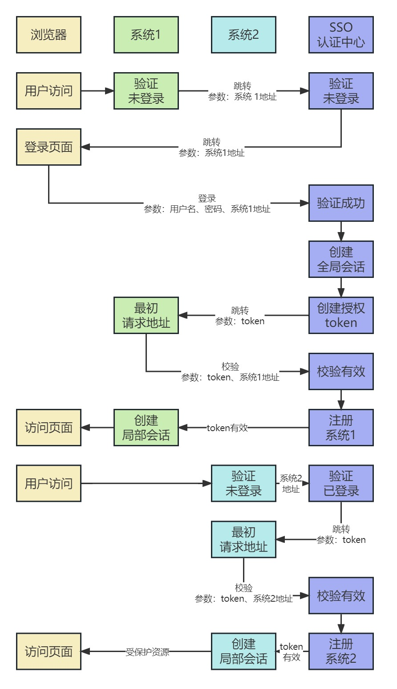

[单点登录原理与简单实现](https://www.cnblogs.com/ywlaker/p/6113927.html)

[单点登录的三种方式](https://blog.csdn.net/m0_51505198/article/details/121242591)

[单点登录实现的几种方式及原理【单点登录】](https://blog.csdn.net/wang121213145/article/details/124850518)

# 1. 单系统登录机制

## 1.1 http无状态协议

* web应用采用browser/server架构，http作为通信协议

* http是无状态协议，浏览器的每一次请求，服务器会独立处理，不与之前或之后的请求产生关联

* 由于http为无状态协议，因此任何用户都能通过浏览器访问服务器资源。若想保护服务器的资源，就需要限制浏览器请求=>鉴别浏览器请求，响应合法请求，忽略非法请求=>了解服务器请求状态=>服务器和浏览器共同维护一个状态

## 1.2 会话机制

* 创建过程：浏览器第一次请求服务器，服务器创建一个会话，并将会话的id作为响应的一部分发送给浏览器，浏览器存储会话id，并在后续第二次和第三次请求中带上会话id，服务器取得请求中的会话id来判断是否是同一个用户

* 服务器在内存中保存会话对象

* 浏览器保存会话id方式：
	* 请求参数：将会话id作为每一个请求的参数，服务器接收请求时解析参数获得会话id，并判断是否来自同一会话。但是不安全
	* cookie：cookie是浏览器用来存储少量数据的一种机制，数据以键值对形式存储，浏览器发送http请求时自动附带cookie信息

* 　tomcat会话机制也实现了cookie，访问tomcat服务器时，浏览器中可以看到一个名为"JSESSIONID"的cookie，这就是tomcat会话机制维护的会话id

## 1.3 登录状态

* 浏览器第一次请求服务器需要输入用户名与密码验证身份，服务器获得用户名密码去数据库比对，正确的话证明当前持有这个会话的用户是合法用户，应该将这个会话标记为"已授权"或者"已登录"等状态，既然是会话的状态，自然要保存在会话对象中

* tomcat在会话对象中设置登录状态如下所示↓：
```Java
HttpSession session = request.getSession();
session.setAttribute("isLogin", true);
```

* 用户再次访问时，tomcat在会话对象中查看登录状态如下所示↓：
```Java
HttpSession session = request.getSession();
session.getAttribute("isLogin");
```

* 每次请求受保护资源时都会检查会话对象中的登录状态，只有 isLogin=true 的会话才能访问，登录机制因此而实现

# 2. 多系统的复杂性

* web系统由单系统发展成多系统组成的应用群，复杂性应该由系统内部承担，而不是用户。无论web系统内部多么复杂，对用户而言，都是一个统一的整体，也就是说，用户访问web系统的整个应用群与访问单个系统一样，登录/注销只要一次就够了

* 单系统使用cookie的限制：单系统登录解决方案的核心是cookie，cookie携带会话id在浏览器与服务器之间维护会话状态。但cookie是有限制的，这个限制就是cookie的域(通常对应网站的域名)，浏览器发送http请求时会自动携带与该域匹配的cookie，而不是所有cookie

* 早期同域名共享cookie的方式：
	* 实现方式：将web应用群中所有子系统的域名统一在一个顶级域名下，然后将他们的cookie域设置为顶级域名。早期很多多系统登录就采用这种同域名共享cookie的方式
	* 局限：
		* 应用群域名需要统一
		* 应用群各系统使用的技术(至少是web服务器)要相同，不然cookie的key值不同，无法维持会话，共享cookie的方式是无法实现跨语言技术平台登录的
		* cookie本身不安全

# 3. 单点登录

* 定义：单点登录(Single Sign On，SSO)，是指在多系统应用群中登录一个系统，便可在其他所有系统中得到授权而无需再次登录，包括单点登录与单点注销两部分

## 3.1 单点登录

* 原理：相比于单系统登录，sso需要一个独立的认证中心，只有认证中心能接受用户的用户名密码等安全信息，其他系统不提供登录入口，只接受认证中心的间接授权。间接授权通过令牌实现，sso认证中心验证用户的用户名密码没问题，创建授权令牌，在接下来的跳转过程中，授权令牌作为参数发送给各个子系统，子系统拿到令牌，即得到了授权，可以借此创建局部会话，局部会话登录方式与单系统的登录方式相同

* 单点登录过程示例如下图所示，括号中的内容为携带的参数↓：
	1. 用户访问系统1的受保护资源，系统1发现用户未登录，跳转至sso认证中心，并将自己的地址作为参数
	2. sso认证中心发现用户未登录，将用户引导至登录页面
	3. 用户输入用户名密码提交登录申请
	4. sso认证中心校验用户信息，创建用户与sso认证中心之间的会话，称为全局会话，同时创建授权令牌
	5. sso认证中心带着令牌跳转会最初的请求地址(系统1)
	6. 系统1拿到令牌，去sso认证中心校验令牌是否有效
	7. sso认证中心校验令牌，返回有效，注册系统1
	8. 系统1使用该令牌创建与用户的会话，称为局部会话，返回受保护资源
	9. 用户访问系统2的受保护资源
	10. 系统2发现用户未登录，跳转至sso认证中心，并将自己的地址作为参数
	11. sso认证中心发现用户已登录，跳转回系统2的地址，并附上令牌
	12. 系统2拿到令牌，去sso认证中心校验令牌是否有效
	13. sso认证中心校验令牌，返回有效，注册系统2
	14. 系统2使用该令牌创建与用户的局部会话，返回受保护资源



* 会话：用户登录成功之后，会与sso认证中心及各个子系统建立会话
	* 分类：
		* 全局会话：用户与sso认证中心建立的会话
		* 局部会话：用户与各个子系统建立的会话
	* 局部会话建立之后，用户访问子系统受保护资源将不再通过sso认证中心
	* 全局会话与局部会话的约束关系：
		1. 局部会话存在，全局会话一定存在
		2. 全局会话存在，局部会话不一定存在
		3. 全局会话销毁，局部会话必须销毁

## 3.2 单点注销


* 单点注销：在一个子系统中注销，所有子系统的会话都将被销毁。sso认证中心一直监听全局会话的状态，一旦全局会话销毁，监听器将通知所有注册系统执行注销操作

* 单点注销过程示例如下图所示↓：
	1. 用户向系统1发起注销请求
	2. 系统1根据用户与系统1建立的会话id拿到令牌，向sso认证中心发起注销请求
	3. sso认证中心校验令牌有效，销毁全局会话，同时取出所有用此令牌注册的系统地址
	4. sso认证中心向所有注册系统发起注销请求
	5. 各注册系统接收sso认证中心的注销请求，销毁局部会话
	6. sso认证中心引导用户至登录页面


# 4. 部署

* 单点登录涉及sso认证中心与众子系统，子系统与sso认证中心需要通信以交换令牌、校验令牌及发起注销请求，因而子系统必须集成sso的客户端，sso认证中心则是sso服务端，整个单点登录过程实质是sso客户端与服务端通信的过程

# 5. 实现

## 5.1 sso-client拦截未登录请求

## 5.2 sso-server拦截未登录请求

## 5.3 sso-server验证用户登录信息

## 5.4 sso-server创建授权令牌

## 5.5 sso-client取得令牌并校验

## 5.6 sso-server接收并处理校验令牌请求

## 5.7 sso-client校验令牌成功创建局部会话

## 5.8 注销过程

