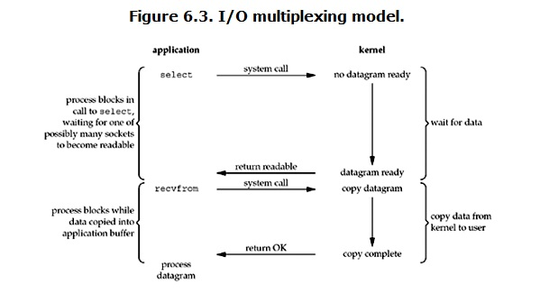
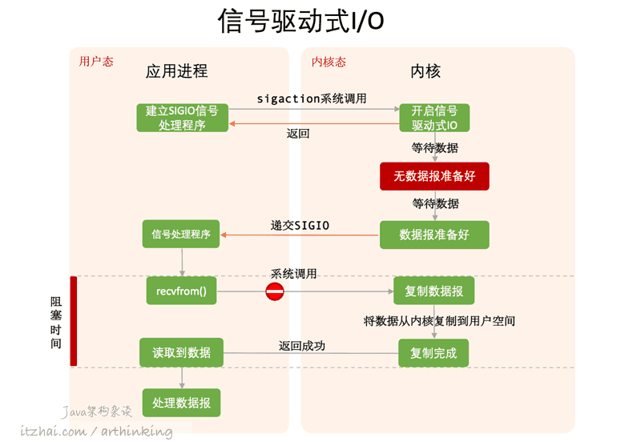

- [面试题汇总](#面试题汇总)
- [C++](#c)
	- [关键字](#关键字)
		- [volatile](#volatile)
		- [register](#register)
		- [static](#static)
		- [const](#const)
		- [auto与const](#auto与const)
		- [decltype](#decltype)
		- [extern](#extern)
		- [NULL与nullptr](#null与nullptr)
		- [new](#new)
		- [inline](#inline)
		- [define](#define)
			- [常见预编译指令](#常见预编译指令)
			- [无参数宏定义](#无参数宏定义)
			- [`define`与`typedef`区别](#define与typedef区别)
			- [带参数宏定义](#带参数宏定义)
			- [define宏定义与函数区别](#define宏定义与函数区别)
			- [宏定义中使用do while(0)](#宏定义中使用do-while0)
		- [预编译指令](#预编译指令)
	- [库函数](#库函数)
	- [多线程与多进程](#多线程与多进程)
	- [语言特性](#语言特性)
		- [Lambda函数](#lambda函数)
		- [函数指针](#函数指针)
		- [进程内存分配](#进程内存分配)
		- [类实现及sizeof()问题](#类实现及sizeof问题)
			- [类成员函数](#类成员函数)
			- [虚函数](#虚函数)
			- [override保留字](#override保留字)
			- [纯虚函数](#纯虚函数)
			- [type\_info](#type_info)
			- [内存分布例子](#内存分布例子)
		- [数据转换cast](#数据转换cast)
			- [基本介绍](#基本介绍)
			- [dynamic\_cast](#dynamic_cast)
			- [dynamic\_cast与static\_cast](#dynamic_cast与static_cast)
		- [地址、指针与引用](#地址指针与引用)
		- [左值、右值](#左值右值)
	- [STL](#stl)
- [数据结构](#数据结构)
- [算法](#算法)
- [计算机网络](#计算机网络)
	- [TCP](#tcp)
	- [UDP](#udp)
- [计算机原理](#计算机原理)
	- [锁](#锁)
	- [虚拟内存](#虚拟内存)
	- [系统调用](#系统调用)
	- [Ubuntu软连接和硬链接的区别](#ubuntu软连接和硬链接的区别)
	- [I/O复用](#io复用)
		- [基础概念](#基础概念)
		- [IO模式](#io模式)
			- [阻塞IO](#阻塞io)
			- [非阻塞IO](#非阻塞io)
			- [IO多路复用(I/O多路复用)](#io多路复用io多路复用)
			- [信号驱动IO](#信号驱动io)
			- [异步IO](#异步io)
		- [总结](#总结)
		- [I/O多路复用之select、poll、epoll详解](#io多路复用之selectpollepoll详解)
	- [同步、异步、阻塞、非阻塞](#同步异步阻塞非阻塞)

# 面试题汇总

[阿秀的学习笔记](https://interviewguide.cn/#/README)

[代码随想录](https://programmercarl.com/)

[huihut interview](https://interview.huihut.com/#/)

[CSDN C++基础](https://blog.csdn.net/xiongchao99/article/details/64441017)

[CSDN C++后端开发面试题](https://blog.csdn.net/garrulousabyss/article/details/83500576)

[博客园 常见C++面试题及基本知识点总结](https://www.cnblogs.com/LUO77/p/5771237.html)

[CSDN C++面试常问问题汇总](https://blog.csdn.net/qq_25680531/article/details/83067870)

[操作系统中的算法](https://www.cnblogs.com/cxuanBlog/p/13372092.html)

# C++

## 关键字

### volatile

* 作用：
	* **不可优化**：不会在两个操作之间把volatile变量缓存在寄存器中，也不会进行常量合并、常量传播等优化
	* **保证内存可见性**：使用缓存一致性原理(如MESI)
	* **禁止指令重排序**：不会进行乱序优化(通过内存屏障实现)
	* **不保证原子性**

实现：volatile可见性是通过汇编加上lock前缀指令，触发底层的MESI缓存一致性协议来实现的

[volatile作用](https://blog.csdn.net/weixin_30342639/article/details/91356608)

[volatile底层实现原理](https://blog.csdn.net/qq_40714246/article/details/118966064)

缓存一致性：[总线锁、缓存锁、MESI](https://blog.csdn.net/qq_35642036/article/details/82801708)、[MESI缓存一致性协议](https://blog.csdn.net/weixin_44688973/article/details/125654564)

### register

用register修饰的局部变量称为寄存器变量，该变量可能以寄存器作为存储空间

register说明仅能建议(而非强制)系统使用寄存器，这是因为寄存器虽然存取速度快，但个数有限，当寄存器不够用时，该变量仍按auto变量处理

* 一般在短时间内被频繁访问的变量置于寄存器中可提高效率。不过并不建议经常使用register变量，理由如下
	1. 在许多情况下使用register变量效果并不明显
	2. 有些版本的C++编译系统具有对局部变量按某种策略自动决定可否占用可用寄存器的功能，效果比程序员决定可能要好一些
	3. 局部变量存于寄存器时它将没有内存地址，可能影响与寻址有关的操作，如寻址运算符&的操作

### static

修饰局部变量：代码不存在栈区而是静态数据区，改变生命周期到程序结束，作用域没有改变

修饰全局变量：作用域从整个工程改变为本源文件

修饰函数：同修饰全局变量，改变作用域到本源文件

修饰类成员变量：所有对象只维持一份拷贝，实现不同对象间的数据共享；不需要实例化即可访问；不能在类内部初始化；

修饰类成员函数：不接受this指针，只能访问类的静态成员；不需要实例化即可访问

### const

常量限定符，通知编译器该变量是只读的，使用const修饰的变量，一定要对变量进行初始化

修饰变量：const优先修饰左侧类型

const修饰基本类型，位置无所谓

底层const：`const int*`，const在*左侧，指针指向的变量是常量

顶层const：`int* const`，const在*右侧，指针是常量，不可指向其他地址

修饰类中元素：

不能在类声明中初始化const成员，必须在构造函数的初始化表中进行初始化

const位于函数之后`void fun() const`：该函数不能修改该类的任何变量，此时const修饰的是传入函数的this指针

const修饰类：const对象只能调用const成员函数，非const对象能访问任意成员函数

### auto与const

auto 让编译器通过初始值来进行类型推演。从而获得定义变量的类型，所以说 auto定义的变量必须有初始值

基本定义如下↓：

```C++
int i = 0;
const int ci = 0;

int* pi = &i;
const int* cpi = &i;
int* const pic = &i;
const int* const cpic = &i;

int& ri = i;
const int& cri = i;
//	int& const ric = i; // 编译时错误
```

对于普通变量，auto会忽略const修饰符，也会忽略顶层const

```C++
// 取值，auto会忽略(顶层)const修饰符
auto j = i;	// int
auto cj = ci;	// int
// 取地址
auto lj = &i;	// int*
auto lcj = &ci;  	// const int*，对常量取地址是一种底层const
```

对于指针，const会忽略*右侧的const，即顶层const

```C++
auto pj = pi;   	// int*
auto cpj = cpi; 	// const int*
auto pjc = pic; 	// int*
auto cpjc = cpic;   // const int*
```

对于普通指针，可以额外添加const，const优先修饰左侧的类型。(对于const int*，则是在所有的结果上加左侧const)

```C++
// 此处使用的是普通指针
auto k = pi;   // int*

// 此处，auto为int*，const修饰的是*
auto const kc = pi; // int* const
const auto ck = pi; // int* const
// 直接理解为const auto等同于auto const算了
auto * const kpc = pi;  // int* const

// 此处，auto为int，const修饰的是int
// 使用这个可以定义指向常量的指针
const auto * ckp = pi;  // const int*
auto const * kcp = pi;  // const int*

// *不能在auto之前，不然会编译时错误
//	const * auto cpk = pi;  // 编译时错误
//	* auto const pkc = pi;  // 编译时错误
```

对应引用，auto不会保留const，auto&会保留const

```C++
auto rj = ri;	// int
auto crj = cri;	// int
auto& rk = ri;	// int&
auto& crk = cri;// const int&
```

auto只会保留指针左侧的const(底层const)，auto&会保留const。使用auto&定义时，右值为指针就太麻烦了，跳过

即auto只会保证指针的左侧const(底层const)和引用的const，其余的都会省略

### decltype

选择并返回操作数的数据类型。在此过程中，编译器只是分析表达式并得到它的类型，却不进行实际的计算表达式的值

不管是顶层const还是底层const，decltype都会保留

指针与引用类型↓：

1. 如果表达式是引用类型, 那么decltype的类型也是引用↓：
```C++
const int i = 3, &j = i;
decltype(j) k = 5;
// k的类型是 const int&
```

2. 如果表达式是引用类型, 但是想要得到这个引用所指向的类型, 需要修改表达式↓：

```C++
int i = 3, &r = i;
decltype(r + 0) t = 5;
// 此时是int类型
```

3. 对指针的解引用操作返回的是引用类型↓：

```C++
int i = 3, j = 6, *p = &i;
decltype(*p) c = j;
// c是int&类型, c和j绑定在一起
```

4. 如果一个表达式的类型不是引用, 但是我们需要推断出引用, 那么可以加上一对括号, 就变成了引用类型了↓：

```C++
int i = 3;
decltype((i)) j = i;
// 此时j的类型是int&类型, j和i绑定在了一起
```

### extern

声明此变量/函数在别处定义

`extern "C"`指示编译器这部分代码按照C语言的方式编译

### NULL与nullptr

算是为了与C语言进行兼容而定义的一个问题吧

NULL来自C语言，一般由宏定义实现，而 nullptr 则是C++11的新增关键字。在C语言中，NULL被定义为(void)0,而在C++语言中，NULL则被定义为整数0*。编译器一般对其实际定义如下↓：

```C++
#ifdef __cplusplus
#define NULL 0
#else
#define NULL ((void *)0)
#endif
```

在C++中指针必须有明确的类型定义。但是将NULL定义为0带来的另一个问题是无法与整数的0区分。因为C++中允许有函数重载，所以可以试想如下函数定义情况↓：

```C++
#include <iostream>
using namespace std;

void fun(char* p) {
	cout << "char*" << endl;
}

void fun(int p) {
	cout << "int" << endl;
}

int main() {
	fun(NULL);
	return 0;
}
//输出结果：int
```

那么在传入NULL参数时，会把NULL当做整数0来看，如果我们想调用参数是指针的函数，该怎么办呢?。nullptr在C++11被引入用于解决这一问题，nullptr可以明确区分整型和指针类型，能够根据环境自动转换成相应的指针类型，但不会被转换为任何整型，所以不会造成参数传递错误

nullptr的一种实现方式如下↓：

```C++
const class nullptr_t{
public:
    template<class T>
	inline operator T*() const{ return 0;}

    template<class C, class T>
	inline operator T C::*() const { return 0; }

private:
    void operator&() const;
} nullptr = {};
```

以上通过模板类和运算符重载的方式来对不同类型的指针进行实例化从而解决了(void*)指针带来参数类型不明的问题，**另外由于nullptr是明确的指针类型，所以不会与整形变量相混淆**。但nullptr仍然存在一定问题，问题如下↓：

```C++
#include <iostream>
using namespace std;

void fun(char* p) {
	cout<< "char* p" <<endl;
}

void fun(int* p) {
	cout<< "int* p" <<endl;
}

void fun(int p) {
	cout<< "int p" <<endl;
}

int main() {
    fun((char*)nullptr);//语句1
	fun(nullptr);//语句2
    fun(NULL);//语句3
    return 0;
}
//运行结果：
//语句1：char* p
//语句2:报错，有多个匹配
//3：int p
```

在这种情况下存在对不同指针类型的函数重载，此时如果传入nullptr指针则仍然存在无法区分应实际调用哪个函数，这种情况下必须显示的指明参数类型。

### new

new与malloc的区别↓：

1. 属性：
	* new/delete是C++关键字，需要编译器支持
	* malloc/free是库函数，需要头文件支持
2. 参数：
	* 使用new操作符申请内存分配时无须指定内存块的大小，编译器会根据类型信息自行计算
	* 而malloc则需要显式地指出所需内存的尺寸
3. 返回类型：
	* new操作符内存分配成功时，返回的是对象类型的指针，类型严格与对象匹配，无须进行类型转换，故new是符合类型安全性的操作符
	* malloc内存分配成功则是返回`void*`，需要通过强制类型转换将`void*`指针转换成我们需要的类型
4. 分配失败：
	* new内存分配失败时，会抛出bac_alloc异常
	* malloc分配内存失败时返回NULL
5. 自定义类型：
	* new会先调用operator new函数，申请足够的内存(通常底层使用malloc实现)。然后调用类型的构造函数，初始化成员变量，最后返回自定义类型指针
	* delete先调用析构函数，然后调用operator delete函数释放内存(通常底层使用free实现)
	* malloc/free是库函数，只能动态的申请和释放内存，无法强制要求其做自定义类型对象构造和析构工作
6. 重载：
	* C++允许重载new/delete操作符，特别的，布局new就不需要为对象分配内存，而是指定了一个地址作为内存起始区域，new在这段内存上为对象调用构造函数完成初始化工作，并返回此地址
	* malloc不允许重载
7. 内存区域：
	* new操作符从自由存储区(free store)上为对象动态分配内存空间
	* malloc函数从堆上动态分配内存
	* 自由存储区是C++基于new操作符的一个抽象概念，凡是通过new操作符进行内存申请，该内存即为自由存储区。堆是操作系统中的术语，是操作系统所维护的一块特殊内存，用于程序的内存动态分配，C语言使用malloc从堆上分配内存，使用free释放已分配的对应内存。自由存储区不等于堆，如上所述，布局new就可以不位于堆中

[虚拟内存及malloc原理](https://blog.csdn.net/Allelujah123/article/details/123874128)

[malloc原理](https://blog.csdn.net/hzhzh007/article/details/6424638)

### inline

* 作用：将函数的代码复制到函数调用处，省去了函数调用时对内存重复开辟带来的开销(调用函数时的栈空间消耗)，但是这是以代码膨胀为代价，可能使得内存消耗更多

* 用法注意：
	1. inline必须与函数定义体放在一起才能使函数成为内联，仅将inline放在函数声明前面不起任何作用
	2. 只适合函数体内代码简单的函数数使用，不能包含复杂的结构控制语句例如while、switch
	3. 内联函数本身不能是直接递归函数(自己内部还调用自己的函数)
	4. inline只是对编译器的建议，编译器会酌情执行

* 不适合使用inline的情况：
	1. 函数体内的代码比较长，使用内联将导致内存消耗代价较高
	2. 函数体内出现循环，那么执行函数体内代码的时间要比函数调用的开销大

* 内联函数与普通函数的区别
	1. 内联含函数比一般函数在前面多一个inline修饰符
	2. 主函数在调用一般函数的时候，是指令跳转到被调用函数的入口地址，执行完被调用函数后，指令再跳转回主函数上继续执行后面的代码；而由于内联函数是将函数的代码直接放在了函数的位置上，所以没有指令跳转，指令按顺序执行
	3. 一般函数的代码段只有一份，放在内存中的某个位置上，当程序调用它时，指令就跳转过来；当下一次程序调用它时，指令又跳转过来；而内联函数是程序中调用几次内联函数，内联函数的代码就会复制几份放在对应的位置上
	4. 内联函数一般在头文件中定义，而一般函数在头文件中声明，在cpp中定义

### define

#### 常见预编译指令

|命令|命令效果|
|:-:|:-:|
|`#`|空指令，无任何效果|
|`#include`|包含一个源代码文件|
|`#define`|定义宏|
|`#undef`|取消已定义的宏|
|`#if`|如果条件为真，则编译下面代码|
|`#ifdef`|如果宏已经定义，则编译下面代码|
|`#ifndef`|如果宏没有定义，则编译下面代码|
|`#elif`|如果前面的`#if`条件为假，当前条件为真，则编译下面代码|
|`#endif`|结束一个`#if...#else`条件编译块|
|`#error`|停止编译并显示错误信息|

#### 无参数宏定义

格式：`#define 标识符 字符串`

`#`表示其为预处理命令，凡是以`#`开头的都是预处理命令；`define`为宏定义命令；`标识符`为所定义的宏名；`字符串`可以是常数、表达式、字符串等

例如：`#define MAXNUM 100`或`#define M (y*y+3*y)`

注意表达式中的`()`是必须的，否则在计算`2*M+2`时会出现错误，如果有括号则为`2*(y*y+3*y)+2`，如果没有括号则为`2*y*y+3*y+2`

末尾不需要分号`;`

define只是简单的文本替换

作用域为宏定义开始，到源程序结束，终止定义域可用`#undef 标识符`

标识符如果出现在字符串中，则不进行替换

可以嵌套定义，如`#define PI 3.14`，`#define S PI*R*R`

#### `define`与`typedef`区别

||`define`|`typedef`|
|:-:|:-:|:-:|
|用途|定义常量及书写复杂的内容|定义类型别名|
|阶段|发生在编译阶段之前，属于文本插入替换|是编译的一部分|
|是否进行类型检查|×|√|
|是否是语句|不是语句，不加分号|是语句，要加分号|

指针操作有区别
```C++
#define PD int*
typedef int* PT

PD a, b;	// a为int*，b为int
PT a, b;	// a和b均为int*
```

#### 带参数宏定义

格式：`#define 宏名(形参) 字符串`

例如：`#define MAX(a,b) (a>b)?a:b`

注意：`宏名`与`(形参)`之间不能有空格，如果有空格则会将`宏名`替换为`(形参) 字符串`

带参数宏定义中的形参不分配内存，仅仅是字符串替换。定义中形参是标识符，在调用中实参可以是表达式

所有的形参最好都用括号括起来，防止运算符优先级出错

多行定义时在每行最后添加`\`

#### define宏定义与函数区别

**是否调用栈空间**：宏定义仅仅是字符串替换，不调用栈空间；函数需要开辟一片栈空间，记录返回地址，将形参压栈，从函数返回还要释放堆栈

**运行速度**：宏定义运行速度快；函数存在函数调用、返回的额外开销

**参数类型**：宏定义与类型无关，可以用于任何参数操作合法的参数；函数有类型限制

**代码占用空间**：每次使用时宏代码将被插入到程序中，除非短小的宏，否则代码长度将大幅度增长；函数代码只出现在一个地方，每次使用函数时调用同一份代码

**宏定义可以将参数类型作为参数传递给函数**，如：`#define MALLOC(n, type) ((type*)malloc((n)*sizeof(type)))`，调用时`int* p = MALLOC(5, int);`将替换为`int* p = ((int*)malloc(5*sizeof(int)))`

**操作符优先级**：宏定义参数如果不加括号，容易在上下文环境中与邻近的操作符优先级产生错误；函数参数在调用时求值一次传递给函数，不容易出现问题

**参数求值**：宏定义每次使用参数时都需要重新求值，因此可能会因为求值的副作用产生问题；函数使用参数时只在调用前求值一次，不会产生多次求值

#### 宏定义中使用do while(0)

1. 宏定义中使用`do while(0)`可以帮助定义复杂的宏以避免错误

直接定义复杂函数，错误如下↓：

```C++
// 宏定义
#define FUN(x) fun1(x); fun2(x)

// 侥幸调用正常
FUN(x);
// 展开为
fun1(x); fun2(x);

// 调用错误
if (a > 0)
	FUN(x);
//展开为
if (a > 0)
	fun1(x);
fun2(x);
// 此时不管a是否>0，fun2(x)均会调用
```

使用`{}`将多个函数包括起来定义，错误如下↓：

```C++
// 宏定义
#define FUN(x) {fun1(x); fun2(x);}

// 调用错误
if (a > 0)
	FUN(x);
//展开为
if (a > 0) {
	fun1(x);
	fun2(x);
};
// 此时if右大括号后有分号，为语法错误
// 虽然部分编译器会自动检测并忽略分号
// 但是旧版本编译器不一定可以
```

使用`do while(0)`，正确示范如下↓：

```C++
// 宏定义，注意while(0)后面没有分号
#define FUN(x) do {	\
	fun1(x);		\
	fun2(x);		\
} while(0)

// 正确调用
if (a > 0)
	FUN(x);
// 展开为
if (a > 0) {
	do {
		fun1(x);
		fun2(x);
	} while(0);
}
// do确保语句被执行，while(0)确保只执行一次
```

2. 避免由空宏引起的警告

内核中由于不同架构的限制，很多时候会用到空宏。部分编译器在编译的时候，会对空宏warning，为了避免warning可以使用`do{...}while(0)`来定义空宏

```C++
#define EMPTY do{}while(0);
```

3. `do while(0)`其他作用：避免使用`goto`控制程序流

在有些函数中，需要在`return`语句之前做一些清理工作，比如释放内存等，示例如下↓：

```C++
void fun() {
	someClass *p = new someClass();

	fun1();
	if (error)
		goto END;
	fun2();
	if (error)
		goto END;
	fun3();

END:
	delete p;
	return;
}
```

使用`do while(0)`优化后如下↓：

```C++
void fun() {
	someClass *p = new someClass();

	do {
		fun1();
		if (error)
			break;
		fun2();
		if (error)
			break;
		fun3();
	} while(0);	// 注意此处有分号

	delete p;
	return;
}
```

### 预编译指令

* 使用`#include`时防止重复引用造成二义性的方式：`#ifndef`或者`#pragma once`实现
	* **支持**：`#ifndef`是C/C++语言的标准支持；`#pragma once`由编译器支持，部分老编译器不支持
	* **重复**：`#ifndef`依赖于定义的宏名称不能冲突，但是不仅可以保证同一个文件不被重复包含，同时可以保证相同内容的不同文件不会被重复包含；`#pragma once`仅可以保证同一个文件不会被重复包含，同时`#pragma once`是针对整个文件，无法针对部分代码段
	* **速度**：使用`#ifndef`，编译器每次都需要打开头文件才能判定是否有重复定义，因此在编译大型项目时，`#ifndef`会使得编译时间相对较长；`#pragma once`效率高

## 库函数

[bind函数](https://blog.csdn.net/weierqiuba/article/details/71155234)


## 多线程与多进程

[future/promise](https://blog.csdn.net/lijinqi1987/article/details/78507623)
[future/promise](https://blog.csdn.net/jiange_zh/article/details/51602938)
[condition_variable](https://blog.csdn.net/lv0918_qian/article/details/81745723)
[wait/notify](https://blog.csdn.net/zhiyuan2021/article/details/118711333)

[共享内存](https://blog.csdn.net/ypt523/article/details/79958188)

## 语言特性

* [智能指针](https://blog.csdn.net/flowing_wind/article/details/81301001)

* [位域](https://blog.csdn.net/zhengnianli/article/details/87386078)

* [递归与尾递归](https://blog.csdn.net/Vermont_/article/details/84557065)、[递归与尾递归](https://blog.csdn.net/zcyzsy/article/details/77151709)

* [重载()、[]、++、->等运算符](https://blog.csdn.net/qq_16628781/article/details/72629722)

### Lambda函数

* **形式**：`[函数对象参数](函数参数)修饰符->返回值类型{函数体};`

* **捕获方式**：Lambda捕获有两种捕获方式，分别是值捕获和引用捕获。值捕获与传值参数类似，采用值捕获的前提是变量可以拷贝复制，与参数不同，被捕获的变量的值是在Lambda创建时拷贝，而不是调用时拷贝。由于被捕获的变量的值是在Lambda创建时复制的，所以随后对其的修改并不会影响到Lambda内对应的值。捕获方式使用如下所示↓：
	* `[]`：不捕获Lambda表达式外的变量
	* `[&]`：以引用传递的方式捕获Lambda表达式外的变量
	* `[=]`：以值传递的方式捕获Lambda表达式外的变量，即以const引用的方式传值
	* `[this]`：Lambda表达式可以使用Lambda表达式所在类的成员变量
	* `[a]`或`[=a]`：以值引用的方式传递变量a，即`const int a`,在函数体内不可改变a的值；但是可以对Lambda表达式使用`mutable`修饰符修饰，使得函数对象参数可以进行赋值，但是该函数对象参数不是被修改为引用传递方式
	* `[&a]`：以引用传递的方式传递变量a，在函数体内可以改变a的值
	* `[x, &y]`：x为值传递方式，y为引用传值方式
	* `[=, &x, &y]`：除x，y为引用传递方式以外，其他参数都为值传递方式进行传递
	* `[&, x, y]`：除x，y为值传递方式以外，其他参数都为引用传递方式进行传递

* **函数参数**：如果函数没有参数，则函数参数可以省略

* **修饰符**：
	* `mutable`：当函数参数以值引用传递方式传递时，在函数体内是不可以修改该函数参数的值的，可以使用`mutable`修饰符，使得该函数参数可以在函数体内改变
	* `exception`：用于指定函数抛出的异常，如抛出整数类型的异常，可以使用`throw(int)`

* **返回值类型**：返回值类型可以省略，Lambda表达式会自动推断返回值类型，但是返回类型不统一会报错

* **函数体**：函数体可以为空，但不能省略

* **最简形式**：`[]{};`

### 函数指针

```C++
double fun(int i) {return 1.0;}	// 函数

// 函数指针
double (*pf)(int);
// 指针pf指向的函数， 输入参数为int,返回值为double

pf = cal;	// 指针赋值

// typedef
typedef double(*PF)(int);
PF _pf = cal;

// 使用函数指针调用函数
int i = 5;
double d = (*pf)(i);
```

### 进程内存分配

内存可大致分为栈区、堆区、全局/静态存储区、常量存储区、代码区

栈：任何在函数内部声明的非static变量，其变量地址本身在栈区。在执行函数时，函数内局部变量的存储单元都可以在栈上创建，函数执行结束时这些存储单元自动被释放。栈内存分配运算内置于处理器的指令集中，效率很高，但是分配的内存容量有限

堆：就是那些由 new分配的内存块，他们的释放编译器不去管，由我们的应用程序去控制，一般一个new就要对应一个 delete。如果程序员没有释放掉，那么在程序结束后，操作系统会自动回收


全局/静态存储区：全局变量和静态变量被分配到同一块内存中，在以前的C语言中，全局变量和静态变量又分为初始化的和未初始化的，在C++里面没有这个区分了，它们共同占用同一块内存区，在该区定义的变量若没有初始化，则会被自动初始化，例如int型变量自动初始为0。静态存储区的变量会在程序刚开始运行时就初始化为0，也是唯一一次初始化

常量存储区：这是一块比较特殊的存储区，这里面存放的是常量，不允许修改

代码区：存放函数体的二进制代码

* 自由存储区

[自由存储区与堆的联系与区别](https://www.cnblogs.com/QG-whz/p/5060894.html)

在C语言中malloc与free是在堆上，C++的new与delete是在自由存储区上

自由存储区与C++中内存区域分配并不是相互包含的关系，堆是操作系统维护的一块内存，而自由存储是C++中通过new与delete动态分配和释放对象的抽象概念。堆与自由存储区并不等价

C++中new与delete是在自由存储区上实现，自由存储区默认是在堆上实现的

### 类实现及sizeof()问题

大小：类所占内存的大小是由成员变量(静态变量除外)决定的，成员函数不计算在内。

空类：空类的大小是1，C++要求每个实例在内存中都有独一无二的地址。空类也会被实例化，所以编译器会给空类隐含的添加一个字节，这样空类实例化之后就有了独一无二的地址了。所以空类的sizeof为1。

子类大小：子类的大小是父类的大小加自己的成员变量的大小，如果父类是空类，则父类的大小按0算

同时还存在字节对齐问题

#### 类成员函数

形式：类成员函数以一般的函数形式存在，a.fun()是通过fun(a.this)来调用的。所谓成员函数只是在名义上是类里的。

存储位置：成员函数存储在代码段中，因此成员函数的大小不在类的对象里面，同一个类的多个对象共享函数代码。实例化对象的时候，只给非静态成员变量实例化分配空间

this指针：

C++普通成员函数本质上是一个包含隐式形参(this指针)的普通函数，成员函数的地址，在编译期就已确定。对象调用成员函数时，编译器可以确定这些函数的地址，并通过传入this指针和其他参数，完成函数的调用，所以类中就没有必要存储成员函数的信息。
比如：A.test()，A对象调用其成员函数test()。事实上可以理解成test(&A)。

实际上，编译器把普通成员函数当成全局函数来调用，只不过增加了一个叫this的形参，指向的其实就是生成的对象，用来建立对象和成员函数之间的联系。

因为C++中成员函数和非成员函数都是存放在代码区的，故类中一般成员函数、友元函数，内联函数还是静态成员函数都不计入类的内存空间

静态成员函数:但是静态成员函数与一般成员函数的唯一区别就是没有this指针，因此不能访问非静态数据成员。

#### 虚函数

* 实现：

每个声明了虚函数或者继承了虚函数的类，都会有一个自己的虚函数表，同时该类的每个对象都会包含一个虚函数指针指向虚函数表，因此类大小中会包含虚函数指针的大小(32位系统为4字节，64位系统为8字节)

虚函数表在编译阶段生成,存储在全局存储区(虚函数表vtable在Linux/Unix中存放在可执行文件的只读数据段中(rodata)，这与微软的编译器将虚函数表存放在常量段存在一些差别)

虚函数按照其声明顺序放于虚函数表中, 虚函数表数组中的每一个元素对应一个函数指针指向该类的虚函数

如果子类覆盖了父类的虚函数，将被放到了虚表中原来父类虚函数的位置

在多继承的情况下，每个父类都有自己的虚表。子类的成员函数被放到了第一个父类的表中

* 总结：

虚函数是动态绑定的，也就是说，使用虚函数的指针和引用能够正确找到实际类的对应函数，而不是执行定义类的函数

构造函数不能是虚函数。而且，在构造函数中调用虚函数，实际执行的是父类的对应函数，因为自己还没有构造好, 多态是被disable的。

析构函数可以是虚函数，而且，在一个复杂类结构中，基类的析构函数必须是虚函数

将一个函数定义为纯虚函数，实际上是将这个类定义为抽象类，不能实例化对象。

纯虚函数通常没有定义体，但也完全可以拥有。

析构函数可以是纯虚的，但纯虚析构函数必须有定义体，因为析构函数的调用是在子类中隐含的。

非纯的虚函数必须有定义体，不然是一个错误。

派生类的override虚函数定义必须和父类完全一致。除了一个特例，如果父类中返回值是一个指针或引用，子类override时可以返回这个指针(或引用)的派生。例如在Base中定义了virtual Base* clone(); 在Derived中可以定义为 virtual Derived* clone()。可以看到，这种放松对于Clone模式是非常有用的。

虚函数的形参的默认值是静态决议的，即只与指针类型有关，与指针实际指向什么类型无关

若父类定义非虚函数`fun()`，子类定义虚函数`fun()`，无论父类有没有定义别的虚函数(即父类有没有虚函数表)，如果定义指针为父类类型，那么无论指针指向什么实际类型，调用`fun()`函数时，实际调用的都是父类的非虚函数版本。自己分析是因为父类的虚函数表没有包含`fun()`的部分，子类新定义的`fun()`会添加在虚函数表的后端，因此父类指针查找父类虚函数表时无法找到`fun()`的函数指针，因此调用`fun()`只会调用父类的`fun()`函数

* 其他

虚函数表是在编译阶段生成,存储在全局存储区(虚函数表vtable在Linux/Unix中存放在可执行文件的只读数据段中(rodata)，这与微软的编译器将虚函数表存放在常量段存在一些差别)

虚函数可以内联，但是内联是在编译阶段展开，虚函数是在运行阶段确定，所以只有在静态调用时编译器可能会考虑内联

#### override保留字

* **作用**：override保留字表示当前函数重写了基类的虚函数

* **目的**：
	* 在函数比较多的情况下可以提示读者某个函数重写了基类虚函数(表示这个虚函数是从基类继承，不是派生类自己定义的)
	* 强制编译器检查某个函数是否重写基类虚函数，如果没有则报错(防止形参表不小心写的与基类不同从而导致想重写虚函数结果却定义了一个新函数)

* override只是C++保留字，不是关键字，这意味着只有在正确的使用位置，override才启"关键字"的作用，其他地方可以作为标志符(如`int override;`是合法的)

#### 纯虚函数

纯虚函数是在基类中声明的虚函数，它在基类中没有定义，但要求任何派生类都要定义自己的实现方法。在基类中实现纯虚函数的方法是在函数原型后加`=0`：`virtual void fun()=0;`(有分号)

原因：
1、为了方便使用多态特性，我们常常需要在基类中定义虚拟函数。
2、在很多情况下，基类本身生成对象是不合情理的。例如，动物作为一个基类可以派生出老虎、孔雀等子类，但动物本身生成对象明显不合常理。

为了解决上述问题，引入了纯虚函数的概念，将函数定义为纯虚函数，则编译器要求在派生类中必须予以重写以实现多态性。同时含有纯虚拟函数的类称为抽象类，它不能生成对象。这样就很好地解决了上述两个问题。声明了纯虚函数的类是一个抽象类。所以，用户不能创建类的实例，只能创建它的派生类的实例。

定义纯虚函数的目的在于，使派生类仅仅只是继承函数的接口。
纯虚函数的意义，让所有的类对象(主要是派生类对象)都可以执行纯虚函数的动作，但类无法为纯虚函数提供一个合理的缺省实现。所以类纯虚函数的声明就是在告诉子类的设计者，"你必须提供一个纯虚函数的实现，但我不知道你会怎样实现它"。

#### type_info

C++提供了一个type_info类来获取对象类型信息，具有如下特点：

type_info的构造函数是private的，因此用户不能直接构造这样的对象，只能通过typeid()函数来获取这个对象．

type_info对外提供了name()，operator==()等方法供用户使用．

typeid()可以对基本的数据类型和对象进行操作，这种情况下，是在编译期静态决定的．如：`typeid(int)`或`int a; typeid(a)`

type_info也可以对类类型和类对象进行操作，分两种情况：如果是声明了虚函数的类对象引用，则typeid()返回的是实际对象的类型信息，在运行时动态决定的；反之(没有定义虚函数，或者**即使定义了虚函数但传入的是对象指针**)，则typeid()返回的是入参声明类型信息，在编译时静态决定的．

虚函数表的第一个slot存有type_info的地址。如果一个类有基类，那么该派生类的type_info中会存有指向基类type_info的指针

* dynamic_cast原理

在动态类型转换dynamic_cast中，如下代码，子类C的type_info会被编译器产生出来。pp指向的对象的type_info会在运行时通过虚函数指针取得。这两个type_info会被交给runtime library函数，比较之后告诉我们是否吻合。如果吻合，返回转换后的子类C*；否则返回nullptr。

```C++
class C : public P {};

P* pp;
C* pc = dynamic_cast<C*>(pp);
```

* typeid()

typeid()返回指针或引用指向的对象的类型信息type_info。如果typeid()的操作数是nullptr，那么typeid()会抛出std::bad_typeid的异常。

```C++
C* pc;

// 返回C类型的type_info↓
typeid(C);
typeid(*pc);

// 返回C*类型的type_info↓
typeid(C*);
typeid(pc);
```

#### 内存分布例子

```C++
class A {
	A(float a);
	virtual ~A();

	float fun() const;
	virtual vFun() const;

	static int staticIntData;
	int intData;
};
```

内存布局：

为class A分配的内存(即`sizeof(A)`)：`int intData`与一个虚函数指针，虚函数指针指向虚函数表

虚函数表：包括指向type_info、`virtual ~A()`与`virtual vFun() const`的指针

静态变量区：`static int staticIntData`

代码区：`float fun() const`

### 数据转换cast

#### 基本介绍

[详细讲解](https://blog.csdn.net/weixin_44030580/article/details/104278244)

* static_cast

1.用于类层次结构中基类和派生类之间指针或引用的转换：进行上行转换(把派生类的指针或引用转换成基类表示)是安全的；进行下行转换(把基类的指针或引用转换为派生类表示)，由于没有动态类型检查，所以是不安全的

2.用于基本数据类型之间的转换，如把int转换成char。这种转换的安全也要开发人员来保证

3.把空指针转换成目标类型的空指针

4.把任何类型的表达式转换为void类型

5.static_cast不能转换掉expression的const、volitale或者__unaligned属性

6.如果涉及到类的话，static_cast只能在有相互联系的类型中进行相互转换,不一定包含虚函数。

* const_cast

强制去掉这种不能被修改的常数特性，但需要特别注意的是const_cast不是用于去除变量的常量性，而是去除指向常数对象的指针或引用的常量性，其去除常量性的对象必须为指针或引用

`const_cast<type_id> (expression)`

该运算符用来修改类型的const或volatile属性。除了const 或volatile修饰之外， type_id和expression的类型是一样的。

常量指针被转化成非常量指针，并且仍然指向原来的对象；

常量引用被转换成非常量引用，并且仍然指向原来的对象；

常量对象被转换成非常量对象

```C++
const int a = 10;
const int* p = &a;
int* q;

int b = const_cast<int>(a);	// 不可行

q = const_cast<int*>(p);	// 可行
*q = 20;    // 可行

return 0;
```

#### dynamic_cast

dynamic_cast提供了类型安全检查，是一种基于能力查询的转换，所以在多态类型间进行转换更提倡采用dynamic_cast。转换时使用到了type_info，详见[类实现及sizeof()问题->type_info](#type_info)

* 用法

```C++
RHS obj;
LHS* pObj = dynamic_cast<LHS*>(&obj);
// 转换为LHS指针，失败返回NULL
LHS& refObj = dynamic_cast<LHS&>(obj);
// 转换为LHS引用，失败抛出bad_cast异常
```

注意，使用时RHS必须是多态类型，即RHS有虚函数(继承而来或者自定义)。若RHS为非多态类，则dynamic_cast会报编译错误。即操作对象为多态类的指针或引用

* 转换类型：

向上转型：从子类向基类转型，这是多态的基础，不用借助任何特殊的方法，直接将子类的指针或者引用赋给基类的指针或引用即可，当然dynamic_cast也支持向上转型

向下转型：从基类向子类的转型

横向转型：多重继承下，从一个基类到兄弟类的转换，如下述代码中从A1到A2的转换

```C++
class A1 {virtual void fun1(){};};
// 保证A1为多态类
class A2 {virtual void fun2(){};};
// 保证A2为多态类
class B : public A1 {};
class C : public A1, public A2 {};

A1* pa1 = new B();
A2* pa2 = dynamic_cast<A2*>(pa1);
// 横向转型失败，pa2 = nullptr

A1 *pa1 = new C();
A2 *pa2 = dynamic_cast<A2*>(pa1);
// 横向转型成功
// 转型成功之后pa1和pa2指向的地址可能不同
// 会有一定的偏差
// 但是它们是指向同一个对象的不同部分
// 所以pa1 == pa2
```

向下转型和横向转型对dynamic_cast来说没有任何区别，它们都属于能力查询

* 多重继承

```C++
class A {virtual void fun(){};};
// 保证A为多态类
class B : public virtual A {};
class C1 : public B {};
class C2 : public B {};
class D : public C1, public C2 {};

D d;
A* a = &d;
B* b = dynamic_cast<B*>(a);	// 此处b指向nullptr
```

上述代码中因为一个d对象含有两个B基类对象，因此在一个D对象内部从A到B的dynamic_cast是模糊的，将会返回nullptr。必须C1和C2对B都是虚继承才可以成功转换

#### dynamic_cast与static_cast

(依旧采用多重继承一节中定义的A、B、C1、C2、D之间的继承关系)

* 多态转换

dynamic_cast可以将一个多态虚基类转换成子类或邻近兄弟类。但是static_cast不能，因为它不会对它的操作对象进行检查类型，代码如下所示↓：

```C++
D d;
C1* pc1 = &d; // C1是D的普通基类
A* pa = &d;
D* pd;

pd = static_cast<D*>(pc1);
// 可行，不检查类型
pd = dynamic_cast<D*>(pc1);
// 可行，运行时检查

pd = static_cast<D*>(pa);
// error：无法从虚基类进行转换
pd = dynamic_cast<D*>(pa);
// 可行，运行时检查
```

* void*转换

编译器无法预知被`void*`指针指向的内存的信息。因此，对于需要查看对象类型的dynamic_cast而言，它无法对`void*`进行转换。而static_cast在这种情况下可以做到，代码如下所示↓：

```C++
// 给定void* pv
A* pa = static_cast<A*>(pv);
D* pd = dynamic_cast<Radio*>(pa);
```

* const指针与私有继承

dynamic_cast和static_cast都无法对const指针或私有继承的指针进行转换。static_cast或者reinterpret_cast都无法将操作对象转换成私有基类。

```C++
class E : private set<Person> {};
E* pe = new E();
const C1* cpc = new C1();

// static与dynamic无法将指向派生类的指针转换到其私有继承的基类
static_cast<set<Person>*>(pe);	// error：访问冲突
dynamic_cast<set<Person>*>(pe);	// error：访问冲突

// static与dynamic无法转换const指针
static_cast<C1*>(cpc);	// error：无法转换const指针
dynamic_cast<C1*>(cpc);	// error：无法转换const指针


C1* pc = const_cast<C1*>(cpc);	// OK
```

### 地址、指针与引用

* 相同点：都是地址的概念；指针指向一块内存，它的内容是所指内存的地址；引用是某块内存的别名。

* 区别：
	1. 指针是一个实体，而引用仅是个别名；
	2. 引用使用时无需解引用(*)，指针需要解引用；
	3. 引用只能在定义时被初始化一次，之后不可变；指针可变；
	4. 引用没有 const，指针有 const；
	5. 引用不能为空，指针可以为空；
	6. "sizeof 引用"得到的是所指向的变量(对象)的大小，而"sizeof 指针"得到的是指针本身(所指向的变量或对象的地址)的大小；
	7. 指针和引用的自增(++)运算意义不一样；
	8. 从内存分配上看：程序为指针变量分配内存区域，而引用不需要分配内存区域。

* 指针与数组名的关系：值都是一个地址，但是指针是可以移动的，数组名是不可变的

### 左值、右值

[左值，右值，左值引用，右值引用](https://blog.csdn.net/xiaolewennofollow/article/details/52559306)

[左值、右值、左值引用、右值引用](https://blog.csdn.net/u012198575/article/details/83142419)

[move、forward](https://blog.csdn.net/guotianqing/article/details/115837222)

## STL

STL六大组件：容器、算法、迭代器、仿函数、适配器、空间配置器

* 容器

STL容器包含两种：序列式容器主要有vector、list、deque，以及关联式容器主要有set、map、multiset、multimap。

容器主要是用来存放数据的，从实现的角度来看容器是一种class template(类模板)。

* 算法

STL包含算法达上百种，主要有sort、search、copy、erase、find等，从实现的角度来说算法是一种function template(函数模板)

注意一个问题：任何的一个STL算法，都需要获得由一对迭代器所标示的区间，用来表示操作范围。这一对迭代器所标示的区间都是前闭后开区间，例如[first, last)。也就是说实际上，整个区间是从first开始到last-1，迭代器last指的是最后一个元素的下一个位置。在STL中所有区间都是采用前闭后开，这样可以带来很多方便。

* 迭代器

STL中迭代器主要用来把容器和算法结合起来，扮演容器与算法之间的胶合剂，是所谓的"泛型指针"。从实现的角度看迭代器是一种将operator*、operator->、operator++、operator--等指针操作重载的class template(类模板)。所有的STL容器都有自己的迭代器，只有容器本身才知道如何遍历自身的元素。

* 仿函数

仿函数是一种行为类似函数，但是实际是重载了operator()的class或class template(类模板)，一般函数指针可视为狭义的仿函数。

* 适配器

适配器主要用来修饰容器接口、迭代器接口或仿函数接口的东西；STL提供了stack、queue两种容器适配器，stack和queue的底层完全是由deque来实现的。

改变容器接口的称为容器适配器、改变迭代器接口的称为迭代器适配器、改变仿函数接口的称为仿函数适配器。

* 空间配置器

STL的空间配置器主要用来给容器进行空间的配置与管理，从实现的角度来说空间配置器是实现了一个动态分配空间、空间管理、空间释放的class template(类模板)。

* 关系

容器通过空间配置器取得数据存储空间；算法利用迭代器向容器存取数据；仿函数协助算法完成不同的策略；适配器可以用来修改容器、迭代器或仿函数的接口；

# 数据结构

[B树、B+树、B*树、红黑树](https://blog.csdn.net/herr_kun/article/details/80550652)

# 算法

# 计算机网络

## TCP

[TCP重传次数](https://blog.csdn.net/weixin_32389853/article/details/117508168)

[TCP Keepalive(保活探测)](https://blog.csdn.net/chrisnotfound/article/details/80111559)

[Tcp Keepalive 和 HTTP Keepalive](https://www.cnblogs.com/hukey/p/5481173.html)

**TCP在高带宽长距离网络上性能很差**：首先，拥塞窗口增加的过于缓慢直接导致吞吐率不高，无法充分利用带宽；其次，大的拥塞窗口需要很低的丢失概率，这在现行TCP中难以达到。目前已有的长距离高带宽环境下的TCP拥塞控制算法具有较差的RTT公平性

[建立TCP服务器的系统调用](https://blog.csdn.net/qq_37964547/article/details/81429627)：socket、bind、listen、connect、accept、send、receive

## UDP

[提高UDP可靠性](https://blog.csdn.net/m0_60259116/article/details/126106019)
[提高UDP可靠性](https://blog.csdn.net/cuxqblt/article/details/120717344)

# 计算机原理

[内核态与用户态](https://blog.csdn.net/youngyoungla/article/details/53106671)、[内核态与用户态](https://blog.csdn.net/zk3326312/article/details/79591358)

缓存一致性：[总线锁、缓存锁、MESI](https://blog.csdn.net/qq_35642036/article/details/82801708)、[MESI缓存一致性协议](https://blog.csdn.net/weixin_44688973/article/details/125654564)

## 锁

[乐观锁与悲观锁](https://blog.csdn.net/qq_34337272/article/details/81072874)

[乐观锁与悲观锁](https://blog.csdn.net/yjclsx/article/details/52598795)

## 虚拟内存

Linux虚拟内存的实现需要6种机制的支持：地址映射机制、内存分配回收机制、缓存和刷新机制、请求页机制、交换机制和内存共享机制

内存管理程序通过映射机制把用户程序的逻辑地址映射到物理地址。当用户程序运行时，如果发现程序中要用的虚地址没有对应的物理内存，就发出了请求页要求。如果有空闲的内存可供分配，就请求分配内存(于是用到了内存的分配和回收)，并把正在使用的物理页记录在缓存中(使用了缓存机制)。如果没有足够的内存可供分配，那么就调用交换机制；腾出一部分内存。另外，在地址映射中要通过TLB(翻译后援存储器)来寻找物理页；交换机制中也要用到交换缓存，并且把物理页内容交换到交换文件中，也要修改页表来映射文件地址。
进程和线程、进程间及线程通信方式、共享内存的使用实现原理

## 系统调用

* **系统调用**：系统内核通过包装一些能够实现特定功能的特殊硬件指令和硬件状态，即为内核函数，通过一组称为系统调用的接口呈现给用户，为系统调用而封装出来的API也达数百个

* **意义**：①避免了用户直接对底层硬件的编程；②隐藏背后的技术细节；③保证系统的安全性和稳定性，避免了用户直接对内核空间的操作，避免了安全隐患；④方便程序的编程

* **系统调用和库函数区别**：
	1. 系统调用是最底层的应用，是面向硬件的；而库函数的调用是面向开发的，相当于应用程序的API接口
	2. 各个操作系统的系统调用是不同的，因此系统调用一般是没有跨操作系统的可移植性；而库函数的移植性良好(c库在Windows和Linux环境下都可以操作)
	3. 系统调用需要在用户空间和内核上下文环境切换，开销较大；库函数属于过程调用，调用开销小
	4. 系统调用调用的是系统内核的服务；库函数调用函数库中的一段程序，这段程序最终还是通过系统调用来实现的

* **具体的执行过程**：系统调用是发生在内核空间的，所以如果在用户空间使用系统调用进行文件操作，必然会引起用户空间到内核空间切换的开销(系统调用是一个很费时的操作)。事实上，即使在用户空间使用库函数对文件进行操作，因为文件总是存在于存储介质上，因此，读写操作都是对硬件(存储器)的操作，所以肯定会引起系统调用，也就是说，库函数对文件的操作是通过系统调用来实现的(即库函数封装了系统调用的很多细节)。例如C库函数的fopen()就是通过系统调用open()来实现的。

* **使用库函数也会有系统调用的开销，为什么不直接使用系统调用呢**：这是因为，文件的读写操作通常是大量的数据(大量是底层实现而言)，这时，使用库函数可以大大减少系统调用的次数。这一结果源于缓冲区技术，在内核空间和用户空间，对文件操作都使用了缓冲区，例如用fwrite()写文件，都是先将内容写到用户空间缓冲区，当用户空间缓冲去写满或者写操作结束时，才将用户缓冲区的内容写到内核缓冲区，同样的道理，当内核缓冲区写满或者写结束时才将内核缓冲区的内容写到文件对应的硬件媒介上。

## Ubuntu软连接和硬链接的区别

* 硬链接：

硬链接的本质就是一条文件名和i结点的关联记录而已。所有的硬链接都指向同一个i节点，文件大小也是相同的。硬连接的作用是允许一个文件拥有多个有效路径名，这样用户就可以建立硬连接到重要文件，以防止"误删"的功能。因为对应该目录的索引节点有一个以上的连接。只删除一个连接并不影响索引节点本身和其它的连接，只有当最后一个连接被删除后，文件的数据块及目录的连接才会被释放。也就是说，文件真正删除的条件是与之相关的所有硬连接文件均被删除。在删除源文件的时候，系统则将链接数减1，当链接数为0的时候，inode就会被系统回收，文件的内容才会被删除

* 软链接：

软链接文件是一个新的i节点。软链接文件有类似于Windows的快捷方式。它实际上是一个特殊的文件。在符号连接中，文件实际上是一个文本文件，其中包含的有另一文件的位置信息。当删除源文件之后软链接失效

## I/O复用

### 基础概念

* **用户空间与内核空间**：

	现在操作系统都是采用虚拟存储器，那么对32位操作系统而言，它的寻址空间(虚拟存储空间)为4G(2的32次方)。操作系统的核心是内核，独立于普通的应用程序，可以访问受保护的内存空间，也有访问底层硬件设备的所有权限。为了保证用户进程不能直接操作内核(kernel)，保证内核的安全，操心系统将虚拟空间划分为两部分，一部分为内核空间，一部分为用户空间。针对linux操作系统而言，将最高的1G字节(从虚拟地址0xC0000000到0xFFFFFFFF)，供内核使用，称为**内核空间**，而将较低的3G字节(从虚拟地址0x00000000到0xBFFFFFFF)，供各个进程使用，称为**用户空间**

* **进程切换**：

	为了控制进程的执行，内核必须有能力挂起正在CPU上运行的进程，并恢复以前挂起的某个进程的执行。这种行为被称为进程切换。因此可以说，任何进程都是在操作系统内核的支持下运行的，是与内核紧密相关的

	从一个进程的运行转到另一个进程上运行，这个过程中经过下面这些变化↓：
	1. 保存处理机上下文，包括程序计数器和其他寄存器
	2. 更新PCB(进程控制块)信息
	3. 把进程的PCB移入相应的队列，如就绪、在某事件阻塞等队列
	4. 选择另一个进程执行，并更新其PCB
	5. 更新内存管理的数据结构
	6. 恢复处理机上下文

* **进程的阻塞**：

	正在执行的进程，由于期待的某些事件未发生，如请求系统资源失败、等待某种操作的完成、新数据尚未到达或无新工作做等，则由系统自动执行阻塞原语(阻塞)，使自己由运行状态变为阻塞状态。可见，进程的阻塞是进程自身的一种主动行为，也因此只有处于运行态的进程(获得CPU)，才可能将其转为阻塞状态。**当进程进入阻塞状态，是不占用CPU资源的**

* **文件描述符fd**：

	文件描述符是一个用于表述指向文件的引用的抽象化概念。文件描述符在形式上是一个非负整数。实际上，它是一个索引值，指向内核为每一个进程所维护的该进程打开文件的记录表。当程序打开一个现有文件或者创建一个新文件时，内核向进程返回一个文件描述符。在程序设计中，一些涉及底层的程序编写往往会围绕着文件描述符展开。但是文件描述符这一概念往往只适用于UNIX、Linux这样的操作系统

* **缓存I/O**：

	缓存I/O又被称作标准I/O，大多数文件系统的默认I/O操作都是缓存I/O。在 Linux 的缓存I/O机制中，操作系统会将I/O的数据缓存在文件系统的页缓存(page cache)中，也就是说，数据会先被拷贝到操作系统内核的缓冲区中，然后才会从操作系统内核的缓冲区拷贝到应用程序的地址空间。

	**缓存I/O的缺点**：数据在传输过程中需要在应用程序地址空间和内核进行多次数据拷贝操作，这些数据拷贝操作所带来的CPU以及内存开销是非常大的。

### IO模式

对于一次IO访问(以read举例)，数据会先被拷贝到操作系统内核的缓冲区中，然后才会从操作系统内核的缓冲区拷贝到应用程序的地址空间。所以说，当一个read操作发生时，它会经历两个阶段：1.等待数据准备；2.将数据从内核拷贝到进程中

正因为这两个阶段，linux系统产生了下面五种网络模式的方案：阻塞I/O、非阻塞I/O、I/O多路复用、信号驱动I/O、异步I/O

#### 阻塞IO

在linux中，默认情况下所有的socket都是阻塞，一个典型的读操作流程大概是这样：


当用户进程调用了recvfrom这个系统调用，kernel就开始了IO的第一个阶段：**准备数据**(对于网络IO来说，很多时候数据在一开始还没有到达。比如，还没有收到一个完整的UDP包。这个时候kernel就要等待足够的数据到来)。这个过程需要等待，也就是说数据被拷贝到操作系统内核的缓冲区中是需要一个过程的。而在用户进程这边，整个进程会被阻塞(当然，是进程自己选择的阻塞)。当kernel一直等到数据准备好了，它就会将数据从kernel中拷贝到用户内存，然后kernel返回结果，用户进程才解除阻塞的状态，重新运行起来。

阻塞IO的**特点**就是在IO执行的两个阶段等待数据准备和内核拷贝入进程都被阻塞了。

#### 非阻塞IO

linux下，可以通过设置socket使其变为非阻塞。当对一个非阻塞 socket执行读操作时，流程是这个样子：


当用户进程发出read操作时，如果kernel中的数据还没有准备好，那么它并不会阻塞用户进程，而是立刻返回一个error。从用户进程角度讲 ，它发起一个read操作后，并不需要等待，而是马上就得到了一个结果。用户进程判断结果是一个error时，它就知道数据还没有准备好，于是它可以再次发送read操作。一旦kernel中的数据准备好了，并且又再次收到了用户进程的system call，那么它马上就将数据拷贝到了用户内存，然后返回。

非阻塞IO的**特点**是用户进程需要不断的主动询问kernel数据好了没有。

#### IO多路复用(I/O多路复用)

I/O多路复用就是所说的**select，poll，epoll**，有些地方也称这种IO方式为event driven IO。select/epoll的好处就在于**单个process就可以同时处理多个网络连接的IO**。它的基本原理就是select，poll，epoll这个function会不断的**轮询**所负责的所有socket，当某个socket有数据到达了，就通知用户进程。



当用户进程调用了select，那么**整个进程会被阻塞**，而同时，kernel会"监视"所有select负责的socket，当任何一个socket中的数据准备好了，select就会返回。这个时候用户进程再调用read操作，将数据从kernel拷贝到用户进程。

I/O多路复用的特点是通过一种机制使得**一个进程能同时等待多个文件描述符**，而这些文件描述符(套接字描述符)其中的任意一个进入读就绪状态，select()函数就可以返回。

**和阻塞IO的区别在于**：这里需要使用两个system call(select 和 recvfrom)，而阻塞IO只调用了一个system call (recvfrom)。但是，用**select的优势在于它可以同时处理多个connection**。

如果处理的连接数不是很高的话，使用select/epoll的web server不一定比使用multi-threading + 阻塞IO的web server性能更好，可能延迟还更大。select/epoll的优势并不是对于单个连接能处理得更快，而是在于能处理更多的连接。

在I/O多路复用模型中，实际中，对于每一个socket，一般都设置成为非阻塞，但是，如上图所示，整个用户的process其实是一直被阻塞的。只不过process是被select这个函数阻塞，而不是被socket IO给阻塞。

#### 信号驱动IO

信号驱动式I/O，就是预先告知内核，当某个描述符准备发生某件事情的时候，让内核发送一个信号通知应用进程。



主要的实现：

- Berkeley的实现使用`SIGIO`信号支持套接字和终端设备上的信号驱动式I/O；
- SVR4使用SIGPOLL信号支持流设备上的信号驱动。

SIGPOLL等价于SIGIO。

#### 异步IO

Linux下的异步IO用得很少。它的流程如下：


用户进程发起read操作之后，立刻就可以开始去做其它的事。而另一方面，从kernel的角度，当它受到一个异步 read之后，首先它会立刻返回，所以不会对用户进程产生任何阻塞。然后，kernel会等待数据准备完成，然后将数据拷贝到用户内存，当这一切都完成之后，kernel会给用户进程发送一个signal，告诉它read操作完成了。

### 总结

* **阻塞和非阻塞的区别**：调用阻塞IO会一直阻塞住对应的进程直到操作完成，而非阻塞IO在kernel还准备数据的情况下会立刻返回。

* **同步IO和异步IO的区别**：两者的区别就在于同步IO做**IO operation**的时候会将process阻塞。按照这个定义，上述的阻塞IO，非阻塞IO，I/O多路复用，信号驱动I/O都属于**同步IO**。
	**定义中所指的"IO operation"是指真实的IO操作**，就是例子中的recvfrom这个system call。非阻塞IO在执行recvfrom这个system call的时候，如果kernel的数据没有准备好，这时候不会阻塞进程。但是，当kernel中数据准备好的时候，recvfrom会将数据从kernel拷贝到用户内存中，这个时候进程是被阻塞了，在这段时间内，进程是被阻塞的。而异步IO则不一样，当进程发起IO 操作之后，就直接返回再也不理睬了，直到kernel发送一个信号，告诉进程说IO完成。在这整个过程中，进程完全没有被阻塞。

* **各个IO Model比较图**：

	

	在非阻塞IO中，虽然进程大部分时间都不会被阻塞，但是它仍然要求进程去主动的check，并且当数据准备完成以后，也需要进程主动的再次调用recvfrom来将数据拷贝到用户内存。而异步IO则完全不同。它就像是用户进程将整个IO操作交给了他人(kernel)完成，然后他人做完后发信号通知。在此期间，用户进程不需要去检查IO操作的状态，也不需要主动的去拷贝数据。

### I/O多路复用之select、poll、epoll详解

select，poll，epoll都是IO多路复用的机制。I/O多路复用就是通过一种机制，一个进程可以监视多个描述符，一旦某个描述符就绪(一般是读就绪或者写就绪)，能够通知程序进行相应的读写操作。但select，poll，epoll本质上都是同步I/O，因为他们都需要在读写事件就绪后自己负责进行读写，也就是说这个读写过程是阻塞的，而异步I/O则无需自己负责进行读写，异步I/O的实现会负责把数据从内核拷贝到用户空间。

* **select**：

	select 函数监视的文件描述符分3类，分别是writefds、readfds、和exceptfds。调用后select函数会阻塞，直到有描述副就绪(有数据 可读、可写、或者有except)，或者超时(timeout指定等待时间，如果立即返回设为null即可)，函数返回。当select函数返回后，可以**通过遍历**fdset，来**找到就绪**的描述符。

	select目前几乎在所有的平台上支持，其良好跨平台支持也是它的一个优点。select的一个缺点在于单个进程能够监视的文件描述符的数量存在最大限制，在Linux上一般为1024，可以通过修改宏定义甚至重新编译内核的方式提升这一限制，但是这样也会造成效率的降低。

* **poll**：

	不同于select使用三个位图来表示三个fdset的方式，poll使用一个 pollfd的指针实现。

	pollfd结构包含了要监视的event和发生的event，不再使用select"参数-值"传递的方式。同时，pollfd并没有最大数量限制(但是数量过大后性能也是会下降)。 和select函数一样，poll返回后，**需要轮询**pollfd来获取就绪的描述符。

	select和poll都需要在返回后，**通过遍历文件描述符来获取已经就绪的socket**。事实上，同时连接的大量客户端在一时刻可能只有很少的处于就绪状态，因此随着监视的描述符数量的增长，其效率也会线性下降。

* **epoll**：

	epoll使用一个文件描述符管理多个描述符，将用户关系的文件描述符的事件存放到内核的一个事件表中，这样在**用户空间和内核空间的copy只需一次**。

	epoll对文件描述符的操作有两种模式：**LT(level trigger)**和**ET(edge trigger)**。LT模式是默认模式，LT模式与ET模式的区别如下：

	* **LT模式**：当epoll_wait检测到描述符事件发生并将此事件通知应用程序，**应用程序可以不立即处理该事件**。下次调用epoll_wait时，会再次响应应用程序并通知此事件。LT是缺省的工作方式，并且同时支持阻塞和非阻塞socket.在这种做法中，内核告诉你一个文件描述符是否就绪了，然后你可以对这个就绪的fd进行IO操作。如果你不作任何操作，内核还是会继续通知你的。

	* **ET模式**：当epoll_wait检测到描述符事件发生并将此事件通知应用程序，**应用程序必须立即处理该事件**。如果不处理，下次调用epoll_wait时，不会再次响应应用程序并通知此事件。ET是高速工作方式，只支持非阻塞socket。在这种模式下，当描述符从未就绪变为就绪时，内核通过epoll告诉你。然后它会假设你知道文件描述符已经就绪，并且不会再为那个文件描述符发送更多的就绪通知，直到你做了某些操作导致那个文件描述符不再为就绪状态了(比如，你在发送，接收或者接收请求，或者发送接收的数据少于一定量时导致了一个错误)。但是请注意，如果一直不对这个fd作IO操作(从而导致它再次变成未就绪)，内核不会发送更多的通知(only once)。ET模式在很大程度上减少了epoll事件被重复触发的次数，因此效率要比LT模式高。epoll工作在ET模式的时候，必须使用非阻塞套接口，以避免由于一个文件句柄的阻塞读/阻塞写操作把处理多个文件描述符的任务饿死。

	在select/poll中，进程只有在调用一定的方法后，内核才对所有监视的文件描述符进行扫描，而**epoll事先通过epoll_ctl()来注册一 个文件描述符，一旦基于某个文件描述符就绪时，内核会采用类似callback的回调机制，迅速激活这个文件描述符，当进程调用epoll_wait() 时便得到通知**。(**此处去掉了遍历文件描述符，而是通过监听回调的的机制。**)

	IO的效率不会随着监视fd的数量的增长而下降。epoll不同于select和poll轮询的方式，而是通过每个fd定义的回调函数来实现的。只有就绪的fd才会执行回调函数。

## 同步、异步、阻塞、非阻塞

同步和异步的概念描述的是用户线程与内核的交互方式：同步是指用户线程发起IO请求后需要等待或者轮询内核IO操作完成后才能继续执行；而异步是指用户线程发起IO请求后仍继续执行，当内核IO操作完成后会通知用户线程，或者调用用户线程注册的回调函数。

阻塞和非阻塞的概念描述的是用户线程调用内核IO操作的方式：阻塞是指IO操作需要彻底完成后才返回到用户空间；而非阻塞是指IO操作被调用后立即返回给用户一个状态值，无需等到IO操作彻底完成。

[同步、异步、阻塞、非阻塞](https://www.cnblogs.com/yanguhung/p/10145755.html)

[同步、异步、阻塞、非阻塞](https://blog.csdn.net/qq_36883141/article/details/92801134)

[select、poll、epoll](https://blog.csdn.net/davidsguo008/article/details/73556811)
