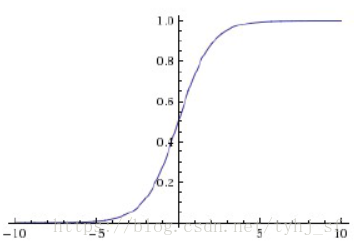
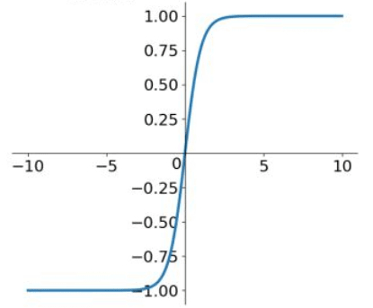

- [1. 基本定义](#1-基本定义)
	- [1.1 参数定义](#11-参数定义)
	- [1.2 神经元模型](#12-神经元模型)
- [2. 激活函数 $y=f(x)$](#2-激活函数-yfx)
	- [2.1 sigmod](#21-sigmod)
	- [2.2 tanh](#22-tanh)
	- [2.3 ReLU](#23-relu)
	- [2.4 ReLU改进](#24-relu改进)
	- [2.5 ELU](#25-elu)
	- [2.6 softmax](#26-softmax)
- [3. 前向传播与反向传播](#3-前向传播与反向传播)
	- [3.1 符号标记](#31-符号标记)
	- [3.2 前向传播](#32-前向传播)
	- [3.3 反向传播](#33-反向传播)
	- [3.4 梯度下降法](#34-梯度下降法)
	- [3.5 梯度消失与梯度爆炸](#35-梯度消失与梯度爆炸)
- [4. 损失函数](#4-损失函数)
	- [4.1 分类损失函数](#41-分类损失函数)
		- [4.1.1 cross entropy(交叉熵损失函数)](#411-cross-entropy交叉熵损失函数)
		- [4.1.2 BCE损失函数](#412-bce损失函数)
		- [4.1.3 Focal loss](#413-focal-loss)
	- [4.2 回归损失函数](#42-回归损失函数)
		- [4.2.1 L1、L2、smoothL1损失函数](#421-l1l2smoothl1损失函数)
		- [4.2.2 MSE(均方误差损失函数)](#422-mse均方误差损失函数)
- [5. 正则化](#5-正则化)
	- [5.1 L1正则化与L2正则化](#51-l1正则化与l2正则化)
	- [5.2 dropout正则化](#52-dropout正则化)
	- [5.3 Batch Normalization](#53-batch-normalization)
- [6. 优化器](#6-优化器)
	- [6.1 SGD、BGD、MBGD](#61-sgdbgdmbgd)
	- [6.2 指数加权移动平均值](#62-指数加权移动平均值)
	- [6.3 Momentum梯度下降法](#63-momentum梯度下降法)
	- [6.4 AdaGrad、RMSprop](#64-adagradrmsprop)
	- [6.5 Adam](#65-adam)
	- [6.7 学习率衰减](#67-学习率衰减)
- [7. 参数初始化](#7-参数初始化)
	- [7.1 全0初始化](#71-全0初始化)
	- [7.2 Xavier Initialization](#72-xavier-initialization)
	- [7.3 He Initialization](#73-he-initialization)
- [8. 神经网络结构、卷积神经网络](#8-神经网络结构卷积神经网络)
	- [8.1 卷积层](#81-卷积层)
	- [8.2 池化层](#82-池化层)
	- [8.3 BN层](#83-bn层)
	- [8.4 全连接层](#84-全连接层)

# 1. 基本定义

## 1.1 参数定义

* batchsize：在深度学习中，一般采用SGD训练，即一次训练选取的样本个数，batchsize的正确选择是为了在内存效率和内存容量之间寻找最佳平衡。适当的增加Batch_Size的优点：1.通过并行化提高内存利用率；2.单次epoch的迭代次数减少，提高运行速度（单次epoch=(全部训练样本/batchsize)/iteration=1）；3.适当的增加Batch_Size,梯度下降方向准确度增加，训练震动的幅度减小

* iteration：1个iteration等于使用batchsize个样本训练一次；一个迭代=一个正向传播+一个反向传播

* epoch：迭代次数，1个epoch等于使用训练集中的全部样本训练一次；一个epoch=所有训练样本的一个正向传播+一个反向传播

## 1.2 神经元模型

表达式：$y=f(x)=f(w1*x1+w2*x2+b)$，f(x)为激活函数

偏置b的作用：偏置的主要功能是为每一个节点提供可训练的常量值（在节点接收的正常输入以外）。偏置值允许将激活函数向左或向右移位，这可能是成功学习的关键

# 2. 激活函数 $y=f(x)$

激活函数作用：如果不用激活函数，在这种情况下每一层节点的输入都是上层输出的线性函数，无论神经网络有多少层，输出都是输入的线性组合，与没有隐藏层效果相当，那么网络的逼近能力就相当有限。正因为上面的原因，我们决定引入非线性函数作为激活函数，这样深层神经网络表达能力就更加强大（不再是输入的线性组合，而是几乎可以逼近任意函数）。

## 2.1 sigmod

表达式：$σ(x)=\frac{1}{1+e^{-x}}$

导数：$σ(x)=σ(x) \cdot (1-σ(x))$

优点：能够把输入的连续实值变换为0和1之间的输出，特别的，如果是非常大的负数，那么输出就是0；如果是非常大的正数，输出就是1

缺点：

1. 梯度消失：Sigmoid函数趋近0和1的时候变化率会变得平坦，也就是说，Sigmoid的梯度趋近于0。神经网络使用Sigmoid激活函数进行反向传播时，输出接近0或1的神经元其梯度趋近于0。这些神经元叫作饱和神经元。因此，这些神经元的权重不会更新。此外，与此类神经元相连的神经元的权重也更新得很慢。该问题叫作梯度消失。因此如果一个大型神经网络包含Sigmoid神经元，而其中很多个都处于饱和状态，那么该网络无法执行反向传播。

2. 输出不以0为中心：Sigmoid的output不是0均值。这是不可取的，因为这会导致后一层的神经元将得到上一层输出的非0均值的信号作为输入。产生的一个结果就是：如$x>0,z=w^Tx+b$，那么对w求局部梯度则都为正，这样在反向传播的过程中w要么都往正方向更新，要么都往负方向更新，导致有一种捆绑的效果，使得收敛缓慢。当然了，如果按batch去训练，那么那个batch可能得到不同的信号，所以这个问题还是可以缓解一下的。因此，非0均值这个问题虽然会产生一些不好的影响，不过跟上面提到的梯度消失问题相比还是要好很多的。

3. 计算成本高昂：解析式中含有幂运算，计算机求解时相对来讲比较耗时。对于规模比较大的深度网络，这会较大地增加训练时间。

## 2.2 tanh

表达式：$tanh(x)=\frac{e^x-e^{-x}}{e^x+e^{-x}}$

优点：tanh函数将其压缩至-1到1的区间内，输出以零为中心，因为区间在-1到1之间。负数输入被当作负值，零输入值的映射接近零，正数输入被当作正值

缺点：梯度消失、计算成本高昂

## 2.3 ReLU

表达式：$f(x)=max(0,x)$

优点：

1. 它不会饱和，即它可以对抗梯度消失问题，至少在正区域可以这样，因此神经元至少在一半区域中不会把所有零进行反向传播

2. 由于使用了简单的阈值化，ReLU计算效率很高

3. 收敛速度远快于sigmoid和tanh

缺点：

1. 不以零为中心：和 Sigmoid 激活函数类似，ReLU 函数的输出不以零为中心。

2. dead ReLU问题：前向传播过程中，如果x<0，则神经元保持非激活状态，且在后向传播中「杀死」梯度。这样权重无法得到更新，网络无法学习。有两个主要原因可能导致这种情况产生:(1)非常不幸的参数初始化，这种情况比较少见(2)学习率太高导致在训练过程中参数更新太大，不幸使网络进入这种状态。解决方法是可以采用Xavier初始化方法，以及避免将学习率设置太大或使用adagrad等自动调节学习率的算法。

3. 当x=0时，该点的梯度未定义，但是这个问题在实现中得到了解决，通过采用左侧或右侧的梯度的方式。

## 2.4 ReLU改进

1. Leaky ReLU

表达式：$f(x)=max(αx,x)$，α一般取0.1或0.01

优点：该函数一定程度上缓解了dead ReLU问题，但是使用该函数的结果并不连贯。尽管它具备ReLU激活函数的所有特征，如计算高效、快速收敛、在正区域内不会饱和

2. PReLU

表达式：$f(x)=max(αx,x)$，α为超参数

优点：引入了一个随机的超参数，它可以被学习，因为你可以对它进行反向传播。这使神经元能够选择负区域最好的梯度，有了这种能力，它们可以变成 ReLU 或 Leaky ReLU。

## 2.5 ELU

表达式：$f(x)=\left\{\begin{matrix}x & x>0 \\α(e^x-1) & otherwise\end{matrix}\right.$

优点：ReLU的基本所有优点，以及不会有Dead ReLU问题、输出的均值接近0，zero-centered

缺点：计算量稍大

## 2.6 softmax

不算是激活函数，一般用在多分类头网络中的最后一层，将多个神经元的输出得分score映射到(0,1)区间内，可以看成概率来理解，从而来进行多分类

表达式：$p_i=\frac{e^{s_i}}{∑_je^{s_j}}$

导数：$\frac{∂p_i}{∂s_c}=\left\{\begin{matrix}p_i⋅(1-p_i)&c=i\\-p_i⋅p_c&c!=i\end{matrix}\right.$

特点：将多个神经元的输出，映射到(0,1)区间内，这些值的和为1，可以看成概率来理解，从而来进行多分类

# 3. 前向传播与反向传播

## 3.1 符号标记

$参数^{第几层}_{本层第几个神经元(下一层第几个神经元)}$

$w^l_{jk}$表示第l-1层的第k个神经元连接到第l层的第j个神经元的权重

$b^l_j$表示第l层的第j个神经元的偏置

$z^l_j$表示第l层的第j个神经元的输入，即$z^l_j=∑_kw^l_{jk}a^{l-1}_k+b^l_j$

$a^l_j$表示第l层的第j个神经元的输出，即$a^l_j=σ(z^l_j)=σ(∑_kw^l_{jk}a^{l-1}_k+b^l_j)$

C表示损失函数，W表示权重矩阵，Z表示输入矩阵，A表示输出矩阵，Y表示GT(真实值)，L表示神经网络层数

## 3.2 前向传播

$z^l=w^la^{l-1}+b^l$

$a^l=σ(z^l)=σ(w^la^{l-1}+b^l)$

## 3.3 反向传播

1. 定义

误差对参数的求导使用链式求导，如$\frac{∂e^3_1}{∂b^3_1}=\frac{∂e^3_1}{∂a^3_1}⋅\frac{∂a^3_1}{∂z^3_1}⋅\frac{∂z^3_1}{∂b^3_1}$

定义$δ^l_j=\frac{∂C}{∂z^l_j}$为第l层第j个神经元上的误差，即为损失函数C对于当前带权输入($z^l_j$)求偏导

⊙为矩阵对应元素乘积

2. 公式

* 输出层的误差：$δ^L=∇_aC⊙σ'(Z^L)$

* 隐藏层的误差：$δ^l=((w^{l+1})^Tδ^{l+1})⊙σ'(Z^l)$

* 偏置梯度：$\frac{∂C}{∂b^l_j}=δ^l_j$

* 权重梯度：$\frac{∂C}{∂w^l_{jk}}=a^{l-1}_k⋅δ^l_j$

3. 推导

输出层误差：

∵ $δ^L_j=\frac{∂C}{∂z^L_j}=\frac{∂C}{∂a^L_j}⋅\frac{∂a^L_j}{∂z^L_j}=\frac{∂C}{∂a^L_j}⋅σ'(z^L_j)$

∴ $δ^L=\frac{∂C}{∂a^L}⊙\frac{∂a^L}{∂z^L}=∇_aC⊙σ'(Z^L)$

隐藏层误差：

∵ $δ^l_j=\frac{∂C}{∂z^l_j}=∑_k\frac{∂C}{∂z^{l+1}_k}⋅\frac{∂z^{l+1}_k}{∂a^l_j}⋅\frac{∂a^l_j}{∂z^l_j}=∑_kδ^{l+1}_k⋅\frac{∂(w^{l+1}_{kj}a^l_j+b^{l+1}_k)}{∂a^l_j}⋅σ'(z^l_j)=∑_kδ^{l+1}_k⋅w^{l+1}_{kj}⋅σ'(z^l_j)$

∴ $δ^l=((w^{l+1})^Tδ^{l+1})⊙σ'(Z^l)$

偏置梯度：$\frac{∂C}{∂b^l_j}=\frac{∂C}{∂z^l_j}⋅\frac{∂z^l_j}{∂b^l_j}=δ^l_j⋅\frac{∂w^l_{jk}a^{l-1}_k+b^l_j}{∂b^l_j}=δ^l_j$

权重梯度：$\frac{∂C}{∂w^l_{jk}}=\frac{∂C}{∂z^l_j}⋅\frac{∂z^l_j}{∂w^l_{jk}}=δ^l_j⋅\frac{∂w^l_{jk}a^{l-1}_k+b^l_j}{∂w^l_{jk}}=a^{l-1}_kδ^l_j$

4. 反向传播伪代码

输入训练集

对训练集中的每个样本x，设置输入层的激活值

前向传播：$z^l=w^la^{l-1}+b^l$、$a^l=σ(z^l)=σ(w^la^{l-1}+b^l)$

计算输出层产生的误差：$δ^L=∇_aC⊙σ'(Z^L)$

反向传播误差：$δ^l=((w^{l+1})^Tδ^{l+1})⊙σ'(Z^l)$

使用梯度下降法训练参数：$w^l→w^l-\frac{η}{m}∑_xδ^{x,l}(a^{x,l-1})^T$、$b^l→b^l-\frac{η}{m}∑_xδ^{x,l}$

## 3.4 梯度下降法

在单变量的函数中，梯度就是函数的微分，代表函数在某个给定点的的切线的斜率

在多变量函数中，梯度时一个向量，向量有方向，梯度的方向就指出了函数在给定点的上升最快的方向

$J(θ+Δθ)≃J(θ)+Δθ∇J(θ)$，所以可令$Δθ=-α∇J(θ)$，保证$Δθ∇J(θ)=-α(∇J(θ))^2<0$，其中α>0

算法过程：

1. 确定当前位置的损失函数的梯度$∇J(θ)$

2. 用步长乘以损失函数的梯度，得到当前位置下降的距离，即$α∇J(θ)$

3. 确定θ向量里面的每个值,梯度下降的距离都小于ε，如果小于ε则算法终止，当前θ向量即为最终结果。否则进入步骤4

4. 更新θ向量$θ=θ-α∇J(θ)$。更新完毕后继续转入步骤1.

## 3.5 梯度消失与梯度爆炸

深度神经网络中，根据W的取值不同，深度神经网络的激活函数将爆炸式增长或者以指数级下降，同样也适用于与层数L相关的导数或梯度函数

梯度爆炸和梯度消失问题都是因为网络太深，网络权值更新不稳定造成的，本质上是因为梯度反向传播中的连乘效应。对于更普遍的梯度消失问题，可以考虑用ReLU激活函数取代sigmoid激活函数

当$|w_jσ'(z_j)|<1$时，前面的层比后面的层的梯度变化更小，故变化更慢，从而引起了梯度消失问题

当$|w_jσ'(z_j)|>1$时，前面的层比后面的层的梯度变化更大，故变化更快，从而引起了梯度消失爆炸

从深层网络角度来讲，不同的层学习的速度差异很大，表现为网络中靠近输出的层学习的情况很好，靠近输入的层学习的很慢，有时甚至训练了很久，前几层的权值和刚开始随机初始化的值差不多。因此，梯度消失、爆炸，其根本原因在于反向传播训练法则

解决方案：添加梯度阈值、采用正则化、使用ReLU,ELU等激活函数、batch normalization、ResNet

# 4. 损失函数

损失函数用来评价模型的预测值和真实值不一样的程度，损失函数越好，通常模型的性能越好。不同的模型用的损失函数一般也不一样。

## 4.1 分类损失函数

### 4.1.1 cross entropy(交叉熵损失函数)

1. 表达式

二分类表达式：$L=-\frac{1}{n}∑_i[y_i⋅lnp_i+(1-y_i)⋅ln(1-p_i)]$

其中$y_i$为样本label正类为1，负类为0；$p_i$为样本i预测为正类的概率

多分类表达式：$L=\frac{1}{n}∑_iL_i=-\frac{1}{n}∑_i∑_{c=1}^My_{ic}ln(p_{ic})$

其中M为类别的数量；$y_{ic}$为样本label，如果样本i的真实类别为c取1，否则取0

2. 性质：

交叉熵函数是凸函数，求导时能够得到全局最优值

通常用法：神经网络最后一层得到每个类别的得分scores，得分经过sigmod(或softmax)函数获得概率输出，模型预测的类别概率输出进行交叉熵损失函数计算

当使用sigmoid作为激活函数的时候，常用交叉熵损失函数而不用均方误差损失函数，因为它可以完美解决平方损失函数权重更新过慢的问题，具有“误差大的时候，权重更新快；误差小的时候，权重更新慢”的良好性质

二分类使用sigmod激活函数，或者多分类使用softmax函数时，$\frac{∂L_i}{∂w_i}=(p_i-y_i)⋅x_i$、$\frac{∂L_i}{∂b_i}=(p_i-y_i)$

当使用MSE损失函数时，$\frac{∂L_i}{∂w_i}=(p_i-y_i)⋅σ'(z)⋅x_i$、$\frac{∂L_i}{∂b_i}=(p_i-y_i)⋅σ'(z)$

3. 优点：模型效果越差时，误差越大，偏导值$(p_i-y_i)⋅x_i$越大，模型学习速度更快

4. 缺点：

随着分类数目的增大，分类层的线性变化矩阵参数也随着增大

对于封闭集分类问题，学习到的特征是可分离的，但对于开放集人脸识别问题，所学特征却没有足够的区分性。对于人脸识别问题，首先人脸数目(对应分类数目)是很多的，而且会不断有新的人脸进来，不是一个封闭集分类问题

sigmoid(softmax)+cross-entropy loss 擅长于学习类间的信息，因为它采用了类间竞争机制，它只关心对于正确标签预测概率的准确性，忽略了其他非正确标签的差异，导致学习到的特征比较散

### 4.1.2 BCE损失函数

BCE损失函数即为binary cross entropy loss，二分类交叉熵函数

表达式：$L=-[y_i⋅lnp_i+(1-y_i)⋅ln(1-p_i)]$

### 4.1.3 Focal loss

1. 表达式：$FL(p_t)=-α_t(1-p_t)^γlog(p_t)$

预测输出 $p_t=\left\{\begin{matrix}p&y=1\\1-p&otherwise\end{matrix}\right.$

正负样本平衡 $α_t=\left\{\begin{matrix}α&y=1\\1-α&otherwise\end{matrix}\right.$

难易样本平衡 $(1-p_t)^γ$

2. 推导：

∵ 交叉熵损失函数：$CE(p,y)=-[y_i⋅lnp_i+(1-y_i)⋅ln(1-p_i)]=\left\{\begin{matrix}-log(p)&y=1\\-log(1-p)&otherwise\end{matrix}\right.$

令$p_t=\left\{\begin{matrix}p&y=1\\1-p&otherwise\end{matrix}\right.$

∴ $CE(p,y)=CE(p_t)=-log(p_t)$

通过$α_t$来控制正负样本对总loss的贡献权重

通过调制系数γ来控制难易样本对总loss的贡献权重：

分类结果越好时(即为简单样本时)，$p_t$越大(接近于1)，$(1-p_t)$越接近于0，通过γ幂运算之后值被减小的更多；

分类结果越差时(即为困难样本时)，$p_t$越小(接近于0)，$(1-p_t)$越接近于1，通过γ幂运算之后值被减小的更少

因此可以通过$(1-p_t)^γ$控制难易样本对总loss的贡献权重，且当γ为0时退化为交叉熵损失函数

1. 作用：

Focal loss主要是为了解决one-stage目标检测中样本的类别不均衡的问题。负样本数量太大，占总的loss的大部分，而且多是容易分类的，因此使得模型的优化方向并不是我们所希望的那样。Focal loss可以通过减少易分类样本的权重，使得模型在训练时更专注于难分类的样本。

## 4.2 回归损失函数

### 4.2.1 L1、L2、smoothL1损失函数

1. 表达式：

L1损失函数表达式：$L_1=∑_i|y_i-p_i|$

L2损失函数表达式：$L_2=∑_i(y_i-p_i)^2$

smooth L1损失函数：$Smooth\ L_1=\left\{\begin{matrix}0.5x^2&|x|<1\\|x|-0.5&otherwise\end{matrix}\right.$

2. 区别与联系：

L1比L2鲁棒性好

L1的解不稳定，L2具有稳定解

L1可能有多个解，L2总是只有一个解

smooth L1对离群点更加鲁棒，与L2相比，对离群点、异常值不敏感，可控制梯度的量级使训练时不容易跑飞

### 4.2.2 MSE(均方误差损失函数)

1. 表达式：

MSE表达式：$MSE=\frac{1}{n}∑_i(y_i-p_i)^2$

均方根误差损失函数RMSE表达式：$RMSE=\sqrt{MSE}=\sqrt{\frac{1}{n}∑_i(y_i-p_i)^2}$

2. MSE优点：

简单

提供了具有很好性质的相似度的度量：1.它是非负的；2.唯一确定性。只有x=y的时候，d(x,y)=0；3.它是对称的，即d(x,y)=d(y,x)；4.符合三角性质。即d(x,z)<=d(x,y)+d(y,z).

物理性质明确，在不同的表示域变换后特性不变，例如帕萨瓦尔等式。

便于计算。通常所推导得到的问题是凸问题，具有对称性，可导性。通常具有解析解，此外便于通过迭代的方式求解。

和统计和估计理论具有关联。在某些假设下，统计意义上是最优的。

3. MSE缺点：

偏导值在输出概率值接近0或者接近1的时候非常小，这可能会造成模型刚开始训练时，偏导值几乎消失。这导致模型在一开始学习的时候速率非常慢，而使用交叉熵作为损失函数则不会导致这样的情况发生

信号的保真度和该信号的空间和时间顺序无关。即，以同样的方法，改变两个待比较的信号本身的空间或时间排列，它们之间的误差不变。例如，[1,2,3],[3,4,5]两组信号的MSE和[3,2,1],[5,4,3]的MSE一样。

误差信号和原信号无关。只要误差信号不变，无论原信号如何，MSE均不变。例如，对于固定误差[1,1,1]，无论加在[1,2,3]产生[2,3,4]还是加在[0,0,0]产生[1,1,1]，MSE的计算结果不变。

信号的保真度和误差的符号无关。即对于信号[0,0,0]，与之相比较的两个信号[1,2,3]和[-1,-2,-3]被认为和[0,0,0]具有同样的差别。

信号的不同采样点对于信号的保真度具有同样的重要性。

# 5. 正则化

在训练数据不够多时，或者过度训练时，常常会导致过拟合。正则化方法即为在此时向原始模型引入额外信息，以便防止过拟合和提高模型泛化性能的一类方法的统称。

## 5.1 L1正则化与L2正则化

在原始损失函数$L_0$后面添加惩罚项

通常只正则化w而不正则化b，因为w通常是一个高维参数矢量，已经可以表达高偏差问题

1. L1正则化

表达式：$L=L_0+λ∑_j|w_j|$，即为在原来的损失函数上添加权重参数的绝对值

2. L2正则化

表达式：$L=L_0+λ∑_jw^2_j$，即为在原来的损失函数上添加权重参数的平方和

3. 正则化参数λ

损失函数实际上包含了两个方面：一个是训练样本误差。一个是正则化项。其中，参数λ起到了权衡的作用

λ越大，权重矩阵W就被设置为接近于0的值，Z也会相对变小，激活函数相对呈线性，这个神经网络会计算离线性函数近的值，消除或者减少许多隐藏节点的影响，使神经网络变得简单，这样不容易发生过拟合现象。但过大容易欠拟合

λ越小，权重矩阵W能够取值的范围就越大，这时正则化容易失效进而过拟合

4. 区别与联系

L1正则化会产生稀疏权重矩阵，L2正则化会使权重更接近于0，用于防止过拟合

L2的限定区域是平滑的，与中心点等距；而L1的限定区域是包含凸点的，尖锐的。这些凸点更接近$L_0$的最优解位置，而在这些凸点上，很多$w_j$为0，即w最终会是稀疏的。

在二维的情况下，L1正则化是以原点为中心的正方形，四个顶点均在坐标轴上，而L2正则化则是以原点为中心的圆形

## 5.2 dropout正则化

dropout是指在深度学习网络的训练过程中，对于神经网络单元，按照一定的概率将其**暂时**从网络中丢弃。对于随机梯度下降来说，由于是随机丢弃，故而每一个mini-batch都在训练不同的网络。

随机失活正则化，按照一定概率公式消除一些节点并删除连线，然后进行训练。主要用在计算机视觉领域，缺点是损失函数不再被明确定义，所以最好先不使用dropout，确定损失函数单调递减之后再使用dropout

## 5.3 Batch Normalization

见[8.3 BN层](#83-bn层)

# 6. 优化器

## 6.1 SGD、BGD、MBGD

方法对应于[3.4 梯度下降法](#34-梯度下降法)

$θ=θ-α∇J(θ)$，θ可取w或b：$w=w-α∇J(w)$、$b=b-α∇J(b)$

1. BGD(批量梯度下降法)：在更新参数时使用所有的样本来进行更新

	* 优点：每次迭代都需要把所有样本都送入，这样的好处是每次迭代都顾及了全部的样本，能保证做的是全局最优化

	* 缺点：由于这种方法是在一次更新中，就对整个数据集计算梯度，所以计算起来非常慢，遇到很大量的数据集也会非常棘手，而且不能投入新数据实时更新模型

2. SGD(随机梯度下降法)：与BGD原理类似，区别在与求梯度时仅仅选取一个样本来求梯度

	* 优点：仅采用一个样本来迭代，训练速度快；通过调节采样数据的大小，易于使用有限的内存

	* 缺点：
		1. 准确度差，仅用一个样本决定梯度方向，导致解很有可能不是最优

		2. 收敛速度慢，一次迭代一个样本，导致迭代方向变化很大，并不是每次迭代都向着整体最优化方向，不能很快的收敛到局部最优解，并且SGD永远都不会收敛，会一直在最小值附近波动

		3. 学习率难以选择；(学习率太小，梯度下降的步伐比较慢，训练的时间长；学习率太大，在凸函数最优解位置会来回震荡，难以收敛。所以一般随着训练不断的降低学习率)

3. MBGD(小批量梯度下降法)：把训练集分割为小一点的子训练集，对输入和输出都要进行拆分，使用mini-batch梯度下降法，则并不是每一次迭代的损失函数都是下降的

	* Mini-Batch大小为m时得到BGD，单次迭代耗时太长；Mini-Batch大小为1时得到SGD，失去向量化的加速，效率低下，SGD永远不会收敛，会一直在最小值附近波动

	* Mini-Batch大小选择：如果训练集较小(小于2k个样本)，直接使用batch梯度下降法，如果梯度较大，Mini-Batch大小一般为64~512,2的幂更容易计算

	* 缺点：MBGD不能保证很好的收敛性，learning rate如果选择的太小，收敛速度会很慢，如果太大，损失函数就会在极小值处不停地震荡甚至偏离。对于非凸函数，还要避免陷于局部极小值处，或者鞍点处

## 6.2 指数加权移动平均值

各数值的加权系数随时间呈指数式递减，越靠近当前时刻的数值加权系数就越大，即一阶滤波

$V_t=βV_{t-1}+(1-β)θ_t=(1-β)∑^t_{i=1}β^{t-i}θ_i$

β代表了现在的θ之前的$\frac{1}{1-β}$个θ有关

修正偏差：如果将$V_0$初始化为0，那么在计算的初期$V_t$会偏小，所以预测的值采用$V_t=\frac{V_t}{1-β^t}=\frac{βV_{t-1}+(1-β)θ_t}{1-β^t}$，随着t的增加，$β^t$接近于0，所以当t很大时，偏差修正几乎没有作用。但在实际使用时很少采用偏差修正，因为过了最初的阶段数值就正常了、如果对于前期的局部平均值的精度没有要求，可以不用使用偏差修正，偏差修正主要是针对前期的局部平均值的误差

## 6.3 Momentum梯度下降法

在第t次迭代的过程中，用现有的Mini-Batch计算dW、db，将$V_{dw}$、$V_{db}$采用一阶滑动滤波进行计算

$V_{dθ}=βV_{dθ}+(1-β)dθ$ ==> $θ=θ-αV_{dθ}$

β常用值为0.9

由于动量积攒了历史的梯度，如果点P前一刻的梯度与当前的梯度方向几乎相反。因此原本在P点原本要大幅徘徊的梯度，主要受到前一时刻的影响，而导致在当前时刻的梯度幅度减小，允许使用一个更大的学习率，收敛速度快

直观上讲就是，要是当前时刻的梯度与历史时刻梯度方向相似，这种趋势在当前时刻则会加强；要是不同，则当前时刻的梯度方向减弱。

## 6.4 AdaGrad、RMSprop

1. AdaGrad

将参数的每一次迭代的梯度取平方累加后开方，用全局学习率除以这个数，作为学习率的动态更新，从而达到自适应学习率的效果

$S_{dθ}=S_{dθ}+(dθ)^2$ ==> $θ=θ-\frac{αdθ}{\sqrt{S_{dθ}+ε}}$

其中平方操作为逐元素的，为了保证分母不为0，在分母上添加常数ε，一般取值为1e-8

当dθ较大时，$(dθ)^2$会较大，进而$S_{dθ}$也会较大，最终使得$\frac{dθ}{\sqrt{S_{dθ}+ε}}$等结果变得非常小

2. RMSprop

root mean square prop(均方根)：对参数的梯度使用平方加权平均数，即对AdaGrad方法使用一阶滤波

$S_{dθ}=βS_{dθ}+(1-β)(dθ)^2$ ==> $θ=θ-\frac{αdθ}{\sqrt{S_{dθ}+ε}}$

RMSProp有助于减少抵达最小值路径上的摆动，并允许使用一个更大的学习率α，从而加快算法学习速度

## 6.5 Adam

将Momentum算法和RMSProp算法结合起来使用，能够达到防止梯度的摆幅过大，同时还能够加快收敛速度

1. 初始化

梯度的累积量：$V_{dθ}=0$

梯度的平方累积量：$S_{dθ}=0$

2. Momentum和RMSprop参数更新

Momentum：$V_{dθ}=β_1V_{dθ}+(1-β_1)dθ$

RMSprop：$S_{dθ}=β_2S_{dθ}+(1-β_2)(dθ)^2$

3. (可选的)偏差修正：$V_t=\frac{V_t}{1-β^t_1}$、$S_t=\frac{S_t}{1-β^t_2}$

4. 计算得到：$θ=θ-\frac{αV_{dθ}}{\sqrt{S_{dθ}}+ε}$

常用默认值：$β_1=0.9$、$β_2=0.999$、$ε=1e-8$

优点：

1.当前更新梯度与上一次更新的梯度不会相差太大，即梯度平滑、稳定的过度，可以适应不稳定的目标函数；

2.可以为不同参数产生自适应的学习率

3.超参数通常无需调整或仅需要很少的微调

4.参数更新的大小不随着梯度大小的缩放而变化

5.更新参数时的步长的边界受限于超参的步长的设定

6.不需要固定的目标函数

7.支持稀疏梯度

8.它能够自然的执行一种步长的退火

缺点：1.可能不收敛；2.可能错过全局最优解

trick：

1.adam可以结合Nesterov approach进行修正

2.adam尽管有步长自动退火的功能，但是仍然可以手动设置学习率的递减，并且会有比较好的效果

3.考虑到其收敛性问题，adam可以结合SGD同时使用，即先进行Adam训练，再进行SGD

## 6.7 学习率衰减

固定学习率缺点：在最小值点附近，由于不同的batch中存在一定的噪声，因此不会精确收敛，而是始终在最小值周围一个较大的范围内波动

如果随着时间慢慢减少学习率α的大小，在初期α较大时，下降的步长较大，能以较快的速度进行梯度下降；而后期逐步减小α的值，即减小步长，有助于算法的收敛，更容易接近最优解

例如：$α=\frac{α_0}{1+d⋅e}$、$α=0.95^{e}⋅α_0$等，其中d为dacay rate衰减率，需要调整的超参数；e为epoch数目，$α_0$为超参数

# 7. 参数初始化

## 7.1 全0初始化

如果把初始权重w全初始化为0，则通过归纳法可以证明同一层的不同节点的计算是对称的，那么神经网络就是对称的。不管是哪个神经元，它的前向传播和反向传播的算法都是一样的，如果初始值也一样的话，不管训练多久，它们最终都一样，都无法打破对称,那每一层就相当于只有一个神经元，最终L层神经网络就相当于一个线性的网络

因此w必须随机初始化，此时b可以不需要随机初始化，因为w随机初始化之后就已经打破了对称，所以在w随机初始化之后b可以初始化为0

## 7.2 Xavier Initialization

w初始化服从均匀分布：$U[-\frac{\sqrt{6}}{\sqrt{n_{in}+n_{out}}},\frac{\sqrt{6}}{\sqrt{n_{in}+n_{out}}}]$

其中$n_{in}$为输入参数数目，即上一层神经网络节点数，$n_{out}$为输出参数数目，即本层神经网络节点数

## 7.3 He Initialization

适用于ReLU激活函数

w初始化服从均匀分布：$U[-\sqrt{\frac{6}{n_{in}}},\sqrt{\frac{6}{n_{in}}}]$

其中$n_{in}$为输入参数数目，即上一层神经网络节点数

# 8. 神经网络结构、卷积神经网络

## 8.1 卷积层

1. 维度计算

$output=\left\lfloor\frac{input +2p-f}{s}+1\right\rfloor$

上式中input为输入图像边长，p为padding大小，f为卷积核边长，s为卷积步长，将结果向下取整

输入图像的channel=卷积核的channel

卷积核的数目=输出图像的channel

反向传播公式：$δ^l=δ^{l+1}⋅\frac{∂z^{l+1}}{∂z^l}=δ^{l+1}*rot180(w^l)⊙σ'(Z^l)$

2. 卷积核

二维卷积为输入图像与卷积核对应位置的权重相乘，在加上bias即为输出

若输入图像有多个channel，则卷积核的channel与输入图像的channel相同，分别在每个二维矩阵上进行卷积计算，然后将所有channel的卷积结果相加得到一个输出

padding作用：保留边界信息；保证经过卷积后的特征图与原来的图尺寸一致

3. 卷积层作用

和只用全连接层相比，卷积层的优点在于参数少，主要在于参数共享和稀疏链接。这样我们可以使用更小的训练集来训练，从而预防过度拟合

参数共享：特征检测(如垂直边缘检测)如果适用于图片的某个区域，那么他也可能适用于图片的其他区域

稀疏连接：在每一层，每个输出值都仅依赖于一点输入值

平移不变性：卷积神经网络善于捕捉平移不变，图像平移几个像素之后仍然可以识别

4. 1X1卷积层作用

实现全卷积神经网络中用1X1的卷积层替换到全连接层，这样可以不限制输入图片大小的尺寸，使网络更灵活

实现跨通道的交互和信息整合

进行卷积核通道数的降维和升维

1X1卷积给神经网络添加了一个非线性函数，从而减少或保持或增加输入层中的信道数量

5. 感受野 receptive field

定义：卷积神经网络每一层输出的feature map上的像素点在输入图片上映射区域大小

计算：从最后一层开始往前计算，最后一层feature map的感受野大小为该层卷积核大小，往前计算过程中不考虑padding

计算公式：$RF_i=(RF_{i+1}-1)⋅s_i+f_i$，其中$RF_i$为第i层感受野大小，$s_i$为第i层卷积步长，$f_i$为第i层卷积核大小

有效感受野：并不是感受野内所有像素对输出向量的贡献相同，在很多情况下感受野区域内像素的影响分布是高斯，有效感受野仅占理论感受野的一部分，且呈高斯分布从中心到边缘快速衰减

## 8.2 池化层

作用：缩减模型的大小，压缩数据和图像，提高计算速度，减小过拟合，同时提高所提取特征的鲁棒性。在图像识别领域，池化还具有平移和旋转不变性，实际上是一种降采样方式

最大池化：在滤波器内取最大值，很少使用padding

平均池化：取滤波器范围内的平均值，不常用，但是非常深的神经网络可以用平均层来分解网络的表示层

全局池化：将w\*h\*d的一个张量变为1\*1\*d的张量

多维池化层的处理方式与卷积层不同，多维池化层对输入图像的每个channel分别进行池化计算，所以输入图像channel=输出图像channel

池化层中梯度下降无需改变任何值，具有超参数s、p

反向传播公式：$δ^l=upsample(δ^{l+1})⊙σ'(Z^l)$

## 8.3 BN层

批量归一化(Batch Normalization)

1. 计算公式

输入：一个mini-batch中的左右的参数$x_i$、待学习参数γ,β

输出：$y_i=BN_{γ,β}(x_i)$

$μ_B=\frac{1}{m}∑^m_{i=1}x_i$

$σ^2_B=\frac{1}{m}∑^m_{i=1}(x_i-μ_B)^2$

$x'_i=\frac{x_i-μ_B}{\sqrt{σ^2_B+ε}}$，ε为小常数，实现数值稳定性

$y_i=γx'_i+β$

2. 反向传播公式

下式中l为损失函数loss

$\frac{∂l}{∂x'_i}=\frac{∂l}{∂y_i}⋅γ$

$\frac{∂l}{∂σ^2_B}=∑^m_{i=1}\frac{∂l}{∂x'_i}⋅\frac{∂x'_i}{∂σ^2_B}=∑^m_{i=1}\frac{∂l}{∂x'_i}⋅(x_i-μ_B)⋅\frac{-1}{2}(σ^2_B+ε)^{-3/2}$

$\frac{∂l}{∂μ_B}=(∑^m_{i=1}\frac{∂l}{∂x'_i}⋅\frac{∂x'_i}{∂μ_B})+\frac{∂l}{∂σ^2_B}⋅\frac{∂σ^2_B}{∂μ_B}=(∑^m_{i=1}\frac{∂l}{∂x'_i}⋅\frac{-1}{\sqrt{σ^2_B+ε}})+\frac{∂l}{∂σ^2_B}⋅\frac{-2}{m}∑^m_{i=1}(x_i-μ_B)$

$\frac{∂l}{∂x_i}=\frac{∂l}{∂x'_i}⋅\frac{∂x'_i}{∂x_i}+\frac{∂l}{∂σ^2_B}⋅\frac{∂σ^2_B}{∂x_i}+\frac{∂l}{∂μ_B}⋅\frac{∂μ_B}{∂x_i}=\frac{∂l}{∂x'_i}⋅\frac{1}{\sqrt{σ^2_B+ε}}+\frac{∂l}{∂σ^2_B}⋅\frac{2(x_i-μ_B)}{m}+\frac{∂l}{∂μ_B}⋅\frac{1}{m}$

$\frac{∂l}{∂β}=∑^m_{i=1}\frac{∂l}{∂y_i}$

3. 作用

**可以使用更高的学习率**：如果每层的scale不一致，实际上每层需要的学习率是不一样的，同一层不同维度的scale往往也需要不同大小的学习率，通常需要使用最小的那个学习率才能保证损失函数有效下降，Batch Normalization将每层、每维的scale保持一致，那么我们就可以直接使用较高的学习率进行优化。

**移除或使用较低的dropout**： dropout是常用的防止过拟合的方法，而导致过拟合的位置往往在数据边界处，如果初始化权重就已经落在数据内部，过拟合现象就可以得到一定的缓解

**防止过拟合**：在网络的训练中，BN的使用使得一个mini batch中所有样本都被关联在了一起，因此网络不会从某一个训练样本中生成确定的结果，即同样一个样本的输出不再仅仅取决于样本的本身，也取决于跟这个样本同属一个batch的其他样本，而每次网络都是随机取batch，可以看做一种数据增强，一定程度上避免了过拟合

**加快网络的训练和收敛的速度**：在深度神经网络中中，如果每层的数据分布都不一样的话，将会导致网络非常难收敛和训练，而如果把每层的数据都在转换在均值为零，方差为1的状态下，这样每层数据的分布都是一样的训练会比较容易收敛

**控制梯度爆炸，防止梯度消失**

减少对初始化的依赖

4. 缺点：

bn改变了输入源数据的分布，输入数据丢失了一部分的特征---处理方式：通过最后的$y_i=γx'_i+β$线性变化最后有加上了一部分的信息

batch size较小的时候效果较差---使用LN

因为样本的长度不一样，RNN里无法效果不好

强化学习、GAN里面效果不好

5. 为什么BN层一般用在线性层和卷积层后面，而不是放在非线性单元后

因为非线性单元的输出分布形状会在训练过程中变化，归一化无法消除他的方差偏移，相反的，全连接和卷积层的输出一般是一个对称,非稀疏的一个分布，更加类似高斯分布，对他们进行归一化会产生更加稳定的分布

像ReLU这样的激活函数，如果你输入的数据是一个高斯分布，经过他变换出来的数据能是一个什么形状？小于0的被抑制了，也就是分布小于0的部分直接变成0了，这样不是很高斯了

6. BN、LN、IN、GN

batch、layer、instance、group

输入维度为[bs, h, w, c]，其中bs为batch size大小，h与w为图像大小，c为图像channel数目

BN是对[bs, h, w]维度进行归一化计算得到一个均值和标准差，总共c组产生参数

BN的一个缺点是需要较大的batch size才能合理训练数据的均值和方差，需要较大显存，同时很难应用在数据长度不同的RNN模型上，而LN的一个优势是不需要批训练，在单条数据内部就能归一化

LN是对每个样本的[h, w, c]维度上的数据归一化，保留bs维度，常用在RNN

IN是对[h, w]归一化，常用在风格迁移，如果特征图可以用到通道之间的相关性，那么就不建议使用它做归一化处理

GN介于LN和IN之间，适用于占用显存比较大的任务。首先将channel分为许多组，将feature map的维度由[bs, h, w, c]reshape为[bs⋅g, h, w, c//g]，归一化的维度为[h, w, c//g]。当g=1时GN为LN，当g=c时GN为IN

对于BN，IN，GN，其γ和β都是维度等于通道数c的向量。而对于LN，其γ和β都是维度等于normalized_shape的矩阵

## 8.4 全连接层

fully connected layers，FC

1. 计算

全连接层为1⋅n个神经元，若全连接层前面为卷积层，则n为卷积层所用卷积核的数目；若全连接层前面为全连接层，则就是f=Wx+b

前层是FC的FC可以转化为卷积核为1⋅1的卷积，前层是卷积层的FC可以转换为卷积核为h⋅w的全局卷积

2. 作用

在整个卷积神经网络中起到分类器的作用。如果说卷积层、池化层和激活函数层等操作是将原始数据映射到隐层特征空间的话，全连接层则起到将学到的"分布式特征表示"映射到样本标记空间的作用，大大减少位置特征对分类带来的影响
