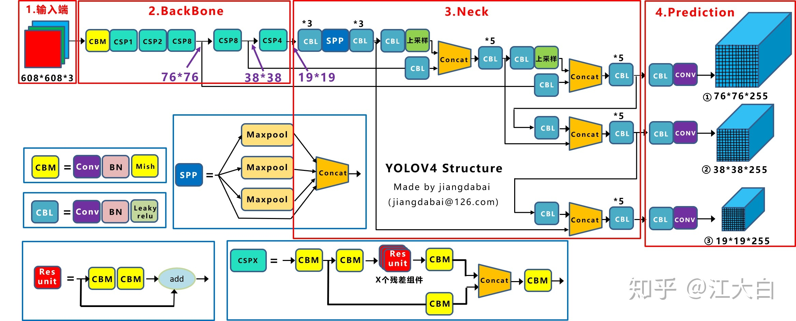
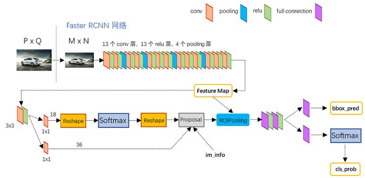
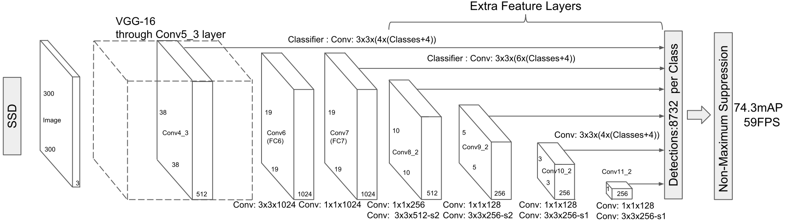

- [常用参数、方法](#常用参数方法)
	- [IOU](#iou)
	- [NMS](#nms)
	- [attention](#attention)
- [评价指标](#评价指标)
	- [二分类评价指标](#二分类评价指标)
		- [混淆矩阵](#混淆矩阵)
		- [accuracy、precision、recall、miss rate](#accuracyprecisionrecallmiss-rate)
		- [F1、MCC](#f1mcc)
		- [ROC、AUC](#rocauc)
		- [PR曲线](#pr曲线)
		- [ROC与PR的选择](#roc与pr的选择)
	- [多分类评价指标](#多分类评价指标)
		- [AP、mAP](#apmap)
- [常用算法](#常用算法)
	- [YOLO](#yolo)
		- [YOLO v1](#yolo-v1)
		- [YOLO v2](#yolo-v2)
		- [YOLO v3](#yolo-v3)
		- [YOLO v4](#yolo-v4)
		- [YOLO v5](#yolo-v5)
	- [Faster RCNN](#faster-rcnn)
		- [Backbone](#backbone)
		- [RPN](#rpn)
		- [RoI Polling](#roi-polling)
		- [Head](#head)
	- [FPN](#fpn)
		- [网络结构](#网络结构)
	- [SSD](#ssd)
		- [创新点](#创新点)
		- [怎样设置default boxes(anchor)](#怎样设置default-boxesanchor)
		- [怎样对anchor进行匹配](#怎样对anchor进行匹配)
		- [负样本选择](#负样本选择)
		- [怎样得到预测的检测结果](#怎样得到预测的检测结果)
		- [anchor到gt的偏差映射关系](#anchor到gt的偏差映射关系)
- [行人检测](#行人检测)
	- [密集行人检测](#密集行人检测)
- [trick](#trick)
	- [正负样本判别](#正负样本判别)
	- [困难样本挖掘](#困难样本挖掘)
- [anchor & anchor-free](#anchor--anchor-free)
	- [anchor](#anchor)
	- [anchor free](#anchor-free)


α
β
γ
θ
δ
μ
ε
η
∂
σ
∑
⋅
∵
∴


常用方法：attention

常用网络：ResNet

常用算法：RetinaNet

two stage与one stage

# 常用参数、方法

## IOU

交并比(Intersection over Union, IOU)

预测输出与GT的交集与并集的比值

```Python
def IOU(box1, box2):
	"""
	box:[top, left, bottom, right]
	"""
	in_h = min(box1[2], box2[2]) - max(box1[0], box2[0])
	in_w = min(box1[3], box2[3]) - max(box1[1], box2[1])
	if in_h < 0 or in_w < 0:
		inter = 0
	else:
		inter = in_h * in_w
	union = (box1[2] - box1[0]) * (box1[3] - box1[1]) +
			(box2[2] - box2[0]) * (box2[3] - box2[1]) - inter
	iou = inter / union
	return iou
```

## NMS

非最大值抑制(Non-Maximum Suppression, NMS)

* 原理

对于bbox的列表B及其对应的置信度S,采用下面的计算方式：选择具有最大score的检测框M，将其从B集合中移除并加入到最终的检测结果D中。通常将B中剩余检测框中与M的IoU大于阈值Nt的框从B中移除。重复这个过程，直到B为空。常用阈值是0.3~0.5

```Python
def NMS(dets, threshold):
	"""
	dets:(bboxNums, 5), [top, left, bottom, right, score]
	"""
	x1 = dets[:, 0]
	y1 = dets[:, 1]
	x2 = dets[:, 2]
	y2 = dets[:, 3]
	scores = dets[:, 4]

	# 计算每个bbox的面积
	areas = (x2 - x1 + 1) * (y2 - y1 + 1)
	# 按照score置信度降序排序，其中argsort为
	order = scores.argsort()[::-1]

	keep = []	# 保留的结果集合
	while order.size > 0:
		# 保留剩余bbox中得分最高的一个
		i = order[0]
		keep.append(i)

		# 计算相交区域，左、上、右、下
		xx1 = np.maximum(x1[i], x1[order[1:]])
		yy1 = np.maximum(y1[i], y1[order[1:]])
		xx2 = np.minimum(x2[i], x2[order[1:]])
		yy2 = np.minimum(y1[i], y2[order[1:]])

		# 计算相交面积，不相交为0
		w = np.maximum(0.0, xx2 - xx1 + 1)
		h = np.maximum(0.0, yy2 - yy1 + 1)
		inter = w * h

		# 计算IOU
		ovr = inter / (areas[i] + areas[order[1:]] - inter)

		# 保留IOU<threshold的bbox，即移除IOU>阈值的bbox
		inds = np.where(ovr <= thres)[0]

		# 因为ovr数组的长度比order数组少一个,所以这里要将所有下标后移一位
		order = order[inds + 1]

	return keep
```

## attention

* 基本思想

大多数是集中于使用掩码(mask)来形成注意力机制。掩码的原理在于通过另一层新的权重，将图片数据中关键的特征标识出来，通过学习训练，让深度神经网络学到每一张新图片中需要关注的区域，也就形成了注意力。这种思想，进而演化成两种不同类型的注意力，一种是软注意力(soft attention)，另一种则是强注意力hard attention)

软注意力的关键点在于，这种注意力更关注区域或者通道，而且软注意力是确定性的注意力，学习完成后直接可以通过网络生成，最关键的地方是软注意力是可微的，这是一个非常重要的地方。可以微分的注意力就可以通过神经网络算出梯度并且前向传播和后向反馈来学习得到注意力的权重。

强注意力与软注意力不同点在于，首先强注意力是更加关注点，也就是图像中的每个点都有可能延伸出注意力，同时强注意力是一个随机的预测过程，更强调动态变化。当然，最关键是强注意力是一个不可微的注意力，训练过程往往是通过强化学习(reinforcement learning)来完成的。

* 空间域、通道域、

空间域：attention模块会学到全局参数θ，这组参数可以作为网络生成器的参数，生成一个变换矩阵，与原始图片相乘之后，可以得到变换之后的矩阵，能够实现旋转、去噪等功能

通道域：

# 评价指标

## 二分类评价指标

### 混淆矩阵

|变量|说明|
|:-:|:-:|
|TP|分类正确，预测输出为正类|
|FP|分类错误，预测输出为正类|
|FN|分类错误，预测输出为负类|
|TN|分类正确，预测输出为负类|

|GT\DT|True|False|
|:-:|:-:|:-:|
|True|TP|FN|
|False|FP|TN|

### accuracy、precision、recall、miss rate

* 准确率：$accuracy=\frac{TP+TN}{TP+TN+FP+FN}$，即所有类别预测正确的比例

* 精确率：$precision=\frac{TP}{TP+FP}$，即预测输出为正类中正确的比例

* 召回率：$recall=\frac{TP}{TP+FN}$，即GT中正类预测正确的比例

* 丢失率：$miss\ rate=\frac{FN}{TP+FN}$，即GT中正类预测错误的比例

$recall+miss\ rate=1$

precision高，意味着分类器要尽量在“更有把握”的情况下才将样本预测为正样本，这意味着precision能够很好的体现模型对于负样本的区分能力，precision越高，则模型对负样本区分能力越强

recall高，意味着分类器尽可能将所有有可能为正样本的样本预测为正样本，这意味着recall能够很好的体现模型对于正样本的区分能力，recall越高，则模型对正样本的区分能力越强

### F1、MCC

* F1-score：$F1=\frac{2}{1/P+1/R}=\frac{2⋅precision⋅recall}{precision+recall}$

因为Precision和Recall是一对相互矛盾的量，当P高时，R往往相对较低，当R高时， P往往相对较低，所以为了更好的评价分类器的性能，一般使用F1-Score作为评价标准来衡量分类器的综合性能

$F_β=\frac{1+β^2}{1/P+β^2/R}=\frac{(1+β^2)⋅precision⋅rescall}{β^2⋅precision+recall}$，其中β即为recall和precision的权重比，β越大，recall权重越高

* MCC：$MCC=\frac{TP⋅TN-TP⋅FN}{\sqrt{(TP+FP)⋅(TP+FN)⋅(TN+FP)⋅(TN+FN)}}$

MCC主要用于衡量二分类问题，其综合考虑了TPTN,FP,FN，是一个比较均衡的指标，对于样本不均衡情况下也可以使用。MCC的取值范围在[-1,1]，取值为1表示预测与实际完全一致，取值为0表示预测的结果还不如随机预测的结果，-1表示预测结果与实际的结果完全不一致。因此我们看到，MCC本质上描述了预测结果与实际结果之间的相关系数

值得注意的是，对于两个2分类器而言，可能其中一个分类器的F1值较高，而其MCC值较低，这表示单一的指标是无法衡量分类器的所有优点与缺点的。

### ROC、AUC

* ROC定义

$FPR=\frac{FP}{FP+TN}$，即GT中负类预测错误的比例

$TPR=\frac{TP}{TP+FN}$，即GT中正类预测正确的比例，与recall相同

ROC曲线：以FPR作为横坐标，TPR作为纵坐标

* 关键点

(0,1)：FP=0，FN=0，所有样本都正确分类，是一个完美的分类器

(1,0)：TN=0，TP=0，所有样本都错误分类，是完全失败的分类器

(0,0)：FP=0，TP=0，所有样本都分类为负样本

(1,1)：TN=0，FN=0，所有样本都分类为正样本

直线y=x：表示随机猜测分类器的结果

ROC曲线越靠近左上角，效果越好

* 绘制方法

根据每个测试样本属于正样本的概率值从大到小排序

从高到低，依次将“Score”值作为阈值threshold，当测试样本属于正样本的概率大于或等于这个threshold时，我们认为它为正样本，否则为负样本

每次选取一个不同的threshold，我们就可以得到一组FPR和TPR，即ROC曲线上的一点

当我们将threshold设置为1和0时，分别可以得到ROC曲线上的(0,0)和(1,1)两个点。将这些(FPR,TPR)对连接起来，就得到了ROC曲线。当threshold取值越多，ROC曲线越平滑

* ROC特点

优点：当测试集中的正负样本的分布变化的时候，ROC曲线能够保持不变。因为TPR聚焦于正例，FPR聚焦于与负例，使其成为一个比较均衡的评估方法。在实际的数据集中经常会出现类不平衡现象，即负样本比正样本多很多(或者相反)，而且测试数据中的正负样本的分布也可能随着时间变化

缺点：ROC曲线的优点是不会随着类别分布的改变而改变，但这在某种程度上也是其缺点。因为负例N增加了很多，而曲线却没变，这等于产生了大量FP。像信息检索中如果主要关心正例的预测准确性的话，这就不可接受了。在类别不平衡的背景下，负例的数目众多致使FPR的增长不明显，导致ROC曲线呈现一个过分乐观的效果估计。ROC曲线的横轴采用FPR，根据FPR，当负例N的数量远超正例P时，FP的大幅增长只能换来FPR的微小改变。结果是虽然大量负例被错判成正例，在ROC曲线上却无法直观地看出来。(当然也可以只分析ROC曲线左边一小段)

* AUC

很多时候，ROC曲线并不能清晰的说明哪个分类器的效果更好，而AUC恰恰能够对分类器做出直观的评价。AUC为ROC曲线下的面积，这个面积的数值介于0到1之间，能够直观的评价出分类器的好坏，AUC的值越大，分类器效果越好(ROC曲线越接近左上角)

AUC=1:完美分类器，采用该模型，不管设定什么阈值都能得出完美预测(绝大多数时候不存在)

0.5<AUC<1:优于随机猜测，分类器好好设定阈值的话，有预测价值

AUC=0.5(y=x下的面积)：跟随机猜测一样，模型没有预测价值

AUC<0.5:比随机猜测还差，但是如果反着预测，就优于随机猜测

注：两个模型的AUC相同并不代表两个模型的效果相同

### PR曲线

PR曲线的横坐标为Recall，纵坐标为Precision

改变识别阈值，每个类的precision和recall都不断变化，阈值的变化会在坐标系上产生不同的点，从而得到PR曲线

PR曲线不单调

若曲线1完全在曲线2外侧，则说明模型1优于模型2；若二者存在交叉的情况，一般采用曲线下面积大小衡量性能，面积越大，性能越好

特点：PR曲线使用了Precision，因此PR曲线的两个指标都聚焦于正例。类别不平衡问题中由于主要关心正例，所以在此情况下PR曲线被广泛认为优于ROC曲线

### ROC与PR的选择

ROC曲线由于兼顾正例与负例，所以适用于评估分类器的整体性能，相比而言PR曲线完全聚焦于正例

如果有多份数据且存在不同的类别分布，如果只想单纯地比较分类器的性能且剔除类别分布改变的影响，则ROC曲线比较适合，因为类别分布改变可能使得PR曲线发生变化时好时坏，这种时候难以进行模型比较；反之，如果想测试不同类别分布下对分类器的性能的影响，则PR曲线比较适合

如果想要评估在相同的类别分布下正例的预测情况，则宜选PR曲线

类别不平衡问题中，ROC曲线通常会给出一个乐观的效果估计，所以大部分时候还是PR曲线更好

最后可以根据具体的应用，在曲线上找到最优的点，得到相对应的precision，recall，F1等指标，去调整模型的阈值，从而得到一个符合具体应用的模型

## 多分类评价指标

可将二分类的方法用在多分类中，其中GT作为正例，其余所有均作为负例

### AP、mAP

* AP

假设总共有N个样本中有M个正样本，将分类score按照降序排列，从Top-1到Top-N可以有M个recall值，分别为1/M...M/M，对于每个recall值r，都可以从recall r'>r中找到最大的precision，即在PR曲线上找到当前recall右侧最大的precision，绘制出单调递减的PR曲线，然后对PR曲线下的面积积分。因为样本为离散值，所以对M个precision求均值即可

* mAP

对每个类别均计算AP，求均值得到mAP

# 常用算法

## YOLO

### YOLO v1

[论文翻译](https://blog.csdn.net/woduoxiangfeiya/article/details/80866155)

1. 特点：速度快，能够达到实时的要求；使用全图作为Context信息，背景错误(将背景错认为物体)比较少；泛化能力强
2. 核心思想：利用整张图作为网络的输入，直接在输出层回归bounding box的位置和bounding box所属的类别

3. 实现方法：

将输入图像划分成S×S个网格。如果一个物体的中心点在某个网格中，则这个网格负责检测这个物体。每个网格单元预测B个边界框以及每个边界框的置信度confidence。这些confidence反映了网络模型对该边界框是否含有物体的信心，以及边界框位置预测的准确度。置信度$C=Pr(Object)⋅IOU^{truth}_{pred}$。其中网格中存在物体则Pr(Object)=1，网格中不存在物体则Pr(Object)=0，$IOU^{truth}_{pred}$为预测边界框和真实边界框的IOU(交并比)

最后一层输出即为S⋅S⋅(5⋅B+C)，其中C为类别数目。在VOC数据集上超参数设置为S=7，B=2，C=20

每个边界框有5个预测值：x，y，w，h，confidence，(x，y)代表预测边界框的中心点坐标，w，h是边界框的宽度和高度，通过图像的宽度和高度来标准化边界框的宽度和高度至0到1之间，我们将边界框x和y坐标参数化为相对特定网格的偏移量，使其值处于0到1之间，confidence是预测边界框和真实边界框的IOU

每个网格预测C个条件类别概率，$Pr(Class_i|Object)$，这是网格中含有物体的条件下属于某个类别的概率，每个网格只预测一组条件类别概率，B个边界框公用

测试时我们将条件类概率和confidence相乘，为我们提供了每个边界框在各个类别的得分值 ，这些得分值代表该类别物体出现在框中的概率和边界框与物体的拟合程度。$Pr(Class_i|Object)⋅Pr(Object)⋅IOU^{truth}_{pred}=Pr(Class_i)⋅IOU^{truth}_{pred}$。得到每个box的class-specific confidence score以后，设置阈值，滤掉得分低的boxes，对保留的boxes进行NMS处理，就得到最终的检测结果

YOLO为每个网格预测多个边界框。在训练时我们希望每个物体只有一个边界框负责检测这个物体。我们选择和真实物体位置IOU最大的边界框作为负责检测这个物体的边界框。这使得我们的边界框预测变量都负责预测特定物体。所以每个预测变量可以更好地预测边界框尺寸，纵横比或物体类别，从而改善整体召回率

### YOLO v2

[论文翻译](https://www.jianshu.com/p/9bb7d2c2b083)

1. Better：

**batch normalization**：批标准化导致收敛性的显着改善，同时消除了对其他形式正则化的需求

**使用高分辨率图像微调分类模型**：图像分类的训练样本很多，而标注了边框的用于训练对象检测的样本相比而言就比较少了，因为标注边框的人工成本比较高。所以对象检测模型通常都先用图像分类样本训练卷积层，提取图像特征。但这引出的另一个问题是，图像分类样本的分辨率不是很高。所以YOLO v1使用ImageNet的图像分类样本采用 224x224 作为输入，来训练CNN卷积层。然后在训练对象检测时，检测用的图像样本采用更高分辨率的 448x448 的图像作为输入。但这样切换对模型性能有一定影响。所以YOLO2在采用 224x224 图像进行分类模型预训练后，再采用 448x448 的高分辨率样本对分类模型进行微调(10个epoch)，使网络特征逐渐适应 448x448 的分辨率。然后再使用 448x448 的检测样本进行训练，缓解了分辨率突然切换造成的影响

**使用anchor**：在每个grid预先设定一组不同大小和宽高比的边框，来覆盖整个图像的不同位置和多种尺度，这些先验框作为预定义的候选区在神经网络中将检测其中是否存在对象，以及微调边框的位置。之前YOLO1并没有采用先验框，并且每个grid只预测两个bounding box，整个图像98个。YOLO2如果每个grid采用9个先验框，总共有13x13x9=1521个先验框。recall提高7%，mAP降低0. 2%

**聚类提取先验框尺度**：聚类提取先验框尺度，结合下面的约束预测边框的位置，使得mAP有4.8的提升。之前先验框都是手工设定的，YOLO2尝试统计出更符合样本中对象尺寸的先验框，这样就可以减少网络微调先验框到实际位置的难度。YOLO2的做法是对训练集中标注的边框进行聚类分析，以寻找尽可能匹配样本的边框尺寸。

**约束预测边框的位置**：在训练的早期阶段，其位置预测容易不稳定。其位置预测公式为$x=(t_x⋅w_a)+x_a$、$y=(t_y⋅h_a)+y_a$，其中x,y是预测边框的中心，$x_a$、$y_a$、$w_a$和$h_a$是anchor的中心点坐标和宽高，$t_x$和$t_y$是待学习参数。由于$t_x$和$t_y$的取值没有任何约束，因此预测边框的中心可能出现在任何位置，训练早期阶段不容易稳定。YOLO调整了预测公式，将预测边框的中心约束在特定gird网格内：$b_x=σ(t_x)+c_x$、$b_y=σ(t_y)+c_y$、$b_w=p_we^{t_w}$、$b_h=p_he^{t_h}$、$Pr(object)⋅IOU(b,object)=σ(t_o)$，其中$b_x$、$b_y$、$b_w$、$b_h$是预测边框的中心和宽高；$Pr(object)⋅IOU(b,object)$是预测边框的置信度；$(c_x,c_y)$是当前网格左上角到图像左上角的距离，要先将网格大小归一化，即令一个网格的宽和高均为1；$p_w$和$p_h$是anchor的宽高；σ为sigmoid函数；$t_x、t_y、t_w、t_h、t_o$是要预测的边框的中心和宽高以及置信度

**passthrough层检测细粒度特征**：YOLO2引入一种称为passthrough层的方法在特征图中保留一些细节信息。具体来说，就是在最后一个pooling之前，特征图的大小是26x26x512，将其1拆4，直接与pooling后并且又经过一组卷积的特征图叠加，两者叠加到一起作为输出的特征图

**多尺度图像训练**：因为去掉了全连接层，YOLO2可以输入任何尺寸的图像。因为整个网络下采样倍数是32，作者采用了{320,352,...,608}等10种输入图像的尺寸，这些尺寸的输入图像对应输出的特征图宽和高是{10,11,...19}。训练时每10个batch就随机更换一种尺寸，使网络能够适应各种大小的对象检测

**高分辨率图像的对象检测**：因为YOLO2调整网络结构后能够支持多种尺寸的输入图像。通常是使用416x416的输入图像，如果用较高分辨率的输入图像，比如544x544，则mAP可以达到78.6，有1.8的提升

2. Faster：

提出了新的分类模型作为backbone，大多使用3X3卷积，并在每个池化步骤之后使通道数量加倍，使用全局平均池化做预测以及1X1滤波器来压缩3X3之间的特征表示，使用BN来稳定训练，加速收敛并正则化模型

3. Stronger/YOLO9000：

VOC数据集可以检测20种对象，但实际上对象的种类非常多，只是缺少相应的用于对象检测的训练样本。YOLO2尝试利用ImageNet非常大量的分类样本，联合COCO的对象检测数据集一起训练，使得YOLO2即使没有学过很多对象的检测样本，也能检测出这些对象。

基本的思路是，如果是检测样本，训练时其Loss包括分类误差和定位误差，如果是分类样本，则Loss只包括分类误差。

要检测更多对象，比如从原来的VOC的20种对象，扩展到ImageNet的9000种对象。简单来想的话，好像把原来输出20维的softmax改成9000维的softmax就可以了，但是，ImageNet的对象类别与COCO的对象类别不是互斥的。比如COCO对象类别有“狗”，而ImageNet细分成100多个品种的狗，狗与100多个狗的品种是包含关系，而不是互斥关系。一个Norfolk terrier同时也是dog，这样就不适合用单个softmax来做对象分类，而是要采用一种多标签分类模型。

YOLO2于是根据WordNet，将ImageNet和COCO中的名词对象一起构建了一个WordTree，以physical object为根节点，各名词依据相互间的关系构建树枝、树叶，节点间的连接表达了对象概念之间的蕴含关系(上位/下位关系)。

整个WordTree中的对象之间不是互斥的关系，但对于单个节点，属于它的所有子节点之间是互斥关系。每个节点下的所有子节点都会进行softmax。

为了计算简便，实际中并不计算出所有节点的绝对概率。而是采用一种比较贪婪的算法。从根节点开始向下遍历，对每一个节点，在它的所有子节点中，选择概率最大的那个(一个节点下面的所有子节点是互斥的)，一直向下遍历直到某个节点的子节点概率低于设定的阈值(意味着很难确定它的下一层对象到底是哪个)，或达到叶子节点，那么该节点就是该WordTree对应的对象

由于ImageNet样本比COCO多得多，所以对COCO样本会多做一些采样(oversampling)，适当平衡一下样本数量，使两者样本数量比为4:1

### YOLO v3


[论文解析](https://zhuanlan.zhihu.com/p/143747206)

1. 调整网络结构

在基本的图像特征提取方面，YOLO3采用了称之为Darknet-53的网络结构(含有53个卷积层)，它借鉴了残差网络ResNet的做法，在一些层之间设置了快捷链路

2. 利用多尺度特征进行对象检测

YOLO2曾采用passthrough结构来检测细粒度特征，在YOLO3更进一步采用了3个不同尺度的特征图来进行对象检测

卷积网络在79层后，经过下方几个黄色的卷积层得到一种尺度的检测结果。相比输入图像，这里用于检测的特征图有32倍的下采样。比如输入是416x416的话，这里的特征图就是13x13了。由于下采样倍数高，这里特征图的感受野比较大，因此适合检测图像中尺寸比较大的对象。

为了实现细粒度的检测，第79层的特征图又开始作上采样(从79层往右开始上采样卷积)，然后与第61层特征图融合，这样得到第91层较细粒度的特征图，同样经过几个卷积层后得到相对输入图像16倍下采样的特征图。它具有中等尺度的感受野，适合检测中等尺度的对象。

最后，第91层特征图再次上采样，并与第36层特征图融合，最后得到相对输入图像8倍下采样的特征图。它的感受野最小，适合检测小尺寸的对象

3. 9种尺度的anchor

类比FPN

随着输出的特征图的数量和尺度的变化，先验框的尺寸也需要相应的调整。YOLO2已经开始采用K-means聚类得到先验框的尺寸，YOLO3延续了这种方法，为每种下采样尺度设定3种先验框，总共聚类出9种尺寸的先验框

分配上，在最小的13x13特征图上(有最大的感受野)应用较大的先验框，适合检测较大的对象。中等的26x26特征图上(中等感受野)应用中等的先验框，适合检测中等大小的对象。较大的52x52特征图上(较小的感受野)应用较小的先验框，适合检测较小的对象

4. 对象分类softmax改成logistic

预测对象类别时不使用softmax，改成使用logistic的输出进行预测。这样能够支持多标签对象

5. 输入映射到输出

不考虑神经网络结构细节的话，总的来说，对于一个输入图像，YOLO3将其映射到3个尺度的输出张量，代表图像各个位置存在各种对象的概率。

我们看一下YOLO3共进行了多少个预测。对于一个416x416的输入图像，在每个尺度的特征图的每个网格设置3个先验框，总共有 13x13x3 + 26x26x3 + 52x52x3 = 10647 个预测。每一个预测是一个(4+1+80)=85维向量，这个85维向量包含边框坐标(4个数值)，边框置信度(1个数值)，对象类别的概率(对于COCO数据集，有80种对象)。

### YOLO v4



[论文翻译](https://blog.csdn.net/qq_38316300/article/details/105759305)

[论文解析](https://zhuanlan.zhihu.com/p/143747206)

1. bag of freebies：能够提高精度而不增加推断时间的技术

**数据增广**：数据增广的目的是增加输入图片的可变性，因此目标检测模型对从不同场景下获取的图片有着更高的鲁棒性。举例来说，photometric distortions(光度畸变)和geometric distortions(几何变形)是用来数据增强方法的两个常用的手段。在处理photometric distortion中，我们会调整图像的亮度，对比度，色调，饱和度以及噪声。对于geometric distortion，我们会随机增加尺度变化，裁剪，翻转以及旋转。上面提及的数据增广的手段都是像素级别的调整，它保留了调整区域的所有原始像素信息。还包括模拟目标物体遮挡问题、用多张图像进行数据增强的方法

网络正则化的方法：Dropout、Dropblock等

类别不平衡的处理方法，

难例挖掘方法，

损失函数的设计等

2. bag of specials：增加稍许推断代价，但可以提高模型精度的方法

比如增大模型感受野的SPP、ASPP、RFB等

引入注意力机制Squeeze-and-Excitation (SE) 、Spatial Attention Module (SAM)等

特征集成方法SFAM , ASFF , BiFPN等

改进的激活函数Swish、Mish等

或者是后处理方法如soft NMS、DIoU NMS等

在基于深度学习的目标检测中使用的后处理方法是NMS,它可以用来过滤那些预测统一物体、但是效果不好的BBoxes，然后仅仅保留较好的BBoxes

3. YOLO v4架构

backbone：CSPResNext50

additional block：SPP-block

path-aggregation neck：PANet

heads：YOLOv3的heads

4. 使用的调优技巧

BoF：

backbone：CutMix和mosaic数据增强，DropBlock正则化，类标签平滑。

detector：ciu -loss,CmBN, DropBlock正则化，Mosaic数据增强，自对抗训练，消除网格敏感性，为单个gt使用多个anchors，余弦退火调度器，最优超参数，随机训练形状

BoS：

backbone：Mish激活、跨级部分连接(CSP)、多输入加权剩余连接(MiWRC)。

detector：Mish activation,SPP-block, SAM-block, PAN path-aggregation block,DIoU-NMS.

### YOLO v5


[论文解析](https://zhuanlan.zhihu.com/p/172121380)

网络架构：

输入端：Mosaic数据增强、自适应锚框计算、自适应图片缩放
Backbone：Focus结构，CSP结构
Neck：FPN+PAN结构
Prediction：GIOU_Loss

## Faster RCNN



### Backbone

Faster RCNN首先将图片缩放到固定大小M*N，然后送入Backbone。Backbone使用了13个卷积层，13个ReLU层和4个池化层

卷积层的参数为kernel_size = 3，padding = 1，stride = 1。因此经过卷积层之后featmap的大小不会改变

池化层的参数为kernel_size = 2，padding = 0，stride = 2.因此经过池化层之后featmap变长会变为输入的一半

因此backbone最终输出的feature map大小为(M/16)\*(N/16)，以下记为W*H

### RPN

RPN为Region Proposal Networks，首先经过3*3卷积，再分别生成positive anchors和对应的bbox regression偏移量，然后计算出proposals。网络结构图如下↓：


1. anchors：RPN中的anchor中生成九个anchor，按照面积大小分为三类，每一类中按照长宽比分为{1:1, 1:2, 2:1}三个。生成的anchor的值为左上和右下两个顶点的坐标值。实际上通过anchors引入了检测中常用到的多尺度方法。

2. 步骤：

	1. 首先通过3\*3卷积提取featmap信息

	2. 预测anchor内是否包含目标时，使用1\*1卷积，输出维度为W\*H\*18，对应featmap上每个点有9个anchor，每个anchor计算positive和negative的概率。之后的reshape是为了计算方便，然后通过softmax计算positive和negative的概率

	3. 进行bbox边界回归时，使用1\*1卷积，输出维度为W\*H\*36，对应featmap上每个点有9个anchor，每个anchor都要计算anchor与gt中心点和长宽的偏差

	4. Proposal Layer生成proposal：将输入的softmax结果与bbox回归按照positive softmax scores从大到小的顺序排列，提取前pre_nms_topN个anchors，即提取修正位置后的positive anchors，将anchor映射回原始图像的尺寸(同时防止anchors超出图像边界)，剔除尺寸非常小的positive anchors，然后对剩余的anchors进行NMS，将结果作为NMS输出

3. 训练Loss：$L(p_i,t_i)=\frac{1}{N_{cls}}∑_iL_{cls}(p_i,p^*_i)+λ\frac{1}{N_{reg}}∑_ip^*_iL_{reg}(t_i,t^*_i)$。式中，i为anchor index，$p_i$为positive softmax预测概率，$p^*_i$代表对应的GT(anchor与gt的IoU > 0.7时，$p^*_i=1$；IoU < 0.3时，$p^*_i=0$；0.3 < IoU < 0.7时anchor不参与训练)

### RoI Polling

* **RoI Polling作用**：利用不同大小的proposals从feature map中提取出固定大小的proposal feature送入head做分类。就是将一个个大小不同的bbox映射成固定大小的bbox

* **RoI**：Region of interest，一般是指图像上的区域框，此处是指RPN输出的proposals

* **RoI Pooling输入**：
	* backbone提取出的特征图feature map

	* RPN输出的proposals，表示所有RoI的N*5的特征图，N表示RoI的数量，5包含图像index与左上和右下两个顶点的坐标。注意，坐标的参考系是针对输入的原图，而不是featmap

* **RoI操作**：
	1. 根据输入图片与featmap的降采样比值，将RoI映射到featmap的对应位置
	2. 将每个proposals对应的featmap区域平均划分为pooled_w*pooled_ed的网格，实现固定大小输出
	3. 在每个区域内进行max pooling操作，即在每个区域内取最大值作为输出

* **RoI输出**：(bs, channel\*w*h)，其中bs为RoI的个数

* 为什么在有了RoI之后，还需要把输入图片resize到固定大小？由于引入ROI Pooling，从原理上说Faster R-CNN确实能够检测任意大小的图片。但是由于在训练的时候需要使用大batch训练网络，而不同大小输入拼batch在实现的时候代码较为复杂，而且当时以Caffe为代表的第一代深度学习框架也不如Tensorflow和PyTorch灵活，所以作者选择了把输入图片resize到固定大小的800x600。这应该算是历史遗留问题。

### Head

通过全连接层与softmax计算每个proposal的累呗，同时再次利用bbox回归计算proposals的位置偏移量，用于回归更加精确的目标检测框

## FPN

### 网络结构

FPN算法大致结构如下：一个自底向上的线路，一个自顶向下的线路和横向连接，横向连接中的1*1卷积主要的作用是减少featmap的通道数，不改变featmap大小。网络结构如下


1. 自底向上：自底向上的过程就是神经网络普通的前向传播过程，特征图经过卷积核计算，通常会越变越小。具体而言，对于ResNets，使用每个阶段的最后一个residual block输出的特征激活输出。对于conv2，conv3，conv4和conv5输出，将这些最后residual block的输出表示为{C2，C3，C4，C5}，并且它们相对于输入图像具有{4，8，16，32}的步长。由于其庞大的内存占用，不会将conv1纳入金字塔中

2. 自顶向下：自上而下的过程是把更抽象、语义更强的高层特征图进行上采样（upsampling），将低分辨率的特征图做2倍上采样（为了简单起见，使用最近邻上采样）

3. 横向连接：将上采样的结果和自底向上生成的相同大小的featmap进行融合（merge）。横向连接的两层特征的空间尺寸相同，这样做可以利用底层定位细节信息。然后通过按元素相加，将上采样映射与相应的自底而上映射合并。这个过程是迭代的，直到生成最终的分辨率图。这个最终的特征映射集称为{P2，P3，P4，P5}，分别对应于{C2，C3，C4，C5}，它们具有相同的尺寸。

4. 由于金字塔的所有层次都像传统的特征化图像金字塔一样使用共享分类器/回归器，因此在所有特征图中固定特征维度（通道数，记为d）。在本文中设置d=256，因此所有额外的卷积层都有256个通道的输出

## SSD

### 创新点

1. 基于Faster R-CNN中的Anchor，提出了相似的先验框(Prior box)

2. 从不同比例的特征图(多尺度特征)中产生不同比例的预测，并明确地按长宽比分离预测

不同于前面的R-CNN系列，SSD属于one-stage方法。SSD使用VGG16网络作为特征提取器(和Faster R-CNN中使用的CNN一样)，将后面的全连接层替换成卷积层，并在之后添加自定义卷积层，并在最后直接采用卷积进行检测。在多个特征图上设置不同缩放比例和不同宽高比的先验框以融合多尺度特征图进行检测，靠前的大尺度特征图可以捕捉到小物体的信息，而靠后的小尺度特征图能捕捉到大物体的信息，从而提高检测的准确性和定位的准确性。网络结构如下图所示



### 怎样设置default boxes(anchor)

SSD中default box的概念有点类似于Faster R-CNN中的anchor。不同于Faster R-CNN只在最后一个特征层取anchor，SSD在多个特征层上取default box，可以得到不同尺度的default box。在特征图的每个单元上取不同宽高比的default box，一般宽高比在{1，2，3，1/2，1/3}中选取，有时还会额外增加一个宽高比为1但具有特殊尺度的box。原文对于300x300的输入，分别在conv4_3，conv7，conv8_2，conv9_2，conv10_2，conv11_2的特征图上的每个单元取4，6，6，6，4，4个default box。由于以上特征图的大小分别是38x38，19x19，10x10，5x5，3x3，1x1，所以一共得到38x38x4+19x19x6+10x10x6+5x5x6+
3x3x4+1x1x4=8732个default box。对一张300x300的图片输入网络将会针对这8732个default box预测8732个边界框

### 怎样对anchor进行匹配

SSD在训练的时候只需要输入图像和图像中每个目标对应的gt。先验框与gt的匹配遵循两个原则：

1. 对图片中的每个gt，在先验框中找到与其IOU最大的先验框，则该先验框对应的预测边界框与gt匹配

2. 对于1中每个剩下的没有与任何gt匹配到的先验框，找到与其IOU最大的gt，若其与该gt的IOU值大于某个阈值(一般设为0.5)，则该先验框对应的预测边界框与该gt匹配

按照这两个原则进行匹配，匹配到gt的先验框对应的预测边界框作为正样本，没有匹配到gt的先验框对应的预测边界框作为负样本。尽管一个gt可以与多个先验框匹配，但是gt的数量相对先验框还是很少，按照上面的原则进行匹配还是会造成负样本远多于正样本的情况。为了使正负样本尽量均衡(一般保证正负样本比例约为1：3)，SSD采用hard negative mining，即对负样本按照其预测背景类的置信度进行降序排列，选取置信度较小的top-k作为训练的负样本。

### 负样本选择

为了避免网络的预测值少数服从多数而向负样本靠拢，取正样本数：负样本数大约为1:3，用来训练网络的负样本为提取的负样本的子集，那么选择负样本中容易被分错类的困难负样本来进行网络训练

困难负样本是指容易被网络预测为正样本的proposal，即假阳性(FP)，训练hard negative对提升网络的分类性能具有极大帮助。先用初始样本集去训练网络，再用训练好的网络去预测负样本集中剩余的负样本，选择其中得分最高，即最容易被判断为正样本的负样本为困难样本，加入负样本集中，重新训练网络，循环往复。

在生成prior boxes之后，会产生很多个符合gt的positive boxes（候选正样本集），但同时，不符合ground truth boxes也很多，而且这个negative boxes（候选负样本集），远多于positive boxes。这会造成negative boxes、positive boxes之间的不均衡。训练时难以收敛。因此对default boxes以confidence loss由高到低排序，取最高的一些值，把将正负样本控制在3:1的范围。

### 怎样得到预测的检测结果

最后分别在所选的特征层上使用3x3卷积核预测不同default boxes所属的类别分数及其预测的边界框location。

由于对于每个box需要预测该box属于每个类别的置信度(假设有c类，包括背景，例如20class的数据集合，c=21)和该box对应的预测边界框的location(包含4个值，即该box的中心坐标和宽高)，则每个box需要预测c+4个值。所以对于某个所选的特征层，该层的卷积核个数为(c+4)乘该层的default box个数。最后将每个层得到的卷积结果进行拼接。

对于得到的每个预测框，取其类别置信度的最大值，若该最大值大于置信度阈值，则最大值所对应的类别即为该预测框的类别，否则过滤掉此框

对于保留的预测框根据它对应的先验框进行解码得到其真实的位置参数(这里还需注意要防止预测框位置超出图片)，然后根据所属类别置信度进行降序排列，取top-k个预测框，最后进行NMS，过滤掉重叠度较大的预测框，最后得到检测结果。

SSD优势是速度比较快，整个过程只需要一步，首先在图片不同位置按照不同尺度和宽高比进行密集抽样，然后利用CNN提取特征后直接进行分类与回归，所以速度比较快，但均匀密集采样会造成正负样本不均衡的情况使得训练比较困难，导致模型准确度有所降低。另外，SSD对小目标的检测没有大目标好，因为随着网络的加深，在高层特征图中小目标的信息丢失掉了，适当增大输入图片的尺寸可以提升小目标的检测效果。

### anchor到gt的偏差映射关系

$t_x=(G_x-P_x)/P_w$

$t_y=(G_y-P_y)/P_h$

$t_w=log(G_w/P_w)$

$t_h=log(G_h/P_h)$

# 行人检测

## 密集行人检测


# trick

## 正负样本判别

每次mini-batch迭代中，正负样本数量差异很大，负样本占据绝大多数；如果这些负样本都用于训练，那么最终的loss将会偏向于海量的负样本；同时，如果使用那些分类边界上的模棱两可的正负样本训练，模型又学不到有价值的信息，性能也会下降

* YOLO：将输入图像划分成S×S个网格。如果一个物体的中心点在某个网格中，则这个网格负责检测这个物体。每个网格单元预测B个边界框以及每个边界框的置信度confidence。这些confidence反映了网络模型对该边界框是否含有物体的信心，以及边界框位置预测的准确度。置信度$C=Pr(Object)⋅IOU^{truth}_{pred}$。其中网格中存在物体则Pr(Object)=1，网格中不存在物体则Pr(Object)=0，$IOU^{truth}_{pred}$为预测边界框和真实边界框的IOU(交并比)

* Faster RCNN：anchor与gt的IoU > 0.7时判定为正样本；IoU < 0.3时判定为负样本；0.3 < IoU < 0.7时anchor不参与训练

* Dense Box(anchor free)：距离gt中心点在gt高度一定比例(如0.3)为半径的圆内的点为正样本，其余点为负样本，如果某个负样本附近两个像素的距离内有正样本，就将该样本认为忽略样本

* FCOS：给定featmap上的一个点(x, y)，如果该点落在gt中，那么该位置就会被判别为正例并赋予相应的类别标签，否则类别标签为0表示背景。预测时类别预测概率p>0.005即视为正例。当有重叠物体时，若在同一层特征图，则选择区域小的gt作为回归目标，若在不同特征图，则利用不同层的featmap检测不同尺寸的物体

* Fovea：将连续尺度划分成多个区间，并将它们和FPN中的不同层对应。因此，FPN中每层只负责预测某个特定尺度范围的矩形框，其中$S_l$表示第l层特征的基础大小(FPN中P3到P7分别为32,64,128,256,512)，而给定的区间范围由一个系数η控制，衡量方式如下式所示：$[S_l/η, S_l*η]$。η最佳为2。通过缩放因子$σ_1$将正样本区域设置为原区域的一个衰减区域以方盒子语义区域的相互交叠；使用缩放因子$σ_2$将设置负样本区域，剩余的区域为ignore区域，不参与反向传播

## 困难样本挖掘

* SSD：在生成prior boxes之后，会产生很多个符合gt的positive boxes（候选正样本集），但同时，不符合ground truth boxes也很多，而且这个negative boxes（候选负样本集），远多于positive boxes。这会造成negative boxes、positive boxes之间的不均衡。训练时难以收敛。因此对default boxes以confidence loss由高到低排序，取最高的一些值，把将正负样本控制在3:1的范围

* Dense Box(anchor free)：mini-batch中，所有样本先做次前向操作，对所有pixel输出的loss作降序排序，选择top1%作为难负样本；并保留所有的正样本，控制正负样本比例为1：1；所有的负样本，一半来自从non-hard negative（也即剩余top99%负样本）中随机取样，一半来自从top1% hard-negative中的采样；每个mini-batch中，通过设置Fsel=1来标识样本是否被选中（正样本+难负样本+随机选中的负样本）

# anchor & anchor-free

[参考](https://blog.csdn.net/u012863603/article/details/118395468)

## anchor

* 中心思想：首先预设一组不同尺度不同位置的固定参考框，覆盖几乎所有位置和尺度，每个参考框负责检测与其交并比大于IOU的目标，anchor技术将问题转换为"这个固定参考框中有没有认识的目标，目标框偏离参考框多远"，不再需要多尺度遍历滑窗，真正实现了又好又快

* 缺点：

	1. anchor的设计过程中需要额外的超参数选择。影响anchor设置的一个最重要因素是anchor的密集程度，即需要对每个目标预设多少个anchor进行覆盖。为了获得一个好的召回率，anchor需要根据特定任务的不同数据集验证集进行精心设计

	2. anchor设计方案通用性不高，对于一个数据集设计的anchor可能不适用于另一个数据集，普适性低

	3. 固定尺寸的anchor表达能力也受到了限制，极端尺度被匹配到的频率相对于大小适中的物体被匹配的频率更低

	4. 正负样本失衡。多个anchor覆盖一个目标物体的思想，决定了最后被划分为正例的anchor相对于负样本来说非常少，这种正负样本失衡一方面浪费了很多额外的算力，另一方面，对于训练来说，会拖累模型的性能。当前的NMS，SSD中的负样本抽样，RetinaNet中的focal loss从不同角度出发，解决这个问题

## anchor free

[常见anchor free网络解读](https://blog.csdn.net/u012863603/article/details/118395468)

* 方向：主要分为基于密集预测和基于关键点估计

* 局限性：

* 基于密集预测bbox回归方式：

	* FCOS：回归(l,t,r,b)，表示featmap上的点到gt bbox左、上、右、下的距离

	* Fovea：神经网络输出$(t_{x1}, t_{y1}, t_{x2}, t_{y2})$，为中心点与gt边界框左上和右下坐标的映射关系，$t_{x1}=log\frac{2^l(x+0.5)-x_1}{\sqrt{S_l}}$、$t_{y1}=log\frac{2^l(y+0.5)-y_1}{\sqrt{S_l}}$、$t_{x2}=log\frac{x_2-2^l(x+0.5)}{\sqrt{S_l}}$、$t_{y2}=log\frac{y_2-2^l(y+0.5)}{\sqrt{S_l}}$

	* CenterNet：head网络有三个分支，在featmap各像素上预测是否为目标中心点，该点相对于原图的位置偏差和gt的宽与高。中心点概率预测分支的label是gt bbox的中心点按照高斯分布产生的一个热图，该分支输出[w, h, classNum]，通过sigmoid输出概率，然后对featmap执行一个最大池化操作(kernel_size = 3, stride = 1, padding = 1)(这一步相当于在做重复框过滤，所以后续不在需要NMS)，然后再选择top K个得分最高的点确定为中心点。然后将中心点偏差分支的输出与中心点结合确定中心点在featmap上的位置，最后结合gt bbox长宽预测分支的输出确定bbox，然后再将bbox映射回输入图像

* 基于密集检测总结：

	* 通用：使用FPN来进行多尺度目标检测、将分类和回归解耦成两个自网络、通过密集预测进行分类和回归

	* 不同：FSAF和FCOS的回归预测的是到边界的记录，FoveaBox的回归预测的是一个坐标转换、FSAF通过在线特征选择的方式选择更加合适的特征来提升性能，FCOS通过剔除低质量bbox来提升性能，FoveaBox通过只预测目标中心区域来提升性能

* 基于关键点估计bbox回归方式

	* CornerNet：网络有两个线路，一个线路预测gt bbox的左上坐标，另一个线路预测右下角。每个线路中有三个分支，分别预测是否是边界点、每个点所属的目标和边界点位置偏差。预测是否是边界点的分支的label是高斯分布生成的，输出class_num个通道，判断是否是边界点；偏差分支预测边界输出featmap到原图的偏差；最后一个分支是一维的输出，给不同的目标赋予不同的id，当两个边界点的id预测输出差距较小时判断为属于同一目标

	* CenterNet:对CornerNet的改进。使用CornerNet预测左上角与右下角的顶点，同时使用一个新的分支预测bbox的中心点。如果根据两个边界点确定的bbox区域中没有中心点存在，则认为此bbox不可靠，如果区域中有中心点存在，则此bbox保留

	* ExtremeNet：预测物体的四个极点和一个中心点，根据几何的分布来进行组合，由极点构造出预测框，得到预测结果。具体过程为预测输出五个(h, w, c)的输出，对应四个极点和中心点，通道数c对应物体的类别数。另外预测输出四个(h, w, 2)的极点偏差输出，用于对极点坐标微调，并且不区分类别(中心点不需要微调)。最后将四个极点和中心点进行组合。组合的过程为现在四个极点的featmap上通过3*3的窗口大小获取局部极大值，从极大值中选取响应值最高的点集t, b, l, r。网络预测时只选取top 40的点来降低枚举的复杂度。然后由t, b, l, r穷举计算出中心点坐标$c=(\frac{l_x+r_x}{2}, \frac{t_y+b_y}{2})$。再根据中心点的热力图，如果坐标$(c_x, c_y)$对应的响应值大于设定的阈值，则将对应的极点进行组合，最后将五个点的响应值求均值作为最终的输出。这是个暴力算法，复杂度为$O(n^4)$。
