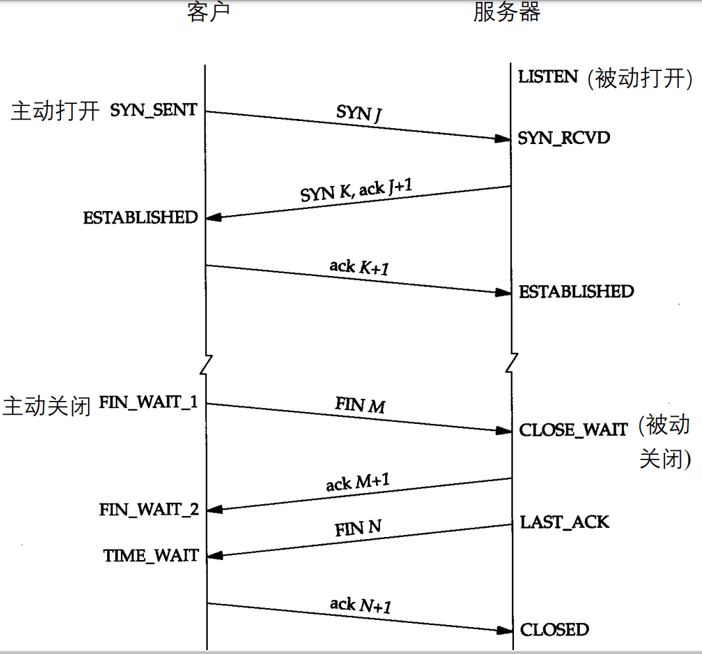
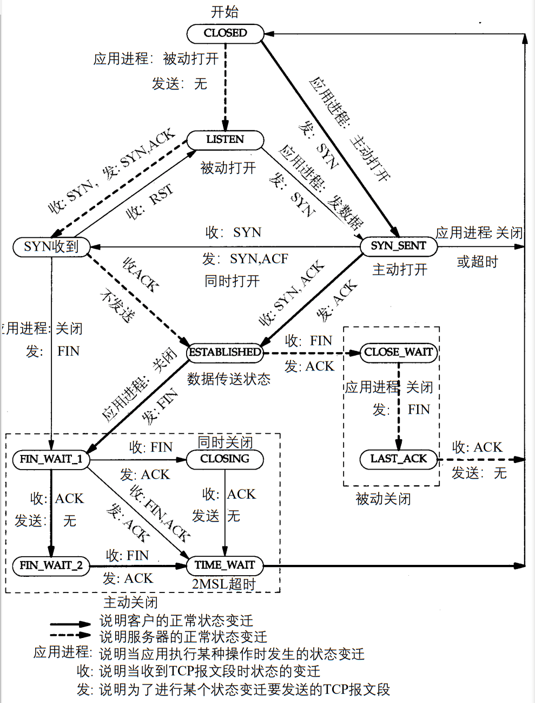

- [操作系统](#操作系统)
	- [进程、线程和协程](#进程线程和协程)
	- [Linux下进程间通信方式](#linux下进程间通信方式)
	- [Linux下线程间通信方式](#linux下线程间通信方式)
	- [线程锁](#线程锁)
	- [并发和并行](#并发和并行)
	- [页面置换算法](#页面置换算法)
	- [死锁](#死锁)
		- [定义](#定义)
		- [资源死锁的条件](#资源死锁的条件)
		- [处理死锁的策略](#处理死锁的策略)
		- [死锁检测和恢复](#死锁检测和恢复)
		- [死锁避免](#死锁避免)
		- [死锁预防](#死锁预防)
- [计算机网络](#计算机网络)
	- [OSI七层模型](#osi七层模型)
	- [五层模型主要协议](#五层模型主要协议)
	- [DNS](#dns)
	- [SSL](#ssl)
	- [Web页面请求的历程](#web页面请求的历程)
	- [TCP](#tcp)
	- [UDP](#udp)
	- [TCP和UDP的区别](#tcp和udp的区别)
- [算法](#算法)
	- [排序算法](#排序算法)

# 操作系统

## 进程、线程和协程

||进程|线程|协程|
|:-:|:-:|:-:|:-:|
|定义|资源分配和拥有的基本单位|程序执行的基本单位|用户态的轻量级线程，线程内部调度的基本单位|
|切换情况|进程CPU环境(栈、寄存器、页表和文件句柄等)的保存以及新调度的进程CPU环境的设置|保存和设置程序计数器、少量寄存器和栈的内容|先将寄存器上下文和栈保存，等切换回来的时候再进行恢复|
|切换者|操作系统|操作系统|用户|
|切换过程|用户态->内核态->用户态|用户态->内核态->用户态|用户态(没有陷入内核)|
|调用栈|内核栈|内核栈|用户栈|
|拥有资源|CPU资源、内存资源、文件资源和句柄等|程序计数器、寄存器、栈、状态字|拥有自己的寄存器上下文和栈|
|并发性|不同进程之间切换实现并发，各自占有CPU实现并行|一个进程内部的多个线程并发执行|同一时间只能执行一个协程，而其他协程处于休眠状态，适合对任务进行分时处理|
|系统开销|切换虚拟地址空间，切换内核栈和硬件上下文，CPU高速缓存失效、页表切换，开销很大|切换时只需保存和设置少量寄存器内容，因此开销很小|直接操作栈则基本没有内核切换的开销，可以不加锁的访问全局变量，所以上下文的切换非常快|
|通信方面|进程间通信需要借助操作系统|线程间可以直接读写进程数据段(如全局变量)来进行通信|共享内存、消息队列|
|使用场景|多机分布、任务间相关性比较弱|频繁创建和销毁、计算量大、任务间相关性比较强、多核分布||

## Linux下进程间通信方式

* 管道
	* 无名管道(内存文件)：管道是一种半双工的通信方式，数据只能单向流动，而且只能在具有亲缘关系的进程之间使用。进程的亲缘关系通常是指父子进程关系。

	* 有名管道(FIFO文件，借助文件系统)：有名管道也是半双工的通信方式，但是允许在没有亲缘关系的进程之间使用，管道是先进先出的通信方式。

* 共享内存：共享内存就是映射一段能被其他进程所访问的内存，这段共享内存由一个进程创建，但多个进程都可以访问。共享内存是最快的IPC方式，它是针对其他进程间通信方式运行效率低而专门设计的。它往往与信号量配合使用来实现进程间的同步和通信。

* 信号：用于通知接收进程某个事件已经发生，比如按下ctrl + C就是信号。

* 信号量：信号量是一个计数器，用于通知接受进程有某种事情发生。可以用来控制多个进程对共享资源的访问。它常作为一种锁机制，实现进程、线程对临界区的同步及互斥访问。

* 消息队列：消息队列是有消息的链表，存放在内核中并由消息队列标识符标识。消息队列克服了信号传递信息少、管道只能承载无格式字节流以及缓冲区大小受限等缺点。可以独立于读写进程存在，从而避免了FIFO中同步管道的打开和关闭时可能产生的困难，避免了FIFO的同步阻塞问题，不需要进程自己提供同步方法，读进程可以根据消息类型有选择地接受消息，而不像FIFO那样只能默认地接受

* 套接字：适用于不同机器间进程通信，在本地也可作为两个进程通信的方式。

## Linux下线程间通信方式

* 信号：类似进程间的信号处理

* 锁机制：互斥锁、读写锁和自旋锁

* 条件变量：使用通知的方式解锁，与互斥锁配合使用

* 信号量：包括无名线程信号量和命名线程信号量

## 线程锁

* 读写锁：

多个读者可以同时进行读

写者必须互斥(只允许一个写者写，也不能读者写者同时进行)

写者优先于读者(一旦有写者，则后续读者必须等待，唤醒时优先考虑写者)

* 互斥锁

一次只能一个线程拥有互斥锁，其他线程只有等待

互斥锁是在抢锁失败的情况下主动放弃CPU进入睡眠状态直到锁的状态改变时再唤醒，而操作系统负责线程调度，为了实现锁的状态发生改变时唤醒阻塞的线程或者进程，需要把锁交给操作系统管理，所以互斥锁在加锁操作时涉及上下文的切换。互斥锁实际的效率还是可以让人接受的，加锁的时间大概100ns左右，而实际上互斥锁的一种可能的实现是先自旋一段时间，当自旋的时间超过阀值之后再将线程投入睡眠中，因此在并发运算中使用互斥锁(每次占用锁的时间很短)的效果可能不亚于使用自旋锁

* 条件变量

互斥锁一个明显的缺点是他只有两种状态：锁定和非锁定。而条件变量通过允许线程阻塞和等待另一个线程发送信号的方法弥补了互斥锁的不足，他常和互斥锁一起使用，以免出现竞态条件。当条件不满足时，线程往往解开相应的互斥锁并阻塞线程然后等待条件发生变化。一旦其他的某个线程改变了条件变量，他将通知相应的条件变量唤醒一个或多个正被此条件变量阻塞的线程。总的来说互斥锁是线程间互斥的机制，条件变量则是同步机制。

* 自旋锁

如果进线程无法取得锁，进线程不会立刻放弃CPU时间片，而是一直循环尝试获取锁，直到获取为止。如果别的线程长时期占有锁，那么自旋就是在浪费CPU做无用功，但是自旋锁一般应用于加锁时间很短的场景，这个时候效率比较高。

## 并发和并行

* 并发：宏观上在一段时间内能同时运行多个程序，操作系统通过引入进程和线程，使得程序能够并发运行

* 并行：同一时刻能运行多个指令，并行需要硬件支持，如多流水线、多核处理器或者分布式计算系统。

## 页面置换算法

|算法|规则|优缺点|
|:-:|:-:|:-:|
|最佳置换法(OPT)|优先淘汰最长时间内不会被访问的页面|缺页率最小，性能最好;但无法实现|
|先进先出置换(FIFO)|优先淘汰最先进入内存的页面|实现简单;但性能很差，可能出现Belady异常|
|最近最久未使用置换(LRU)|优先淘汰最近最久没访问的页面|性能很好;但需要硬件支持，算法开销大|
|时钟置换(CLOCK、NRU)|循环扫描各页面 第一轮淘汰访问位=0的，并将扫描过的页面访问位改为0。若第一轮没选中，则进行第二轮扫描。|实现简单，算法开销小;但未考虑页面是否被修改过。|
|改进型CLOCK (改进型NRU)|若用(访问位，修改位)的形式表述，则第一轮:淘汰(0,0)第二轮:淘汰(0,1)，并将扫描过的页面访问位都置为0，第三轮:淘汰(0,0)，第四轮:淘汰(0,1)|算法开销较小，性能也不错|

## 死锁

### 定义

如果一个进程集合中的每个进程都在等待只能由该进程集合中的其他进程才能引发的事件，那么，该进程集合就是死锁的

### 资源死锁的条件

1. 互斥条件。每个资源要么已经分配给了一个进程，要么就是可用的

2. 占有和等待条件。已经得到了某个资源的进程可以再请求新的资源

3. 不可抢占条件。已经分配给一个进程的资源不能强制性地被抢占，它只能被占有它的进程显式地释放

4. 环路等待条件。死锁发生时，系统中一定有由两个或两个以上的进程组成的一条环路，该环路中的每个进程都在等待着下一个进程所占有的资源

### 处理死锁的策略

1. 忽略该问题。也许如果你忽略它，它也会忽略你

2. 检测死锁并恢复。让死锁发生，检测它们是否发生，一旦发生死锁，采取行动解决问题

3. 仔细对资源进行分配，动态地避免死锁

4. 通过破坏引起死锁的四个必要条件之一，防止死锁的产生

### 死锁检测和恢复

每种资源类型只有一个资源的系统，可以对这样的系统构造一张资源分配图，如果这张图包含了一个或一个以上的环，那么死锁就存在。在此环中的任何一个进程都是死锁进程。如果没有这样的环，系统就没有发生死锁

每种类型多个资源的死锁检测：1. 寻找一个没有标记的进程$P_i$，对于它而言R矩阵的第i行向量≤A；2. 如果找到了这样一个进程，那么将C矩阵的第i行向量加到A中，标记该进程，并转到第1步(即这一进程被运行完毕，释放自己持有的资源并将它们返回到可用资源库中，然后这一进程被标记为完成)；3. 如果没有这样的进程，那么算法终止。虽然算法的运行过程是不确定的(因为进程可按任何行得通的次序执行)，但结果是相同的

从死锁中恢复：利用抢占恢复、利用回滚恢复、通过杀死进程恢复

### 死锁避免

安全状态：如果没有死锁发生，并且即使所有进程突然请求对资源的最大需求，也仍然存在某种调度次序能够使得每一个进程运行完毕，则称该状态是安全的

银行家算法：银行家算法就是对每一个请求进行检查，检查如果满足这一请求是否会达到安全状态。若是，那么就满足该请求;否则，就推迟对这一请求的满足。为了检查状态是否安全，操作系统需要考虑他是否有足够的资源满足某一个进程。如果可以，那么该资源就是能够收回的，并且接着检查最接近最大需求的一个进程，以此类推。如果所有资源最终都能被收回，那么该状态是安全的，最初的请求可以批准

### 死锁预防

1. 破坏互斥条件：通过采用假脱机打印机技术可以允许若干个进程同时产生输出。该模型中唯一真正请求使用物理打印机的进程是打印机守护进程，由于守护进程决不会请求别的资源,所以不会因打印机而产生死锁

2. 破坏占有并等待条件：规定所有进程在开始执行前请求所需的全部资源、当一个进程请求资源时，先暂时释放其当前占用的所有资源,然后再尝试一次获得所需的全部资源

3. 破坏不可抢占条件：允许抢占资源

4. 破坏环路等待条件：保证每一个进程在任何时刻只能占用一个资源，如果要请求另外一个资源，它必须先释放第一个资源、将所有资源统一编号排序，进程可以在任何时刻提出资源请求,但是所有请求必须按照资源编号的顺序(升序)提出、取消必须按升序请求资源的限制，而仅仅要求不允许进程请求比当前所占有资源编号低的资源

# 计算机网络

## OSI七层模型

1. 物理层：利用传输介质为数据链路层提供物理连接，实现比特流的透明传输
2. 数据链路层：接收来自物理层的位流形式的数据，并封装成帧，传送到上一层
3. 网络层：定义IP编址，定义路由功能；如不同设备的数据转发。每台路由器的数据平面的主要作用是从其输入链路向其输出链路转发数据报；控制平面的主要作用是协调这些本地的每路由器转发动作，使得数据报沿着源和目的地主机之间的路由器路径最终进行端到端传送。
4. 传输层：运输层协议为运行在不同主机上的应用进程之间提供了逻辑通信功能
5. 会话层：负责在网络中的两节点之间建立、维持和终止通信
6. 表示层：处理用户信息的表示问题，图像视频数据的编解码，压缩和解压缩，数据的加密和解密
7. 应用层：为用户的应用进程提供网络通信服务

## 五层模型主要协议

* 应用层：FTP、HTTP、DNS、SMTP
* 传输控制层：TCP、UDP
* 网络层：IP、ICMP、BGP、IGMP、RIP
* 数据链路层：ARP、IEEE802.3、RARP
* 物理层：PAM5、FE自协商、EIA422

## DNS

* 工作原理：浏览器缓存，系统缓存，路由器缓存，IPS服务器缓存，根DNS服务器缓存，顶级域DNS服务器缓存，权威DNS服务器缓存。主机向本地域名服务器的查询一般都是采用递归查询，本地域名服务器向根DNS服务器的查询的迭代查询

* 工作步骤：
	1. 当用户输入域名时，浏览器先检查自己的缓存中是否包含这个域名映射的ip地址，有的话解析结束
	2. 若没命中，则检查操作系统缓存中有没有解析过的结果，有解析结束
	3. 若无命中，则请求本地DNS服务器解析
	4. 若本地DNS服务器没有命中就直接跳到根DNS服务器请求解析。根DNS服务器返回给本地DNS服务器一个顶级域DNS服务器地址
	5. 此时本地DNS服务器再发送请求给上一步返回的顶级域DNS服务器地址，接受请求的顶级域DNS服务器地址查找并返回这个域名对应的权威DNS服务器的地址
	6. 权威DNS服务器根据映射关系表找到目标ip，返回给本地DNS服务器
	7. 本地DNS服务器缓存这个域名和对应的ip，把解析的结果返回给用户，用户根据TTL值缓存到本地系统缓存中，域名解析过程至此结束

## SSL

* SSL握手：
	1. 客户发送它支持的密码算法的列表,连同一个客户的不重数
	2. 从该列表中，服务器选择一种对称加密算法(例如AES)、一种公钥算法(例如具有特定密钥长度的RSA)和一种MAC算法。它把它的选择以及证书和一个服务器不重数返回给客户
	3. 客户验证该证书，提取服务器的公钥，生成一个前主密钥(PMS)，用服务器的公钥加密该PMS，并将加密的PMS发送给服务器
	4. 使用相同的密钥导出函数，客户和服务器独立地从PMS和不重数中计算出主密钥(MS)。然后该MS被切片以生成两个密码和两个MAC密钥。此外，当选择的对称密码应用于CBC，则两个初始化向量(IV)也从该MS获得，这两个IV分别用于该连接的两端。自此以后，客户和服务器之间发送的所有报文均被加密和鉴别(使用MAC)
	5. 客户发送所有握手报文的一个MAC
	6. 服务器发送所有握手报文的一个MAC

## Web页面请求的历程

1. 查浏览器缓存，看看有没有已经缓存好的，如果没有检查本机host文件
2. 向DNS服务器发送DNS请求，查询本地DNS服务器，这其中用的是UDP的协议
3. 如果在一个子网内采用ARP地址解析协议进行ARP查询。如果不在一个子网那就需要对默认网关进行DNS查询，如果还找不到会一直向上找根DNS服务器，直到最终拿到IP地址（全球400多个根DNS服务器，由13个不同的组织管理）
4. 这个时候我们就有了服务器的IP地址 以及默认的端口号了，http默认是80，https是 443 端口号，首先尝试http然后调用Socket建立TCP连接
5. 经过三次握手成功建立连接后，开始传送数据，如果正是http协议的话，就返回就完事了
6. 如果不是http协议，服务器会返回一个5开头的的重定向消息，告诉我们用的是https，那就是说IP没变，但是端口号从80变成443了，好了，再四次挥手，完事
7. 再来一遍，这次除了上述的端口号从80变成443之外，还会采用SSL的加密技术来保证传输数据的安全性，保证数据传输过程中不被修改或者替换之类的
8. 这次依然是三次握手，沟通好双方使用的认证算法，加密和检验算法，在此过程中也会检验对方的CA安全证书
9. 确认无误后，开始通信，然后服务器就会返回你所要访问的网址的一些数据，在此过程中会将界面进行渲染

## TCP

* 定义：传输控制协议，是一种面向连接的、可靠的、基于字节流的传输层通信协议

* TCP首部字段

|每行为16比特|
|:-:|
|源端口号|
|目的端口号|
|序号(1/2)|
|序号(2/2)|
|确认号(1/2)|
|确认号(2/2)|
|首部长度 保留未用 CWR ECE URG ACK PSH RST SYN FIN|
|接受窗口|
|因特网校验和|
|紧急数据指针|
|选项(1/...)|
|选项......|
|数据(1/...)|
|数据......|

* 源端口号、目的端口号(16位)：用于多路复用/分解来自或送到上层应用的数据

* 序号字段、确认号(32位)：被TCP发送方和接收方用来实现可靠数据传输服务，讨论见后

* 首部长度(4位)：指示了以32比特的字为单位的TCP首部长度。由于TCP选项字段的原因，TCP首部的长度是可变的(通常，选项字段为空，所以TCP首部的典型长度是20字节)

* 标志字段(6位)：

	* CWR和ECE比特：明确拥塞通告

	* URG比特：用来指示报文段里存在着被发送端的上层实体置为"紧急"的数据。紧急数据的最后一个字节由16比特的**紧急数据指针字段**指出。当紧急数据存在并给出指向紧急数据尾指针的时候，TCP必须通知接收端的上层实体

	* ACK比特：用于指示确认字段中的值是有效的，即该报文段包括一个对已被成功接收报文段的确认

	* PSH比特：当PSH比特被置位时，就指示接收方应立即将数据交给上层

	* RST、SYN和FIN比特：用于连接建立和拆除，我们将在本节后面讨论该问题

	* 在实践中，PSH、URG和紧急数据指针并没有使用。为了完整性起见才提到这些字段

* 接受窗口(16位)：用于流量控制，用于指示接收方愿意接受的字节数量

* 校验和字段(16位)：用于检测在一个传输分组中的比特错误

* 紧急数据指针字段(16位)：对应于标志字段中的URG比特

* TCP实现可靠传输
	* 建立连接：通信前确认通信实体存在
	* 首部中使用数据校验：TCP报文头有校验和，用于校验报文是否损坏
	* 数据合理分片和排序：tcp会按最大传输单元(MTU)合理分片，接收方会缓存未按序到达的数据，重新排序后交给应用层
	* 累计确认和重传：接收方收到报文就会确认，发送方发送一段时间后没有收到确认就会重传
	* 流量控制：当接收方来不及处理发送方的数据，能通过滑动窗口，提示发送方降低发送的速率，防止包丢失
	* 拥塞控制：当网络拥塞时，通过拥塞窗口，减少数据的发送，防止包丢失

## UDP

* 作用：提供无连接的，尽最大努力的数据传输服务（不保证数据传输的可靠性）

* 优点：
	* 关于发送什么数据以及何时发送的应用层控制更为精细
	* 无须连接建立
	* 无连接状态
	* 分组首部开销小：每个TCP报文段都有20字节的首部开销，而UDP仅有8字节的开销

* 首部字段：

|每行为16比特|
|:-:|
|源端口号|
|目的端口号|
|长度|
|校验和|
|应用数据(报文)|

## TCP和UDP的区别

1. TCP面向连接;UDP是无连接的，即发送数据之前不需要建立连接

2. TCP提供可靠的服务。通过TCP连接传送的数据，无差错，不丢失，不重复，且按序到达;UDP尽最大努力交付，即不保证可靠交付

3. TCP面向字节流；UDP是面向报文的：
	* TCP是面向字节流的，它把上面应用层交下来的数据看成无结构的字节流会发送，发送方TCP会将数据放入缓存区，等到可以发送的时候就发送，不能发送就等着TCP会根据当前网络的拥塞状态来确定每个报文段的大小
	* UDP是面向报文的，发送方的UDP对应用层交下来的报文，不合并，不拆分，只是在其上面加上首部后就交给了下面的网络层，无论应用层交给UDP多长的报文，它统统发送，一次发送一个。而对接收方，接到后直接去除首部，交给上面的应用层就完成任务了。因此，它需要应用层控制报文的大小

4. 拥塞控制：TCP有拥塞控制机制，网络处于拥塞时会使源主机的发送速率降低；UDP没有拥塞控制，因此网络出现拥塞不会使源主机的发送速率降低

5. 每一条TCP连接只能是点到点的;UDP支持一对一，一对多，多对一和多对多的交互通信

6. TCP首部开销20字节;UDP的首部开销小，只有8个字节

7. TCP的逻辑通信信道是全双工的可靠信道，UDP则是不可靠信道

# 算法

## 排序算法

|算法|时间-平均|空间|是否稳定排序|时间-最佳|时间-最差|
|:-:|:-:|:-:|:-:|:-:|:-:|
|快速|$nlog(n)$|$log(n)$||$nlog(n)$|$n^2$|
|归并|$nlog(n)$|$n$|√|$nlog(n)$|$nlog(n)$|
|插入|$n^2$|$1$|√|$n$|$n^2$|
|希尔|$(nlog(n))^2$|$1$||$n$|$(nlog(n))^2$|
|堆|$nlog(n)$|$1$||$nlog(n)$|$nlog(n)$|
|计数|$n$|$n$|√|$n$|$n$|
|基数|$nk$|$n+k$||$nk$|$nk$|
|选择|$n^2$|$1$||$n^2$|$n^2$|
|冒泡|$n^2$|$1$|√|$n$|$n^2$|
|桶|$n+k$|$n$||$n+k$|$n^2$|
